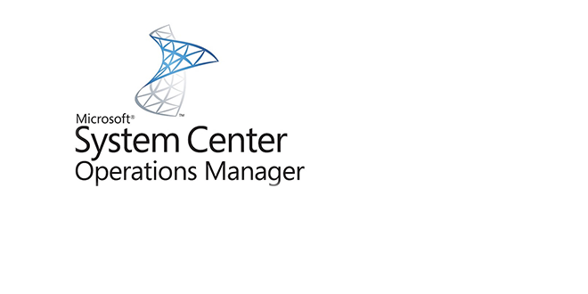

Oggi mi è capitato di sbattere la testa su un gateway SCOM che aveva qualche problema. Dopo qualche ora di inutili tentativi avevo finito le idee quando all’improvviso, ecco accendersi la lampadina: controlliamo se l’antivirus ha le esclusioni corrette. Un breve controllo e… ZAC! Beccato! Cercando su Internet ho trovato varie informazioni sulle corrette esclusioni antivirus SCOM, ma alcuni link riportavano dati confusi e non sistematici. Ho cercato quindi di dare un po’ di ordine a questo marasma schematizzando il tutto secondo il tipo di esclusione che verrà fatta sull’antivirus.

## Esclusioni antivirus SCOM su file eseguibili
Partiamo dalla cosa più semplice: Microsoft sconsiglia caldamente le esclusioni fatte su eseguibili e non ha tutti i torti. Se maglia dei filtri è troppo “larga”, potremmo rischiare di permettere l’esecuzione di eseguibili pericolosi. Quindi, datemi retta, cercate di non farlo a meno che non sappiate con assoluta certezza quali e quanti eseguibili escludere. Per quanto riguarda SCOM in particolare, se volete procedere su questa strada, bisogna escludere dalle scansioni il file

    monitoringhost.exe

Per quali versioni vale? SCOM 2007, 2007 R2, 2012
Per quale ruolo di SCOM vale questa esclusione? Tutti, agenti compresi.

## Esclusioni antivirus SCOM su directory
Le indicazioni che vi darò a questo riguardo partono dall’assunzione che i percorsi di installazione di SCOM sulle macchine siano quelli di default. Solitamente questo è l’approccio vincente al problema, utilizzandolo insieme alle esclusioni sulle estensioni.

Partiamo dalla directory più semplice da individuare, quella d’installazione, che cambia leggermente a seconda della versione in questo caso:

Per **SCOM 2007 e 2007 R2** (**Management Server**, **Gateway**, **Agenti**):

    C:\Program Files\System Center Operations Manager 2007\Health Service State\Health Service Store

Per **SCOM 2012** (**Management Server**, **Gateway**, **Agenti**):

    C:\Program Files\System Center 2012\Operations Manager\Agent\Health Service State\Health Service Store
    C:\Program Files\System Center 2012\Operations Manager\Server\Health Service State\Health Service Store

**SQL Database Server**

Alle esclusioni di cui abbiamo appena parlato, per un ambiente totalmente funzionante, bisogna aggiungere quelle per il SQL server: qui le cartelle possono variare di molto a seconda del vostro ambiente, ma vi basti sapere che dovrete escludere semplicemente le cartelle contenenti i file con estensione .mdf e .ldf.

Esempio:

    C:\Program Files\Microsoft SQL Server\MSSQL.1\MSSQL\Data
    C:\Program Files\Microsoft SQL Server\MSSQL.1\MSSQL\Log

In soldoni quindi dovete preoccuparvi di escludere le cartelle dove risiedono **i file dei database di SCOM**, il **tempdb** e il **master**.

## Esclusioni antivirus SCOM sulle estensioni del file
Se vorrete usare questo approccio, queste sono le estensioni dei file da escludere, divise per tipo:
- Per i SQL Database Server
    - MDF
    - LDF
- Per i server e gli agenti SCOM 2007, 2007 R2, 2012:
    - EDB
    - CHK
    - LOG

Spero di essere stato chiaro ed esaustivo. Alla prossima!