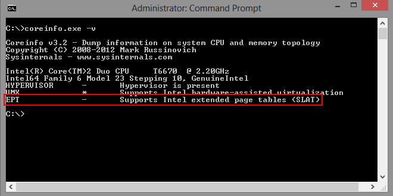

Una delle ragioni per cui ho aggiornato subito il mio PC aziendale a Windows 8 era la possibilità di installare Hyper-V, visto che è sempre comodo poter contare su qualche macchina virtuale di laboratorio per effettuare le proprie prove. Purtroppo mi sono scontrato con un requisito abbastanza stringente, soprattutto per PC non nuovissimi come quello sfortunatamente assegnatomi. Il ruolo Hyper-V su Windows 8 può essere installato solo se la CPU offre il supporto **SLAT** (Second Level Address Translation), ovvero una tecnologia di supporto alla virtualizzazione presente sui processori Core i7, i5, i3, Pentium G6950 e alcuni Xeon. Purtroppo il supporto SLAT non è disponibile sulle CPU Core 2 e precedenti. Se però siete in dubbio e volete verificarlo immediatamente ecco come fare.

Prima di tutto andate sul sito di Sysinternals e scaricate il tool **Coreinfo**: [ecco il link diretto](http://technet.microsoft.com/en-us/sysinternals/cc835722.aspx).

Decomprimete il pacchetto ed estraete il file **coreinfo.exe** dove desiderate.

Lanciate un prompt dei comandi in **modalità amministrativa** e digitate il seguente comando:

    C:\>coreinfo.exe -v

Vi si presenterà a schermo un output simile a questo:

Come interpretarlo? Basta guardare il segno che c’è al centro della riga dell’output: se è un asterisco (*) significa che la caratteristica è supportata, se c’è un meno (–), dite pure addio all’idea di installare Hyper-V sul vostro computer.

Purtroppo, come avrete potuto notare, ho dovuto abbandonare i sogni di gloria. 🙁