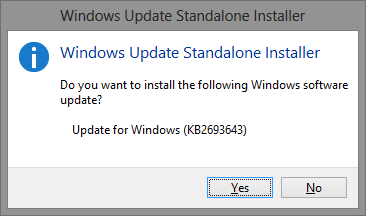
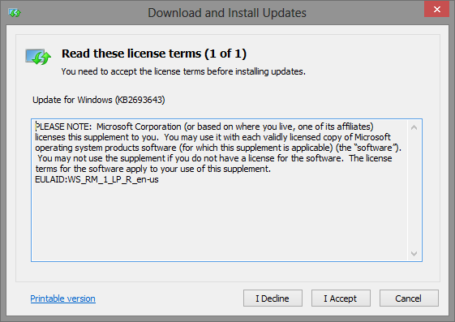
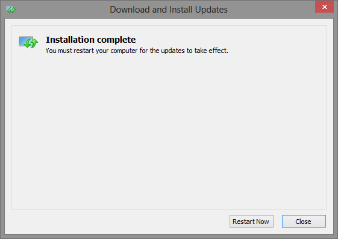
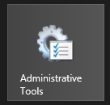

Per chi lavora tutti i giorni con Active Directory è una buona pratica avere installato sul proprio PC un tool indispensabile come Active Directory Users And Computers. Fino a qualche anno fa, con Windows 2003, bastava scaricare l’ormai mitico adminpak.msi ma oggi, con Windows 7 e Windows 8 le cose sono un pochino cambiate. Vediamo quindi come installare Active Directory Users And Computers (e non solo) su Windows 8.

Una piccola premessa prima di continuare: con questo pacchetto non installeremo solo l’ADUC bensì una serie completa di tool amministrativi chiamati R**emote Server Administration Tools**, attraverso i quali potremo amministrare remotamente ruoli di Windows Server 2008, Windows Server 2008 R2 e alcuni ruoli di Windows Server 2003. Il sistema operativo supportato è Windows 8 solo su architetture x86 e x64 mentre sono escluse le piattaforme basate su ARM.

Prima di tutto scarichiamo il pacchetto presente all’indirizzo:

http://www.microsoft.com/en-us/download/details.aspx?id=28972

Clicchiamo su Download a scegliamo la versione (32bit o 64bit).  
Una volta scaricato il file eseguiamolo, confermando di voler procedere

Accettiamo i termini di licenza

A questo punto non ci resta altro che attendere…

... e riavviare il computer al termine dell’installazione

Una volta che il PC sarà riavviato, nella schermata Start di Windows 8 comparirà la seguente icona

 

Clicchiamoci sopra per eseguirla. Comparirà una semplice finestra dove troverete l’elenco **completo** dei tool amministrativi tipici di un ambiente Windows. Ci sarà quindi il nostro Active Directory Users And Computers ma anche gli snap-in di **DNS**, **DHCP**, **DFS**, **ODBC**, e chi più ne ha più ne metta, il tutto finalmente a portata del nostro PC, senza vagare in Remote Desktop tra un server e l’altro! Ecco l’elenco completo dei tool di cui potrete usufruire installando i Remote Server Administration Tools.

 