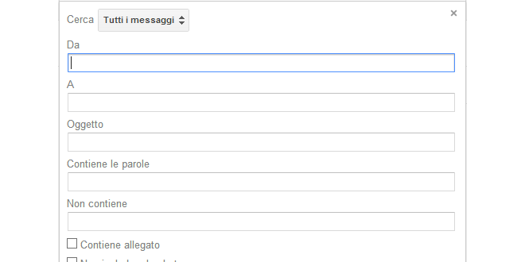

Gmail è stata una rivoluzione nel mondo della posta elettronica, senza ombra di dubbio. Con tutto lo spazio che si ha a disposizione non c’è quasi più la necessità di cancellare la posta, semplicemente si conserva. Io stesso ormai elimino solo la pubblicità e lo spam. Col passare del tempo però ho cominciato ad avere un problema, comune a molti, di ordine e pulizia nella cartella di posta in arrivo: le mail si accumulavano e anche aiutandomi con le etichette non riuscivo a starci dietro. Ho iniziato quindi ad usare i filtri, ma purtroppo le loro opzioni di base non mi permettevano di raggiungere il livello di controllo sperato. Così, ho scoperto che con un paio di trucchetti possiamo automatizzare e archiviare la posta praticamente senza muovere un dito: basta saper usare i filtri avanzati GMail per la ricerca dei messaggi. Vediamo insieme come tenere in ordine la nostra posta in modo pressochè automatico.

Quando si imposta un filtro di posta su GMail, le opzioni di base permettono di filtrare la mail sulla base del mittente, del destinatario, dell’oggetto o delle parole contenute o non contenute nel corpo del messaggio.

Pochi sanno che è possibile spingersi molto più in là di questi campi semplicemente utilizzando gli [operatori di ricerca avanzati](https://support.google.com/mail/answer/7190) nel campo di ricerca di GMail. Se avete già aperto il link proposto poco sopra, avrete visto che ce ne sono moltissimi. Raramente li utilizzerete tutti e, a mio modo di vedere, è molto più importante capire la logica che c’è dietro la costruzione di un filtro: abbinando gli operatori **OR**, **AND**, **()** e **{}** ai classici **from:**, **to:**, **subject:** e **–** (il meno), potremo costruire dei filtri davvero potenti e granulari. Cominciamo dalla base, ripassando alcuni concetti elementari per poi combinarli assieme in query di ricerca più complesse.


  


## from:, to:, subject:
I nomi sono abbastanza chiari ma è sempre opportuno dare una rifrescata a concetti basilari:

| Operatore | Definizione                                | Esempi                    |
|-----------|--------------------------------------------|---------------------------|
| from:     | Specifica il mittente                      | Esempio: **from:amelia**  |
| to:       | Specifica il destinatario                  | Esempio: **to:davide**    |
| subject   | Ricerca le parole specificate nell'oggetto | Esempio: **subject:cena** |

## AND/OR/- (NOT)
Vediamo come funzionano questi due operatori

| Operatore | Descrizione                                                            |
|-----------|------------------------------------------------------------------------|
| AND       | Ricerca che contiene il termine A e contemporaneamente il termine B*   |
| OR        | Ricerca che contiene il termine A oppure il termine B*                 |
| -         | Ricerca che non contiene il termine A                                  |

Ammettiamo ora di voler combinare due o più elementi visti nel punto precedente, cercando ad esempio tutti i messaggi inviati a Giada che contengono la parola “vacanze” nell’oggetto.

    
    from:Giada AND subject:Vacanze
ma potrei scrivere anche

    from:Giada subject:Vacanze

omettendo l’operatore.

Prima chicca:

> **Quando tra due elementi di ricerca non inserite un operatore, la ricerca viene interpretata come un AND**

Diversamente dall’AND, l’OR verifica che solo uno degli elementi sia vero. Quindi, usando l’esempio di prima

    from:Giada OR subject:Vacanze

la ricerca restituirà tutti i messaggi di Giada (anche quelli che non hanno come oggetto Vacanze) e tutti i messaggi che hanno come oggetto Vacanze (anche quelli non inviati da Giada). Capita la differenza?

Complichiamo le cose: vogliamo cercare tutti i messaggi inviati a Giada che non hanno come oggetto la parola vacanze (ho omesso AND, alla luce della nota di poco fa)

    from:Giada -subject:Vacanze

Visto com’è semplice? Il trattino “-” serve per negare uno dei due elementi, basta metterglielo davanti. Andiamo avanti e vediamo un trucco che ci permetterà di costruire dei filtri potentissimi.

## Le parentesi tonde “()” e le parentesi graffe “{}”

Perfetto, abbiamo complicato un po’ le cose e abbiamo visto delle ricerche molto semplici per capire come funziona il tutto. Ora sorge un problema: se abbiamo più di due condizioni oppure vogliamo verificare dei gruppi di condizioni,  diventa scomodo usare gli operatori così come abbiamo visto.

Come sempre, un esempio ci aiuterà a capire. Ammettiamo di creare un’etichetta chiamata “Pubblicità” e di voler filtrare tutte le mail che provengono da 3 o più aziende di modo da raccogliere tutte le mail pubblicitarie sotto quest’etichetta. La ricerca sarebbe

    from:*@azienda1.it OR from:*@azienda2.com OR from:*@azienda3.net

e via dicendo. Questa ricerca, scritta così, è lunga e scomoda. Come fare a renderla più corta e gestibile? Raggruppando gli elementi con le parentesi!

> **Le parentesi tonde () significano AND mentre le parentesi graffe {} significano OR.**

Queste ultime in particolare non sono quasi per niente documentate e non troverete alcun riferimento al loro utilizzo nemmeno nel sito di supporto ufficiale di GMail.
Quindi, come si trasforma la ricerca precedente?

    from:{*@azienda1.it *@azienda2.com *@azienda3.net}

Molto meglio no? Un altro esempio, sempre più raffinato

    (from:{amico1@gmail.com amica2@hotmail.it} subject:Rimpatriata)

Come la interpreterà GMail? Queste sono tutte le mail con oggetto Rimpatriata che avete ricevuto da uno qualunque di quei 2 indirizzi. Spettacolare!

## Come e dove utilizzare questi filtri?
Con l’utilizzo delle parentesi e degli operatori logici che abbiamo appena visto, potrete spingervi nella costruzione di filtri davvero precisi per organizzare la posta in arrivo ed eventualmente archiviare tutto con le etichette. Come sempre, dipende dalle vostre esigenze ed il solo limite è la vostra fantasia.

Dove usarli? E’ sufficiente inserire la query nel campo di ricerca di GMail, in alto. Se volete creare un filtro basato su una particolare ricerca che avete costruito, basta selezionare l’opzione “Crea filtro con questa ricerca” e seguire le istruzioni per renderla permanente, aiutandovi così a tenere pulita la posta in arrivo e ad organizzare più logicamente tutta la vostra casella di posta.

Spero di esservi stato utile: fatemi sapere come va e se siete riusciti a pulire per bene la vostra casella di posta! 😉