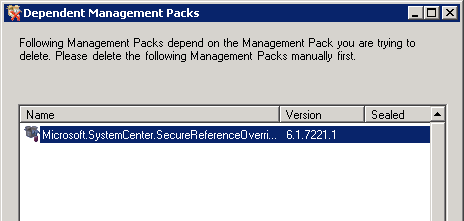
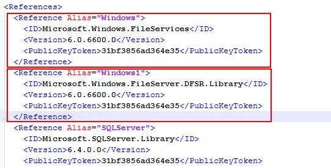
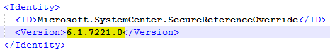

Ciao! Oggi comincio la settimana con un articolo tosto che riguarda un prodotto Microsoft di classe enterprise: [Microsoft System Center Operations Manager](http://technet.microsoft.com/it-it/library/hh509025.aspx). Questa mattina avevo deciso di cancellare il File Services Management Pack ma sfortunatamente questo dipendeva da un altro management pack di nome Microsoft.SystemCenter.SecureReferenceOverride che è assolutamente una pessima pratica rimuovere!  Ero quindi bloccato in un circolo vizioso: impossibilitato a cancellare il primo a causa di una dipendenza da un altro management pack che non potevo comunque cancellare perchè utilizzato da altri management pack. Ecco come ho risolto questo problema.

Cominciamo dal principio ovvero dal tentativo di rimuovere il File Services Management Pack: compare questo avviso.

Questo avviso compare perchè il File Services Management Pack utilizza un Run As account e questa informazione viene memorizzata sotto forma di dipendenza all’interno del Microsoft.SystemCenter.SecureReferenceOverride ma, come dicevo nell’introduzione, cancellare quest’ultimo è male!
Ero quindi bloccato in un circolo vizioso ma con un po’ di Google, pazienza e con Notepad++ ne sono uscito.

Ecco i passi che ho seguito, tenendo presente che questo esempio è stato scritto sulla base dell’esigenza di cancellare il File Services Management Pack ma **il ragionamento vale per qualunque management pack dipenda da Microsoft.SystemCenter.SecureReferenceOverride**.
1. Per prima cosa, prima di tentare di cancellare il management pack dei File Services, ricordati di rimuovere i riferimenti del Run As account dai Run As Profile corrispondenti da **Administration** –> **Profiles**
2. Poi, cancella proprio i Run As account da **Administration** –> **Accounts**
3. Ora vai in **Administration** –> **Management Packs** ed esporta il management pack **Microsoft.SystemCenter.SecureReferenceOverride** (tasto destro, E**xport Management Pack**)
4. Verrà esportato un file XML: editalo con Notepad++ e **rimuovi** le sezioni comprese tra **&lt;Reference&gt;** e **&lt;/Reference&gt;** che ti interessano.

5. Ora, qualche riga sopra, sempre nello stesso file, cambia il numero di versione del management pack Microsoft.SystemCenter.SecureOverride, per esempio scrivendo **6.1.7221.1**: questo serve perchè se tentassi di reimportarlo con lo stesso numero di versione otterresti un errore

6. Salva il file, vai su SCOM in **Administration** –> **Management Packs** e reimporta il management pack Microsoft.SystemCenter.SecureOverride

Ora sarai in grado di cancellare il management pack dei File Services o qualunque management pack che dipende dal Microsoft.SystemCenter.SecureOverride.