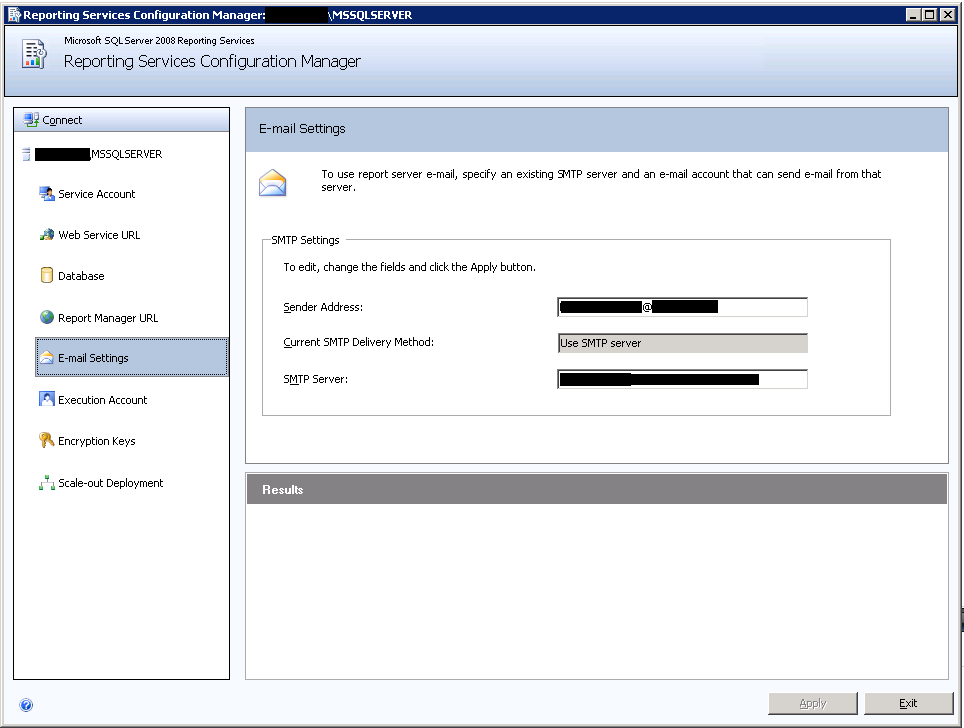

Su richiesta del cliente presso il quale svolgo le mie mansioni attualmente, qualche tempo fa abbiamo programmato SCOM per inviare alcuni report in automatico. Nel dettaglio, la richiesta era di avere settimanalmente un report SCOM con l’elenco degli allarmi più comuni via mail: sulla carta, niente di più facile! Per fortuna i “most common alerts” sono disponibili in un report già pronto all’uso e il tutto si riduce a decidere la sola programmazione temporale, oltre alla casella di posta verso il quale inoltrarlo. Una volta impostato però, l’invio è fallito e anche tutti gli altri report programmati via mail erano in errore per lo stesso motivo. E’ stata quindi l’occasione per verificare tutti i componenti che entrano in gioco nell’invio dei via posta elettronica dei report SCOM.

Ecco l’errore incriminato

*Una piccola premessa:* l’invio dei report di SCOM 2007 R2 via mail è strettamente integrato con i SQL Server Reporting Services (SSRS). Le verifiche seguenti quindi valgono non solo per SCOM ma in generale anche per qualunque invio di posta elettronica tramite SSRS.

Parti dalla cosa più semplice: verifica l’utenza, il metodo di invio e il server di posta in Reporting Services Configuration.

Nel mio caso ho dovuto rimediare cambiando il server (in figura **SMTP Server**), che era sbagliato. Se sei nella mia situazione, il passo successivo è verificare che la macchina dalla quale stai inviando il report abbia i permessi per spedire posta attraverso il mail server che hai impostato. Dai quindi un’occhiata al receive connector del tuo relay/server di posta.

Una volta verificata anche l’utenza, bisogna capire come si autentica SSRS verso il mail server. È necessario quindi aprire il file contenente la configurazione dell’autenticazione di nome **rsreportserver.config**, che troverai nella directory dei Reporting Services della tua installazione di SQL.

Il file è strutturato come un XML, ti basterà cercare il parametro **&lt;SmtpAuthenticate&gt;**, ricordandoti che:
- se tra i tag XML di apertura e chiusura non c’è niente, significa che verrà considerato **0 (zero)** come valore, ovvero **nessuna autenticazione**, ovvero **Anonymous**;
- il valore **1** significa autenticazione **Basic**;
- il valore **2** significa che l’autenticazione è **NTLM**.

Nel mio caso l’ho trovato impostato ad Anonymous, ma il server di posta (quello inizialmente sbagliato che ho successivamente modificato) **non** era un relay, ed ecco il perchè di quell’errore all’inizio dell’articolo!

**SSRS tentava di spedire mail in modalità Anonymous su un server di posta che non era un relay e che quindi richiedeva autenticazione.**

La scelta ora è:
- tenere il server di posta iniziale che richiede autenticazione e impostare a 2;
- cambiare server ed usare il relay aziendale lasciando Anonymous;

Avendo a disposizione un relay creato apposta per questo tipo di invii ed avendo già modificato il server di posta (poco sopra), il cliente ha deciso per la seconda opzione.

I report ora funzioneranno alla grande!