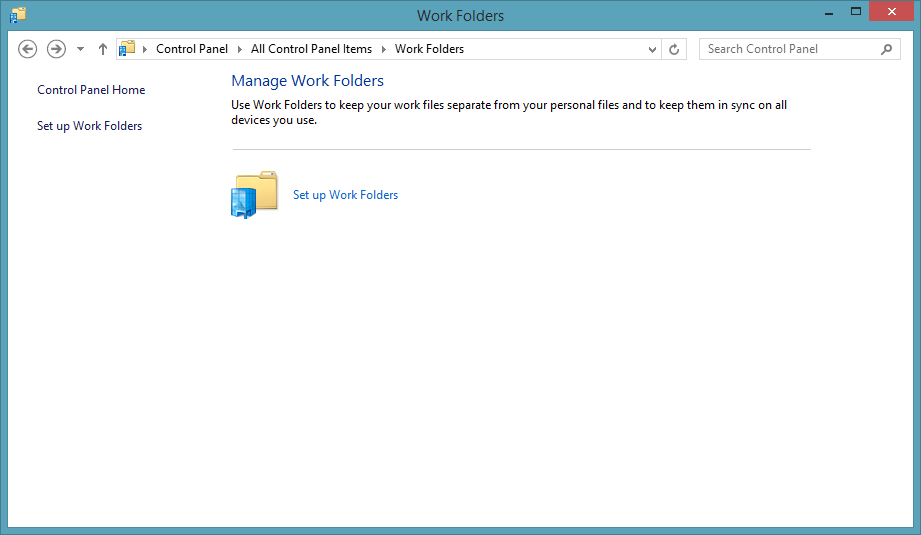

Qualche tempo fa stavo chiacchierando con un amico che ha una piccola azienda e mi parlava di quanto funzioni bene Dropbox per sincronizzare e avere sempre a disposizione i dati di suo interesse, da qualunque dispositivo. Ovviamente lui usa Dropbox per scopi e dati personali mentre in azienda ha un file server classico basato su Windows Server 2008 perchè preferisce avere i dati aziendali “in casa”. A un certo punto, durante la conversazione, mi domanda: “Non sarebbe possibile accedere ai miei dati aziendali ovunque io sia, sincronizzati su qualunque dispositivo ma con la sicurezza di averli “in casa” e non memorizzati su server di terze parti?”. Con Windows Server 2012 R2 Work Folders la risposta ora è **Sì**!

[Work Folders](http://technet.microsoft.com/en-us/library/dn265974.aspx) è una funzionalità introdotta lo scorso ottobre con la versione R2 di Windows Server 2012 che risponde esattamente a questa esigenza: permettere accesso e sincronizzazione dei propri dati ovunque, come se fosse Dropbox, ma con la sicurezza che i dati sono sul proprio server all’interno della propria azienda.

Ti spiego subito i vantaggi di questa soluzione:
- Se hai già un server basato su Windows Server 2012 R2, è già inclusa: basterà solo attivarla e configurarla;
- Un solo punto di accesso a tutti i tuoi dati, sia dalla postazione aziendale che dal tuo dispositivo personale;
- I tuoi file sono fisicamente memorizzati sul tuo computer anche quando sei offline: la sincronizzazione avverrà immediatamente non appena tornerai online;
- Se hai già implementato sul tuo file server le [Folder Redirection o le Offline Folders](http://technet.microsoft.com/en-us/library/hh848267.aspx) potrai integrare anche le Work Folders;
- Ovviamente è possibile impostare cifratura dei dati;
- Può essere clusterizzata per far sì che la risorsa sia in alta affidabilità.
- Si integra con Active Directory e quindi puoi impostare i permessi sui dati con le utenze e i gruppi che hai già;

Essendo una novità, non sono ancora a disposizione le funzioni di collaborazione sui documenti e non è ancora possibile usarla sui dispositivi iOS, Android o sulle versioni precedenti di Windows ma il team di sviluppo ha già annunciato che tutte queste aggiunte verranno rese disponibili in futuro.

Tutto quello di cui avrai bisogno sarà:
- Un server Windows Server 2012 R2, dove verranno ospitati i tuoi dati;
- Il client dovrà usare Windows 8.1 o Windows 8.1 RT come sistema operativo;
- La possibilità di rendere accessibile i dati via internet
- Un certificato per ogni server dove verranno attivate le Work Folders.

La funzione è attivabile da **Server Manager** –> **Manage** –> **Add Roles and Features**

Lato client invece, basterà accedere al pannello di controllo per configurare l’accesso

Una volta configurato l’accesso, comparirà una cartella chiamata “Work Folders” nella vista “Computer” dell’explorer.

Come dicevo prima, mancano ancora alcune funzionalità importanti come l’accesso tramite iOS, Android, non è possibile ancora accedere via browser o con versioni precedenti a Windows 8.1 ma a causa del fatto che è già tutto incluso nel sistema operativo a costo ZERO è solo questione di tempo prima che questo servizio diventi lo standard de facto per accedere ai propri dati aziendali in mobilità.

Che ne pensi? Hai già provato le Work Folders in azienda? Conoci questo servizio? Parliamone nei commenti!