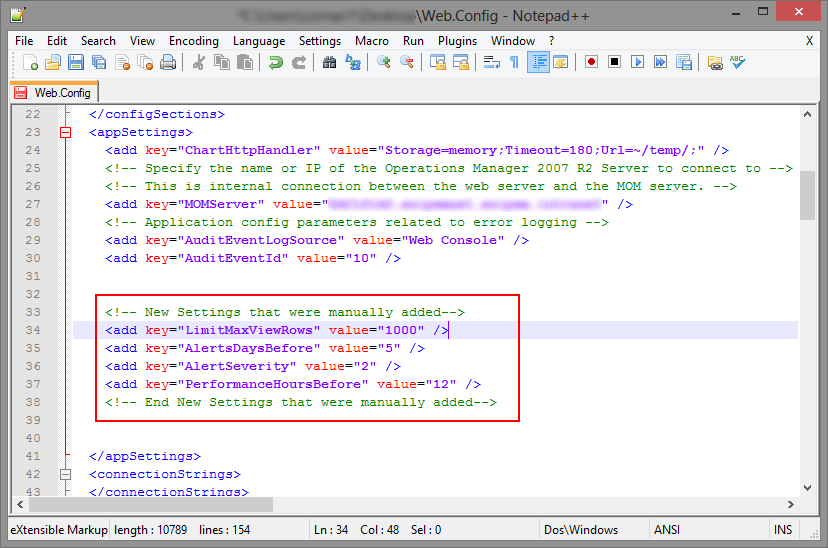

Alcuni giorni fa mi sono trovato alle prese con un apparente mistero: in una vista di monitoraggio sulla web console di SCOM apparivano molte meno macchine di quante ce ne dovessero essere. Stessa storia nelle viste degli allarmi. La cosa curiosa è che le viste si fermavano puntualmente a 200 elementi visualizzati: non uno di più, non uno di meno. Curiosando quindi su Google ho trovato un paio di articoli interessanti in cui si para di alcuni parametri di configurazione per impostare a piacimento la visualizzazione a schermo dei dati, semplicemente modificando il file web.config della web console di SCOM. Ho raccolto per te i più utili ed interessanti.

Il file in questione si trova all’interno della directory dove viene ospitata la web console di SCOM e si chiama **web.config**. Per modificare i parametri basterà aprire questo file con un qualunque editor di testo, localizzando la sezione **&lt;appSettings&gt;** e aggiungendo, cancellando, modificando i parametri

&lt;add key=”*nome parametro*“ value=*”valore“*&gt;

In figura troverai un esempio con le aggiunte posizionate in un’apposita sezione commentata del file XML.

Nel mio caso, per visualizzare tutte le macchine mancanti dalla vista di monitoraggio, è bastato innalzare il limite del parametro **LimitMaxViewRows** a 1000 anzichè 200 (che è il valore di default). Ti sconsiglio di andare oltre le 1000 righe visualizzate se vuoi mantenere delle prestazioni accettabili.

Oltre a questo, come dicevo, ci sono molte altre personalizzazioni possibili. Prima di tuffarti a capofitto nella personalizzazione del web.config di SCOM, è bene ricordare:

Questi parametri **non sono ufficialmente supportati** da Microsoft: usali con buon senso tenendo bene a mente il dimensionamento del tuo ambiente. Alcuni di questi possono influire pesantemente sulle prestazioni della Web console di SCOM (e quindi anche dell’RMS).

Ecco un elenco di quelli più interessanti.


  


| Parametro              | Valore default | Descrizione                                                                                                                                                                                                                                          |
|------------------------|----------------|------------------------------------------------------------------------------------------------------------------------------------------------------------------------------------------------------------------------------------------------------|
| LimitMaxViewRows       | 200            | Il numero massimo di righe (Alerts o State) in una vista. Sconsigliato andare oltre i 1000.                                                                                                                                                          |
| AlertsDaysBefore       | 7              | Se mantenete più di 7 giorni di allarmi, modificate questa voce in accordo con la vostra ritenzione.                                                                                                                                                 |
| AlertSeverity          | 1              | Questo spiega perchè si vedono numeri diversi tra console e web console: di default, nella web console, vengono visualizzati solo Critical e Warning.  **0 – Critical only**, **1 – Critical & Warning**, **2 – Critical, Warning and Information**  |
| ShowAlertAge           | true           | Visualizza l'età dell'allarme, abilitato di default.                                                                                                                                                                                                 |
| PerformanceHoursBefore | 24             | Se volete visualizzare più di 24 ore di dati nelle Performance View. Sconsigliato andare oltre le 72 ore.                                                                                                                                            |
| ViewAutoRefresh        | 5              | Imposta il tempo di refresh della console nel caso in cui non si registri attività da parte dell'utente, come selezionare una vista, ecc.                                                                                                            |
| PerformanceLegendMax   | 45             | Nei grafici questo parametro serve ad impostare il massimo numero di oggetti selezionabili.                                                                                                                                                          |
| TimeViewLoads          | false          |                                                                                                                                                                                                                                                      |

Questo articolo è stato scritto sulla base delle informazioni pubblicate da [Micheal Pearson](http://blogs.technet.com/b/michaelpearson/archive/2009/11/30/opsmgr-r2-web-console-web-config-settings.aspx) e [Michel Kamp](http://www.systemcentercentral.com/undocumented-scom-web-console-parameters/).