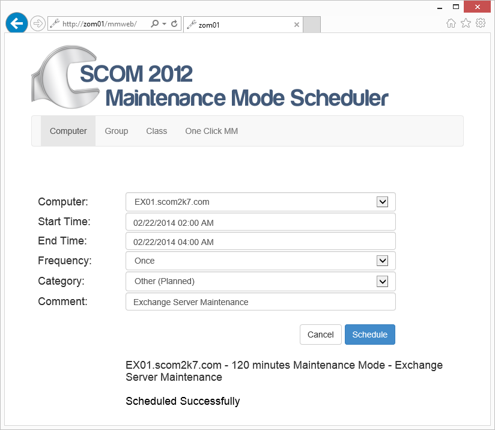

È stato rilasciato qualche giorno fa il tool SCOM 2012 Maintenance Mode Scheduler, molto utile se, come me, amministri quotidianamente un’infrastruttura di monitoraggio basata su System Center Operations Manager. Come suggerisce il nome, la funzione di questa utility è di programmare a tua discrezione la manutenzione degli oggetti SCOM.

Il software è una web application dall’interfaccia molto semplice, compatibile con SCOM 2012, SP1 e R2. Una volta configurato, sarà possibile programmare la manutenzione di gruppi, classi e oggetti.

Altre due caratteristiche interessanti:
- la modalità “One Click Maintenance Mode”, che consiste nel posizionare un’icona con uno shortcut sul desktop di tutti i vostri server: cliccandola il server verrà messo in manutenzione istantaneamente;
- c’è anche un’app sul [Windows App Store](http://apps.microsoft.com/windows/app/scom-2012-maintenance/0d1543bd-c7f1-4568-b350-a55e825598f3) compatibile con Windows 8 che fornisce un’interfaccia in stile Modern UI.

Il download è gratuito, in prova per 30 giorni e il prezzo della licenza dopo i 30 giorni è di 99$.

Puoi scaricare il tool direttamente dal sito [Everything System Center Operations Manager](http://www.scom2k7.com/scom-2012-maintenance-mode-scheduler/) di Tim McFadden.