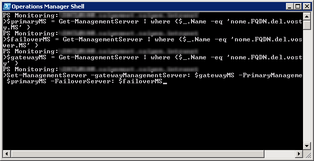

All’interno di un’infrastruttura SCOM 2007 il gateway riporta i dati di monitoraggio ad un Management Server definito in fase di registrazione/installazione del gateway stesso. Il comando di registrazione (Microsoft.EnterpriseManagement.GatewayApprovalTool.exe) permette però di registrare il gateway assegnandolo ad un solo Management Server (da qui in poi abbreviato in MS). Questo è da considerarsi un possibile punto di rottura, dal momento che in caso di indisponibilità del MS, il gateway SCOM non saprebbe più dove inviare i dati di monitoraggio, mettendoli in una coda che però ha un limite di capienza. Per ovviare al problema, con pochi semplici comandi Powershell possiamo configurare un failover management server sul gateway SCOM.

## Impostare il failover management server via Powershell
L’opzione di failover non è configurabile dall’interfaccia grafica della console di SCOM: è necessario armarsi di Powershell, ecco come fare:

Accedi al MS con un’utenza amministrativa di macchina e che sia anche censita tra gli amministratori di SCOM.

Apri la Powershell di Operations Manager.

Esegui i seguenti comandi:

    $primaryMS = Get-ManagementServer | where {$_.Name –eq 'nome.FQDN.del.vostro.Primary.MS' }
    $failoverMS = Get-ManagementServer | where {$_.Name –eq 'nome.FQDN.del.vostro.Failover.MS' }
    $gatewayMS = Get-ManagementServer | where {$_.Name –eq 'nome.FQDN.del.vostro.gateway' }
    Set-ManagementServer -gatewayManagementServer: $gatewayMS -PrimaryManagementServer: $primaryMS -FailoverServer: $failoverMS

Perfetto, hai appena impostato il failoverMS. Per verificare che effettivamente il failover sia impostato, possiamo interrogare il sistema sempre tramite la Operations Manager Shell in questo modo:

    $gw = get-GatewayManagementServer | where {$_.Name -eq "nome.FQDN.del.vostro.gateway"}
    $gw | foreach-object {$_.getPrimaryManagementServer() | select Name; $_.getFailoverManagementServers() | select Name}

Il comando ti restituirà i 2 nomi macchina dei tuoi 2 management server: il primary e il failover.
