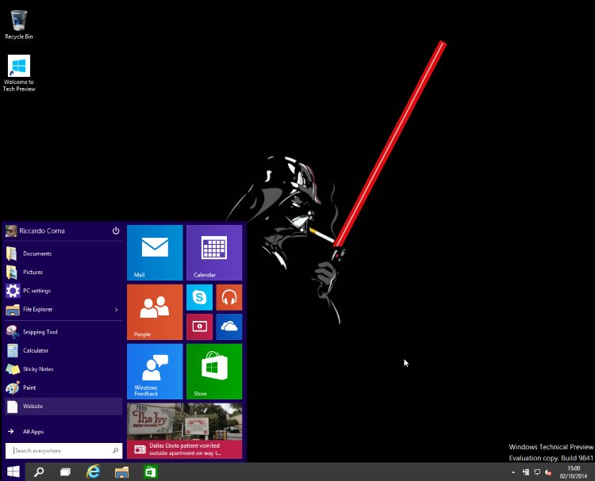
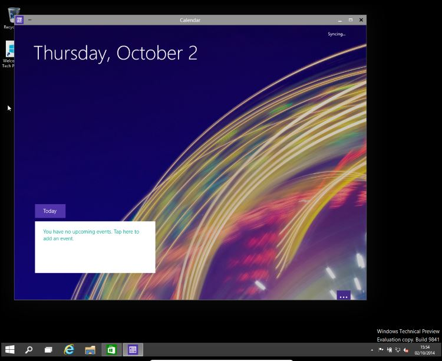

Non ho resistito alla tentazione e l’ho scaricata immediatamente: Windows 10 Technical Preview è un’occasione golosa da molti punti di vista: prima di tutto per mettere alla prova la capacità di Microsoft di ascoltare i propri clienti, in secondo luogo per capire la direzione intrapresa in un’era in cui il sistema operativo di un PC da scrivania è solo la piccola parte di un ecosistema molto più vasto dove tablet, smartphone e servizi cloud si amalgamano nell’utilizzo quotidiano in maniera mai così preponderante come oggi. Windows 7 non era stato concepito per questo tipo di ecosistema, Windows 8 e 8.1 hanno rappresentato solo un’affannosa e parzialmente riuscita rincorsa verso sintesi tra cloud, scrivania e mobile. Windows 10 sarà il vero banco di prova per Microsoft, da questo punto di vista.

*Questo articolo non ha la velleità di essere una recensione, perchè è concettualmente scorretto farla di un prodotto che è ancora in stato “preview”, perchè il sistema operativo è ancora troppo acerbo e le caratteristiche da qui ad Aprile 2015 (termine della fase di anteprima) subiranno sicuramente delle modifiche sostanziali.*
*Prendila quindi come una piccola prova su strada delle novità introdotte che mi sono piaciute di più.* 

Cominciamo!

Il download di Windows 10 Technical Preview non è per tutti: è necessario iscriversi all’[Insider Program](http://windows.microsoft.com/en-us/windows/preview) che ti permetterà di rimanere aggiornato e di provare, qualora tu lo desideri, le anteprime di Windows. Come sempre in questi casi, data la natura di “anteprima”, **evita di installarlo sul tuo PC abituale, molto meglio provarlo su una macchina virtuale**. Se usi Windows puoi creare una macchina virtuale gratuitamente con Hyper-V ([verifica i prerequisiti del tuo computer](/verificare-il-supporto-slat-su-windows-8-per-installare-hyper-v/)) oppure con VirtualBox. Se usi un Mac con OS X, puoi creare una macchina virtuale utilizzando Parallels Desktop o Vmware Fusion.
Torniamo a Windows 10 Technical Preview: il download è stato semplice da trovare anche se un po’ lento e l’installazione segue i soliti schemi: non ci sono novità degne di nota da segnalare.

## Desktop vs Touch
La prima grossa novità è che Windows 10 è intelligente e capisce su che tipo di dispositivo sta girando: se stai usando un tablet si avvierà in modalità touch con le tanto criticate icone quadrate (le tile) altrimenti, se avviato da un Personal Computer normale, il sistema operativo andrà dritto al Desktop. E qui accade la magia...

## Bentornato Start!
Ci siamo! Questa è la novità che tutti aspettavano! Microsoft ha fatto tesoro delle bastonate ricevute dagli utenti e ha reintrodotto il menu Start, che ora è una sintesi perfetta tra vecchio e nuovo paradigma.
C’è l’elenco di tutti i programmi facilmente accessibile, ci sono le tile per gli elementi e le app che usiamo più di frequente: Mail, Contatti, Calendario, Notizie, il tutto completamente personalizzabile.

Non solo è personalizzabile ma anche ridimensionabile: puoi stiracchiarlo in alto o spalmarlo in orizzontale: spettacolo!

## Desktop Multipli
Finalmente, come su Linux e OS X, arrivano i desktop multipli: basta al disordine causato da 1000 finestre di altrettanti programmi!

## Ricerche universali
Su Windows 8 e 8.1 la ricerca globale era raggiungibile in maniera poco intuitiva: qui è stato riportato tutto alla semplicità. Puoi cercare qualunque cosa direttamente dal menu Start.

## Nuove finestre
Le odiosissime finestre a tutto schermo in stile Metro ora sono solo un ricordo. Le app Metro possono girare a tutto schermo, essere rimpicciolite e ridimensionate. Inoltre, come già anticipato in Windows 8.1, appaiono sulla taskbar in basso come qualunque altra applicazione.

## Cosa mi è piaciuto di Windows 10 Technical Preview
Microsoft ha ascoltato gli utenti e l’evoluzione dell’interfaccia sta raggiungendo un’ottima sintesi tra vecchio e nuovo paradigma del menu Start.
Il fatto che ci sia un unico sistema operativo per tablet e Personal Computer, con due interfacce finalmente distinte, semplifica di molto il lavoro degli sviluppatori e potrebbe essere un punto a favore per una maggiore diffusione di App all’interno dello Store. La convergenza di tutto l’ecosistema Microsoft, anche se sta arrivando tardi, è però a buon punto e, a mio parere, è forse più coerente e profonda rispetto all’ecosistema OS X/iOS.

## Cosa non mi è piaciuto di Windows 10 Technical Preview
Come in Windows 8 e 8.1 le impostazioni del computer sono frammentate tra PC Settings e Pannello di Controllo. Solo con l’esperienza e una buona memoria ci si ricorda in quale dei due sia necessario addentrarsi per modificare parametri e configurazioni. Bisogna assolutamente consolidare il tutto in un unico strumento.

## Conclusioni
Ovviamente, come ti dicevo poco fa, è presto per dare giudizi definitivi e le modifiche che verranno introdotte da qui ad Aprile saranno sicuramente tante e sostanziali. Per intanto posso solo dire che la strada tracciata sembra quella giusta e se guardavi a Windows 8.x con una certa ritrosia per via dell’interfaccia, qui ti ritroverai a casa!

Mi piacerebbe sapere se hai provato l’anteprima, se ti è piaciuta e cosa ti ha colpito di più: raccontamelo nei commenti!