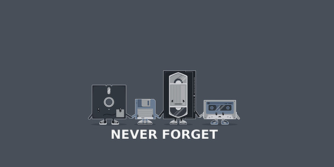
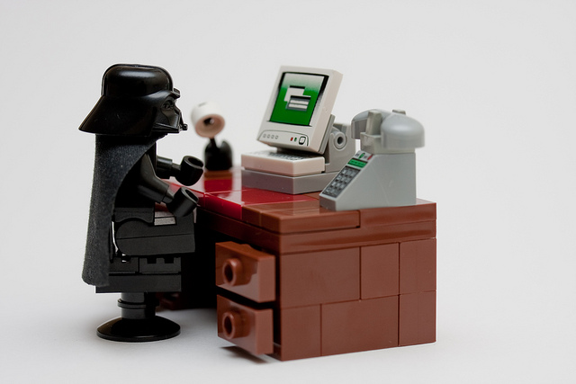
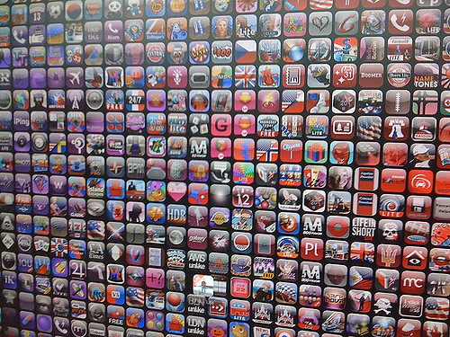
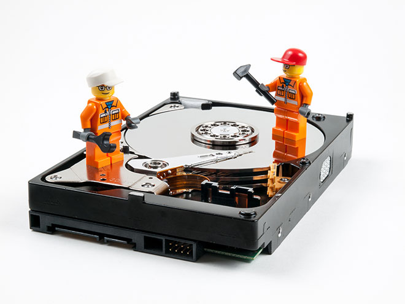

Oggi voglio raccontarti di un ciclo vitale un po’ particolare: il ciclo di vita di un dispositivo informatico. Dirai tu: “Mamma mia che barba! Rick, ma che diamine dovrebbe importarmi di sapere qual è il ciclo vitale di uno smartphone o di un computer?” E se ti dicessi che questo ti aiuterebbe ad aumentare le tue competenze digitali e a prenderti cura dei tuoi dispositivi in maniera migliore e senza disturbare il cugino smanettone? 😉

## Che cos’è davvero un dispositivo informatico?
È opinione diffusa far coincidere il ciclo di vita di un dispositivo con quello dell’oggetto fisico. A mio modo di vedere, c’è di più.

**In generale, un dispositivo informatico è un congegno che provvede a determinate funzioni.**

Come? Attraverso il suo design, i suoi componenti e il suo **sistema operativo**. **Il sistema operativo**! Senza di esso uno smartphone, un tablet, un computer sarebbero solo ferraglia. Al tempo stesso, senza “ferraglia” non avremmo niente su cui far girare un sistema operativo.

> *Un dispositivo informatico è l’insieme di 3 elementi: design, componenti, sistema operativo.*

Maggiore è l’armonia tra essi, migliore sarà il suo funzionamento e quindi la tua esperienza di utilizzo, che sia per svago o per lavoro. Design, componenti elettronici e sistema operativo, considerati insieme, determinano una sequenza ben definita di fasi vitali di un dispositivo informatico sulle quali possiamo agire per sfruttarlo al massimo e allungargli la vita.

## Installazione

Questa fase riguarda più da vicino i personal computer e i Mac perché su smartphone e tablet il sistema operativo è preinstallato e, tendenzialmente, non modificabile. Se hai un Mac, la scelta è limitata: muovendoti all’interno dei vari vincoli dei modelli supportati, puoi installare solo una versione di OS X alla volta, più o meno recente. Se hai un PC, potenzialmente, puoi sbizzarrirti installando una o più versioni di Windows, dalla più vecchia alla più nuova, o magari insieme a una distribuzione di GNU/Linux. Calma 🙂 La scelta di installare dei sistemi dual-boot, ovvero più sistemi operativi installati contemporaneamente sullo stesso dispositivo, era in voga qualche anno fa ma ormai i programmi di virtualizzazione sono così veloci e potenti che creare delle macchine virtuali è un gioco da ragazzi, aiutandoti inoltre a prevenire mal di testa e imprecazioni blasfeme 🙂 Non esiste una scelta migliore in assoluto bensì la scelta migliore rispetto alle tue esigenze e ai mezzi che hai a disposizione. Come si fa quindi a decidere qual è la versione migliore del sistema operativo compatibile col proprio PC o Mac? Ecco alcuni suggerimenti sempre validi:
- **informati sui requisiti consigliati** per un sistema operativo piuttosto che su quelli *minimi* perchè con questi ultimi l’esperienza di utilizzo di un computer non è **mai** soddisfacente;
- se la versione più adatta del sistema operativo scelto non è l’ultima, assicurati almeno che sia supportata per gli aggiornamenti di sicurezza;
- so che in un angolino della tua testa l’hai pensato quindi ti anticipo: no, niet, nada Windows XP! Il mondo deve andare avanti!
- per quanto riguarda i PC Windows, verifica che esistano i driver per tutti componenti del tuo computer e per tutte le tue periferiche;
- se usi programmi particolari che sono indispensabili per il tuo business o per la tua vita digitale, verifica che siano compatibili col sistema operativo che hai scelto.

So che alcune di queste operazioni possono richiedere del tempo ma ritengo sia meglio investire qualche ora di “ricerche” prima di ritrovarsi bloccati con un computer funzionante a metà o per niente. Sei d’accordo con me?

## Configurazione

Questa fase del ciclo di vita di un dispositivo informatico è comune a qualunque tipologia di apparecchio. Ora che il sistema operativo del computer è installato o che hai appena tirato fuori dalla scatola il tuo tablet/smartphone,  puoi passare alla configurazione delle cose indispensabili:
- aggancia il tuo dispositivo alla rete di casa o dell’ufficio;
- prima di fare qualunque altra cosa, installa un buon antivirus!
- fai gli aggiornamenti di sicurezza che ti vengono proposti, è importante!
- configura le tue caselle di posta elettronica;
- imposta il computer per lavorare insieme al tuo smartphone o tablet, di modo che tutta la tua vita digitale sia facilmente accessibile su tutti i tuoi dispositivi;
- installa le periferiche che dovrai utilizzare insieme al tuo dispositivo: stampanti, scanner, eccetera eccetera.

A questo punto sei pronto per fruire dei contenuti e dei servizi di Internet. Fino a qualche anno fa per fare tutto questo avresti dovuto scaricare e installare quasi una decina di applicativi. Per fortuna non è più così e ora i sistemi operativi (finalmente anche Windows) offrono da subito tutti gli strumenti per essere operativi e collegati ai tuoi dati e alla tua vita digitale.

## Pausa!
No, questa non è una fase del ciclo di vita di un dispositivo 🙂 È un articolo tosto, lo so, la tua testa sta assorbendo tantissimi concetti ognuno dei quali potrebbe benissimo essere un articolo a sé. Fai un minuto di pausa durante il quale sorseggiare la tua bevanda preferita e… darmi un piccolo aiuto, se ti va. Se condividessi questo articolo sui tuoi social preferiti per me sarebbe prezioso come ricevere un tuo “Grazie” a viva voce.

## Installazione delle applicazioni

È il momento di diventare produttivi: elaboratore di testo, fogli di calcolo, ritocco o archiviazione di fotografie, contabilità, disegno, messaggistica, insomma tutto quello che ti serve nel caso in cui tu debba produrre contenuti col tuo dispositivo informatico. Alcuni suggerimenti:
- su computer, assicurati di aver installato eventuali prerequisiti della tua applicazione;
- installa il minimo indispensabile: più app e programmi installerai suoi tuoi dispositivi, più memoria e spazio di archiviazione occuperai e peggiori saranno le prestazioni e la stabilità;
- questo suggerimento è valido specialmente per smartphone e tablet: se il sito web del servizio online che usi è ottimizzato per funzionare sui dispositivi mobili, perchè installare un’app? Risparmia spazio, memoria e la seccatura di decine di notifiche inutili che, tra l’altro, ti distraggono riducono drasticamente la durata della batteria.

## Ottimizzazione e manutenzione

Questa è la fase sulla quale possiamo lavorare di più per fare in modo che tutto fili liscio come l’olio col passare del tempo. Una volta, specialmente sui PC Windows, si dovevano perdere intere giornate a fare deframmentazioni, checkdisk, cose del genere. Anche in questo caso, fortunatamente, le operazioni di routine si sono ridotte e semplificate di molto.
- disabilita servizi, funzionalità o notifiche delle app di sistema che non usi;
- se ne hai la possibilità, disinstalla le app che non utilizzi;
- su computer quando installi nuovi applicativi e ti viene chiesto se vuoi farli partire all’avvio, valuta bene se sia davvero utile: sicuro sia necessario che un programma tipo Adobe Reader parta all’avvio del PC o del Mac?
- su smartphone, dopo aver installato una nuova app, domandati se davvero ti servano le notifiche;
- periodicamente fai “un giro” tra le applicazioni installate e disinstalla quelle che non usi più;
- ogni sistema operativo ha le sue peculiarità e operazioni di routine per mantenere reattivo il dispositivo su cui gira: imparale e mettile in pratica.
- che sia l’hard disk di un computer o la memoria di uno smartphone/tablet, assicurati di non saturare lo spazio di memorizzazione.

Su questa parte ci si potrebbe dedicare un intero blog! È impossibile esaurire le possibili ottimizzazioni e manutenzioni nelle poche righe di un articolo ma queste che ti ho riportato sono sicuramente un’ottima base da cui partire.

## Aggiornamento o dismissione?

Ed eccoci ad un nodo cruciale nel ciclo di vita di un dispositivo. Sono passati anni, l’hai mantenuto a puntino ma, aggiornamento dopo aggiornamento, comincia comunque ad essere un po’ lento oppure a non supportare più nuove versioni dei programmi o delle app che ti servono. Che si fa? Se si tratta di un computer, puoi pensare di espandere la RAM: con una spesa modica potresti avere enormi benefici. Stesso discorso per l’hard disk: se il tuo computer ne usa ancora uno di quelli “tradizionali”, passare ad un disco SSD gli darà una seconda vita! Diverso il discorso per smartphone e tablet: qui la decisione è più legata alla compatibilità delle app. Tutt’al più, se hai uno smartphone con memoria espandibile, puoi pensare di comprare una scheda SD più capiente ma, data la natura di questo tipo di dispositivi, la decisione tra aggiornare o dismettere per comprarne uno nuovo è più netta e meno rimandabile rispetto ad un computer.

## Conclusione

Prima di tutto grazie per avermi dedicato la tua attenzione fino a qui, leggendo uno degli articoli sicuramente più lunghi di questo blog. È stato difficile condensare così tanti concetti in 1500 parole ma spero di essere riuscito a trasmetterti tutto nella maniera più chiara e semplice possibile. Se hai bisogno di un aiuto, come sempre sono qui 🙂 Tu come ti prendi cura del tuo dispositivo? Hai qualche idea che possa ulteriormente migliorarne la gestione o aiutare qualcuno a sfruttarlo meglio? Ti aspetto nei commenti per parlarne insieme!

Riccardo