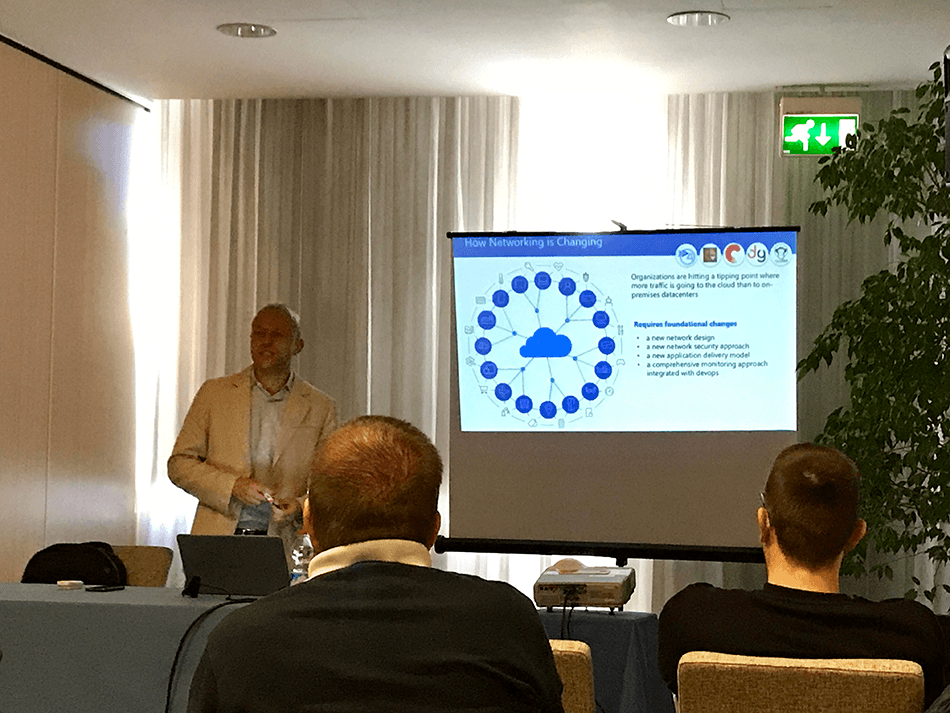
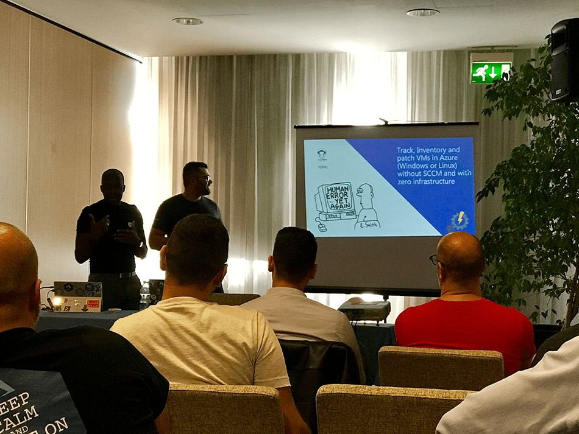
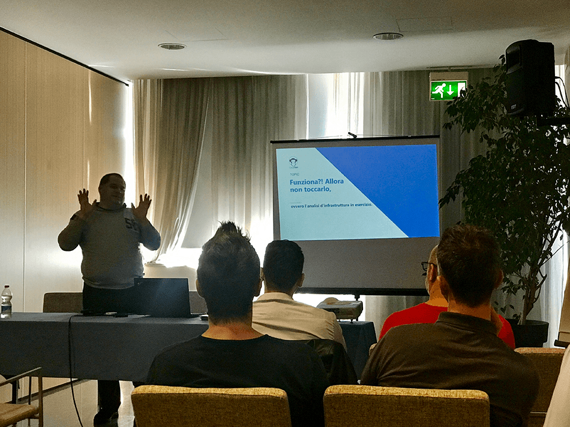
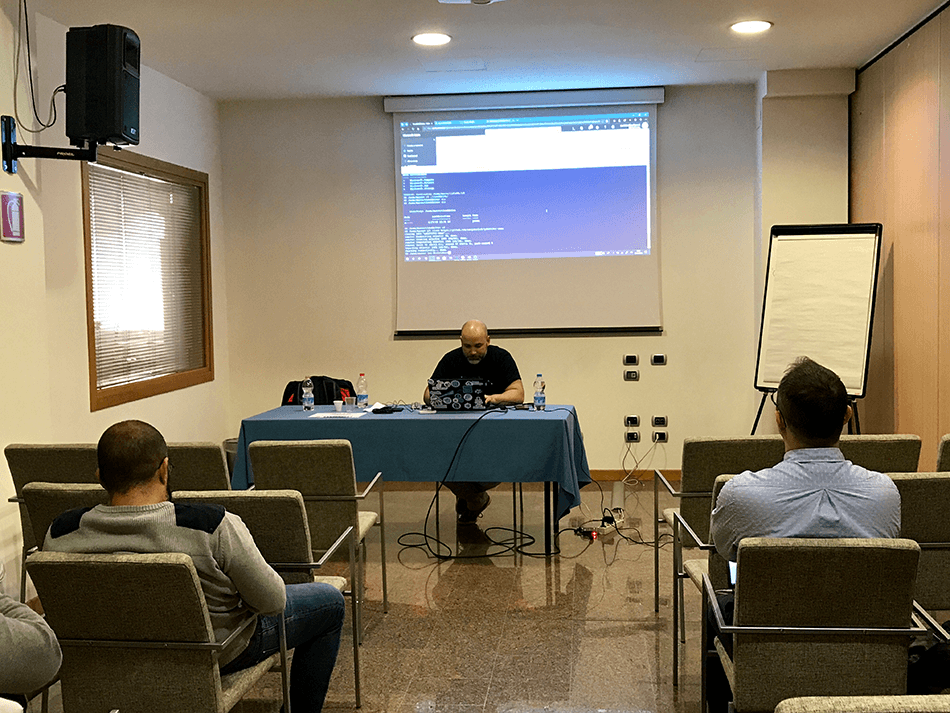
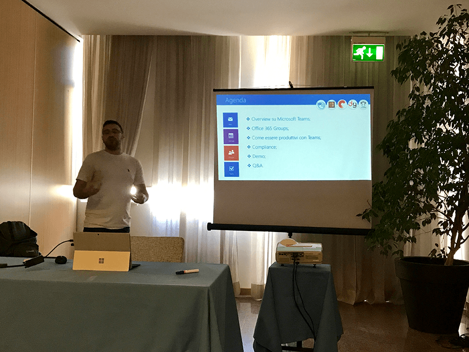

Queste ultime giornate un po’ ventose hanno sospinto la nuvoletta di Azure verso Verona, dove sabato 27 Aprile 2019 si è tenuta una delle tappe italiane del Global Azure Bootcamp. Di seguito un mini-racconto della mia giornata all’evento.

## Cos’è il Global Azure Bootcamp
Il Global Azure Bootcamp è un evento mondiale in cui centinaia di gruppi e community che si occupano di cloud computing organizzano localmente sul proprio territorio giornate di formazione e conferenze su questo tema. Quest’anno in Italia si sono tenuti 4 eventi: Milano, Torino, Caserta, Verona.

## Il Global Azure Bootcamp di Verona
Io sono stato all’evento di Verona organizzato dai ragazzi dell’associazione [CloudGen](https://cloudgen.it/). Sotto gli auspici di una splendida e calda giornata di primavera e dopo una sveglia traumatica intorno alle 5.30 del mattino, mi sono mosso da Milano intorno alle 7.00, raggiungendo facilmente la sede dell’evento per le 8.30. Unica nota negativa? La mia intempestiva ed inopportuna voglia di fare il giovane frizzante nottambulo la sera prima, rientrando a casa alle 2.30 dopo una serata con gli amici a base di birra e chupiti di rum 🙂 Confesso che c’ho messo un po’ a carburare!

Quello che mi aspettavo e che desideravo portare a casa da questo evento erano spunti utili a migliorare la mia conoscenza di Azure negli ambiti networking, architetture cloud, approccio DevOps al cloud. Aspettative totalmente soddisfatte grazie ad una scaletta di argomenti varia e ben calibrata, un’organizzazione precisa e, chiaramente, grazie anche all’esperienza e alla competenza degli speaker. La mia giornata si è svolta prevalentemente in sala “Infrastructure”, ecco il mio racconto.

## Come realizzare architetture di rete ibride, sicure e funzionali in Azure

Nella prima conferenza si è parlato dei principi di funzionamento base delle Virtual Network in Azure e di come sia possibile mettere in comunicazione il mondo cloud con il mondo on-premises, attraverso architetture ibride realizzate secondo le best practice suggerite da Microsoft e anche dall’esperienza di [Francesco Molfese](https://twitter.com/francescomolf), che ha raccontato il tutto in maniera semplice ed estremamente chiara. Sono rimasto particolarmente colpito dalla funzionalità [ExpressRoute Global Reach](https://azure.microsoft.com/en-us/updates/expressroute-global-reach-is-now-available/).

## Track, Inventory and patch VMs in Azure (Windows or Linux) without SCCM and with zero infrastructure

Un’esigenza che sta nascendo sempre più di frequente in alcuni clienti, soprattuto chi ha già iniziato ad intraprendere un percorso “cloud-first”, è quella di affrontare i vari aspetti di gestione di un parco macchine senza avere alcuna infrastruttura System Center Configuration Manager (SCCM) on premises.

Ho espresso la mia opinione a riguardo in un articolo scritto poco tempo fa dove ho affrontato alcuni aspetti del [device management in ambito Azure Active Directory](/differenza-azure-ad-registered-azure-ad-joined-hybrid-azure-ad-joined/): per chi ha investito molto in un’infrastruttura SCCM on-premises articolata, regolandola a puntino per gestire inventory, tracking, aggiornamenti, eccetera, è impensabile poter staccare di colpo il cordone ombelicale. Azure in questo momento non offre lo stesso tipo di granularità nel controllare questo aspetto. Per chi invece ha iniziato ad intraprendere il viaggio verso il cloud senza avere strumenti di tracking, inventory e patch management, Azure offre degli strumenti veramente interessanti.

Questa sessione, oltre agli interessanti spunti tecnici, è stata una sorta di stand-up comedy applicata al mondo delle conferenze IT grazie alla strana coppia formata da [Florent Appointaire](https://twitter.com/florent_app) e [Samuel Erskine](https://twitter.com/samerskine): ci hanno fatto letteralmente rotolare dalle risate, Sam è un personaggio assoluto!

## Funziona?! Allora non toccarlo, ovvero l’analisi d’infrastruttura in esercizio

Un approccio decisamente innovativo e in salsa DevOps quello proposto da [Giuliano Latini](https://twitter.com/giulianolatini). Con una ricerca personale continua e uno spirito di sperimentazione fuori dal comune, è riuscito a trovare nelle pieghe di Azure Kusto (una piattaforma per interrogazioni sui big data) elementi interessanti e utili anche all’analisi di infrastruttura degli oggetti Azure: VM, Load Balancer, eccetera. La funzionalità è ancora in preview e il supporto al linguaggio Kusto query non è completo ma, con un po’ di fantasia e codice, si possono realizzare delle query incredibili, in read-only e senza intaccare in alcun modo l’infrastruttura.

## Gestisci il tuo ambiente cloud con Azure Cloud Shell

Sessione interessantissima quella di Marco Obinu densa di contenuti utili immediatamente applicabili alle operazioni di tutti i giorni che si svolgono su Azure. L’Azure Cloud Shell e, più in generale, PowerShell, sono strumenti che permettono davvero di risparmiare tempo e fatica e, soprattutto, sono utilizzabili da qualunque dispositivo. Impressionante, nella parte finale di demo, l’Azure Cloud Shell eseguita live su un dispositivo Android.

## Produttività con Microsoft Teams

Teams è lo strumento col più alto e veloce tasso di crescita mai registrato per un prodotto Microsoft e sta entrando prepotentemente nelle abitudini quotidiane di moltissime aziende. Dal momento che, dietro certi punti di vista, è una sorta di “raccoglitore” di molte funzionalità, per chi lo amministra può non essere immediato comprendere a quali altri strumenti di Office 365 si appoggi e “cosa venga creato/memorizzato dove”.

A mettere a fuoco i concetti principali ci ha pensato [Denis Signorelli](https://twitter.com/signorellidenis), con una panoramica introduttiva a Microsoft Teams molto chiara e concreta.

Personalmente, utilizzo Teams quotidianamente eppure Denis è riuscito svelare al pubblico alcune autentiche chicche.

## Conclusioni di fine giornata
Cosa mi è piaciuto:
- evento ben organizzato;
- speaker di grande esperienza e competenza;
- in una sola giornata ci si porta a casa una tonnellata di spunti utili ed immediatamente spendibili sulle proprie attività;
ottima varietà degli argomenti trattati.

Da migliorare:
- in alcune sessioni gli orari non sono stati rispettati: non è un problema in sé ma questa compressione degli intervalli tra una sessione e l’altra ha di fatto ridotto all’osso le possibilità di scambiare 4 chiacchiere e fare un po’ di networking, cosa che a mio modo di vedere è fondamentale in questo tipo di eventi;
- la location, per quanto abbia supportato più che degnamente l’evento, non permetteva di vivere moltissimo gli spazi al di fuori delle sale e anche questo è un elemento a sfavore del fare rete.

Assolutamente da non ripetere:
- fare serata con gli amici fino alle 2.30 la notte prima di questo tipo di eventi (vedi sguardo perso e semi-nascosto dagli occhiali da sole in questa foto scattata alle 8.45 del mattino) 🙂

Grazie per avermi letto fino a qui, spero di averti raccontato al meglio questo evento, a presto!

Riccardo

