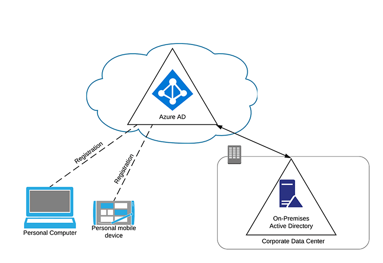
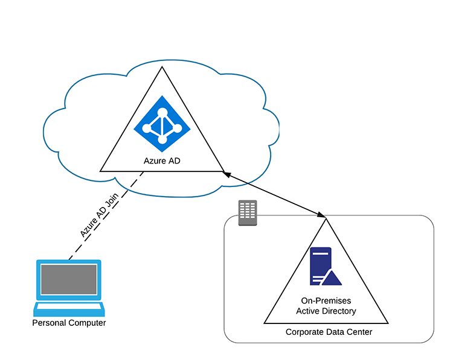
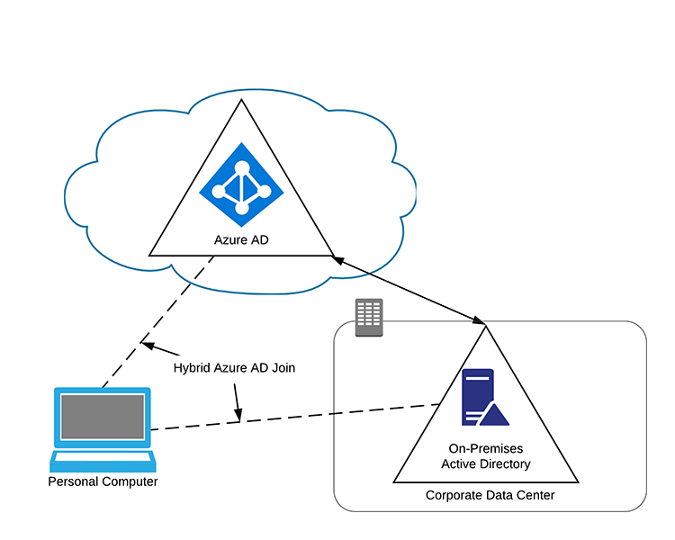

L’utilizzo sempre più massivo di servizi cloud anche su dispositivi personali, sia mobili che non, mette davanti a delle grandi sfide chi gestisce un’infrastruttura IT.

Da una parte è necessario dare agli utenti la giusta flessibilità nell’accesso ai servizi online anche sui dispositivi personali ma dall’altra parte questo rende più sfidante mettere in sicurezza le risorse aziendali. Azure AD mette a disposizione diverse modalità di censire, registrare e controllare varie tipologie di dispositivi: personali e aziendali, computer (desktop o laptop) e dispositivi mobili. Quali sono i possibili stati di registrazione di un dispositivo? Eccoli:
- [Azure AD Registered](#azure-ad-registered)
- [Azure AD Joined](#azure-ad-joined)
- [Hybrid Azure AD Joined](#hybrid-azure-ad-join)

Ultimamente, quando mi trovo dai clienti per svolgere attività legate in qualche modo a come Azure AD censisce i dispositivi, ho notato che la più grande fonte di dubbi è comprendere la differenza tra i vari stati di registrazione e le loro potenzialità. Le domande che mi vengono poste tipicamente sono:

> *Qual è la differenza tra questi 3 stati di registrazione?*

> *Che tipo di controlli e funzionalità ho a disposizione a seconda di come sono registrati?*

Facciamo un po’ di chiarezza? Via!

## Azure AD Registered

Questo è un tipico scenario BYOD (Bring Your Own Device) in cui un utente accede, attraverso un work account, alle risorse aziendali dal proprio dispositivo personale. Quando l’utente accede, il dispositivo viene registrato in Azure AD (Azure AD Registered appunto) e, volendo, è anche possibile effettuare un enrollment all’interno del sistema MDM.

### Quali dispositivi possono essere Azure AD Registered?
- Windows 10
- macOS
- iOS
- Android

### Che tipo di controllo ho su dispositivi Azure AD Registered?
Puoi impostare Azure AD di modo che, per accedere ai servizi aziendali, il dispositivo personale rispetti certi requisiti di sicurezza come ad esempio impostare la Multi Factor Authentication (MFA), e via dicendo. La registrazione permette anche di configurare un accesso con esperienza Single Sign On verso le applicazioni cloud dell’azienda e, con le opportune configurazioni in uno scenario WAP + ADFS + Azure AD Device Writeback, anche ad applicazioni on-premises.

## Azure AD Joined

La prima grande differenza rispetto ad un dispositivo Azure AD Registered riguarda la proprietà del dispositivo stesso: mentre prima stavamo parlando di un dispositivo personale, in questo caso stiamo parlando di un dispositivo di proprietà dell’azienda. Abbiamo quindi un maggior controllo su tutto il ciclo di vita e gestione del dispositivo, in particolare su questi 3 aspetti:
- deployment di Windows
- accesso alle applicazioni aziendali dai dispositivi Windows
- gestione dei dispositivi Windows basata su una tecnologia cloud

**L’Azure AD Join è quindi ideale per le organizzazioni che vogliono essere “cloud-first”. La join ad Azure AD esclude la possibilità di joinare il dispositivo Windows al dominio Active Directory on-premises.**

Joinare un dispositivo ad Azure AD è differente rispetto al joinare un dominio Active Directory on-premises, ed è bene rimarcare la principali differenza:

- la gestione centralizzata di un dispositivo Azure AD Joined viene fatta dal sistema MDM (come Intune ad esempio) mentre lo strumento principale usato su un dominio Active Directory on-premises sono le Group Policy (GPO)

Al momento della scrittura di questo articolo è possibile usare alcuni template ADMX via Intune ma, chiaramente, non si hanno a disposizione tutti gli strumenti che solitamente si avrebbero con le GPO.

Ok, è ora di riassumere!

### Quali dispositivi possono essere Azure AD Joined?
- Windows 10 e Windows 11

### Che tipo di controllo ho su dispositivi Azure AD Joined?
In breve, le funzionalità che si possono utilizzare e i benefici che si possono ottenere attraverso Azure AD Join:
- **Single-Sign-On (SSO)** verso applicazioni e servizi SaaS gestiti in Azure;
- **Roaming delle impostazioni** profilo degli utenti tra i dispositivi;
- **Accesso al Windows Store for Business** attraverso un’utenza Azure AD;
- **Windows Hello**;
- **Restrizione dell’accesso alle applicazioni** solo dai dispositivi che rispettano certi requisiti di sicurezza e conformità;
- **Accesso senza soluzione di continuità (seamless access) alle risorse on-premises** quando il dispositivo si trova nel “campo visivo” del domain controller on-premises.

Azure AD Join è quindi ideale in queste situazioni:
- infrastruttura basata su cloud e gestione dei dispositivi attraverso un sistema MDM come Intune;
- i tuoi utenti accedono principalmente ad applicazioni e servizi SaaS gestiti in Azure
- (esempio) vuoi maggiore controllo sui dispositivi di uffici remoti con un’infrastruttura on-premises limitata

## Hybrid Azure AD Join

Moltissime aziende usano Active Directory on-premises ormai da più di 10/15 anni. Questa tecnologia ha permesso ai loro dipartimenti IT di gestire centralmente i dispositivi aziendali (siano essi client o server) e consentito agli utenti di autenticarsi con le loro identità aziendali.

Tipicamente, queste aziende utilizzano un’immagine di sistema operativo standardizzata la cui distribuzione viene orchestrata attraverso System Center Configuration Manager (SCCM). Alcune delle impostazioni dell’esperienza utente e delle macchine sono gestite da SCCM stesso ma la maggior parte di questo lavoro viene fatto dalle Group Policy di Active Directory.

Questo tipo di architettura è molto comune in tantissime realtà aziendali e, nel corso degli anni, specialmente per quanto riguarda SCCM, l’infrastruttura potrebbe essere cresciuta ed essersi evoluta in qualcosa di più complesso che assolve alla gestione di tutte le [fasi del ciclo vitale di un dispositivo](/ciclo-di-vita-di-un-dispositivo-informatico/) in azienda: imaging, deployment, inventory, aggiornamenti, distribuzione di applicazioni Win-32, configurazioni dell’esperienza utente e via dicendo. Per questo motivo, quando si è raggiunto un controllo così granulare di questi aspetti sul proprio parco macchine, è difficile se non impensabile tagliare improvvisamente il cordone ombelicale con l’Active Directory on-premises ed SCCM.

È in situazioni come queste che torna utile l’Hybrid Azure AD Join! Attraverso opportune configurazioni, le macchine joinate al dominio on-premises vengono rappresentate e registrate anche su Azure AD, di modo da poter sfruttare appieno anche gli strumenti cloud per i dispositivi. A livello di gestione dei dispositivi, Intune ed SCCM possono anche coesistere (co-management) con l’unica accortezza di non sovrapporne gli ambiti d’azione.

Riassuntino? Sì!

### Quali dispositivi possono essere Hybrid Azure AD Joined?
- Windows 10
- Windows Server 2016
- Windows Server 2019

Con opportuni accorgimenti e configurazioni:
- Windows 8.1
- Windows 7
- Windows Server 2012 R2
- Windows Server 2012
- Windows Server 2008 R2

## Conclusione e approfondimenti
L’argomento è veramente vasto e ogni configurazione ha i suoi scopi, i suoi pro e i suoi contro.

> *La soluzione giusta per te dipende da un’analisi del tuo ambiente attuale e dalla strategia evolutiva che hai immaginato per la tua infrastruttura.*

Se vuoi approfondire ulteriormente l’argomento, ecco due articoli Microsoft dove troverai sicuramente materiale interessante:
- [What is device management in Azure AD?](https://docs.microsoft.com/en-us/azure/active-directory/devices/overview)
- [Compare Azure AD Join and Active Directory Domain Services](https://docs.microsoft.com/en-us/azure/active-directory-domain-services/active-directory-ds-compare-with-azure-ad-join)

Sono riuscito a fare chiarezza? Spero di sì! Ti aspetto nei commenti per parlarne!

Riccardo