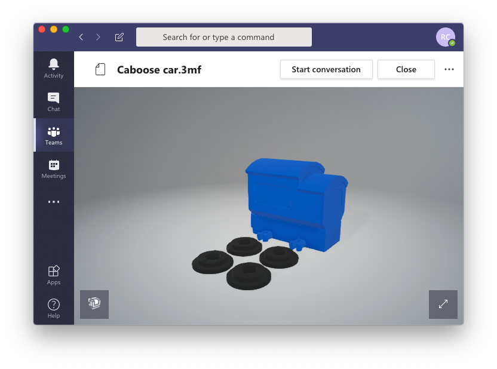

L’anteprima file Microsoft Teams supporta ormai tantissimi formati di file che possono essere visualizzati direttamente all’interno dell’applicazione.

## Vantaggi dell’anteprima file Microsoft Teams
I vantaggi di uno spazio di lavoro unificato ed orientato alla collaborazione sono molteplici:
- comunicazioni più facili ed immediate;
- condivisione dati tra i collaboratori a portata di mano;
- poter visualizzare direttamente nello spazio di lavoro i contenuti su cui si sta collaborando, indipendentemente dal fatto che siano file di Office o meno, fa risparmiare molto tempo;
- non è più necessario installare l’applicazione utilizzata per creare un certo tipo di file.

## Tipi di file supportati
Di seguito l’elenco dei tipi di file supportati dall’anteprima file Microsoft Teams:
- **3D Modeling/Printing**: 3MF, COOL, GLB, GLTF, OBJ, STL
    - ***Nota:*** *per questo tipo di contenuti, OneDrive può mostrare anteprime di file 3D fino a 250 MByte;*
- **Apple**: MOVIE, PAGES, PICT, SKETCH
- **Adobe**: AI, PDF, PSB, PSD
- **Audio/Video Media Files**: 3G2, 3GP, ASF, BMP, M2TS, M4V, MOV, MP3, MP4, MP4V, MTS, TS, WMV
- **AutoCAD**: DWG
- **AutoDesk**: FBX
- **BioWare Game Engine**: ERF
- **Compressed File**: ZIP
- **Compressed File (Unix)**: Z
- **DICOM Medical Images**: DCM, DCM30, DICM, DICOM
- **Finale**: PLY
- **HydroCAD**: HCP
- **Image Formats**: GIF, JPEG, JPG. JPE, MEF, MRW, NEF, NRW, ORF, PANO, PEF, PNG, SPM, TIF, TIFF, XBM, XCF
    - ***Note:*** *OneDrive può mostrare icone o anteprime di immagini che non superino i 100 Mbyte (approssimativamente 12000 x 8000 pixel);*
- **License Key**: KEY
- **Log Files**: LOG
- **Microsoft Office (Word, PowerPoint, Excel)**: CSV, DIC, DOC, DOCM, DOCX, DOTM, DOTX, POT, POTM, POTX, PPS, PPSM, PPSX, PPT, PPTM, PPTX, XD, XLS, XLSB, XLSX, SLTX
- **Microsoft Outlook**: EML, MSG
- **Microsoft Visio**: VSD, VSDX
- **Microsoft Windows**: CUR, ICO, ICON
- **Open eBook**: EPUB
- **OpenOffice**: ODP, ODS, ODT
- **Photo**: ARW, CR2, CRW, DNG
- **Rich Text Format**: RTF
- **Text and Code**: ABAP, ADA, ADP, AHK, AS, AS3, ASC, ASCX, ASM, ASP, AWK, BAS, BASH, BASH_LOGIN, BASH_LOGOUT, BASH_PROFILE, BASHRC, BAT, BIB, BSH, BUILD, BUILDER, C, C++, CAPFILE, CBK, CC, CFC, CFM, CFML, CL, CLJ, CMAKE, CMD, COFFEE, CPP, CPT, CPY, CS, CSHTML, CSON, CSPROJ, CSS, CTP, CXX, D, DDL, DI. DIF, DIFF, DISCO, DML, DTD, DTML, EL, EMAKE, ERB, ERL, F90, F95, FS, FSI, FSSCRIPT, FSX, GEMFILE, GEMSPEC, GITCONFIG, GO, GROOVY, GVY, H, H++, HAML, HANDLEBARS, HBS, HRL, HS, HTC, HTML, HXX, IDL, IIM, INC, INF, INI, INL, IPP, IRBRC, JADE, JAV, JAVA, JS, JSON, JSP, JSX, L, LESS, LHS, LISP, LOG, LST, LTX, LUA, M, MAKE, MARKDN, MARKDOWN, MD, MDOWN, MKDN, ML, MLI, MLL, MLY, MM, MUD, NFO, OPML, OSASCRIPT, OUT, P, PAS, PATCH, PHP, PHP2, PHP3, PHP4, PHP5, PL, PLIST, PM, POD, PP, PROFILE, PROPERTIES, PS, PS1, PT, PY, PYW, R, RAKE, RB, RBX, RC, RE, README, REG, REST, RESW, RESX, RHTML, RJS, RPROFILE, RPY, RSS, RST, RXML, S, SASS, SCALA, SCM, SCONSCRIPT, SCONSTRUCT, SCRIPT, SCSS, SGML, SH, SHTML, SML, SQL, STY, TCL, TEX, TEXT, TEXTILE, TLD, TLI, TMPL, TPL, TXT, VB, VI, VIM, WSDL, XAML, XHTML, XOML, XML, XSD, XSL, XSLT, YAML, YAWS, YML, ZSH
- **Web/Hypertext**: HTM, HTML, Markdown, MD, URL

##  Altri prodotti che supportano l’anteprima file
Microsoft Teams, in fin dei conti, non è altro che un contenitore che si basa su altri prodotti della suite Office 365. Per questo, lo stesso ragionamento fatto per le anteprime dei file vale anche per:
- Sharepoint Online
- Office for business
- OneDrive for business

## Fonti
Un numero sempre maggiore di formati verrà supportato da Microsoft Teams e, per quanto io cerchi di stare al passo con le novità, potrebbe sfuggirmi qualcosa 🙂
Per questo, se vuoi ulteriori approfondimenti, ecco la pagina ufficiale dove sono riportati tutti i dettagli per soddisfare la tua curiosità:
- F[ile types supported for previewing files in OneDrive, SharePoint, and Teams](https://support.office.com/en-us/article/file-types-supported-for-previewing-files-in-onedrive-sharepoint-and-teams-e054cd0f-8ef2-4ccb-937e-26e37419c5e4)

Grazie di avermi seguito fino a qui 🙂
A presto!

Riccardo