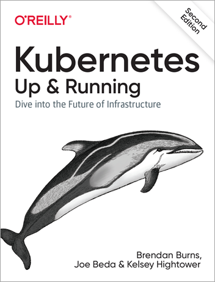

Oggi ho raccolto per te un un ebook gratis su Kubernetes. Gli ebook gratuiti sono una grandissima risorsa di formazione in un ambito come il nostro che cambia così velocemente.

Per questo, appena ne vedo uno, mi ci fiondo sopra come un avvolotoio 🙂

Oggi ti segnalo un interessantissimo ebook riguardante Kubernetes.
Se sei un sistemista di provenienza un po’ più “classica”, se di recente ti stai avvicinando ad un approccio DevOps del tuo lavoro o, più semplicemente, se ti incuriosisce Kubernetes, questa è una lettura ideale!

Ecco il link dove poter scaricare l’ebook gratis:
- [Kubernetes: Up & Running](https://azure.microsoft.com/en-us/resources/kubernetes-up-and-running/)

Come ogni risorsa gratuita, viene richiesta una registrazione per la quale servono alcuni dati. Se invece disponi già di un Microsoft Account o di un account GitHub, sarà sufficiente autenticarsi.

Se hai altre letture interessanti da suggerire, ti aspetto nei commenti per parlarne.

Buona lettura!

Riccardo