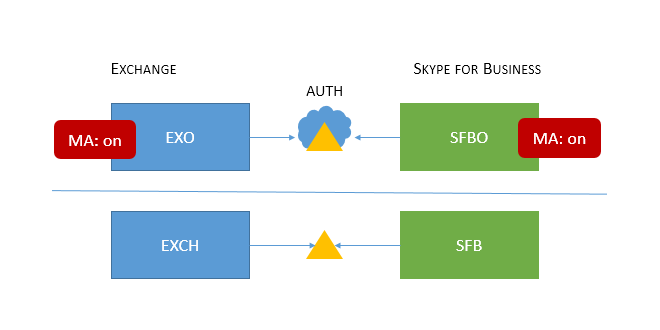
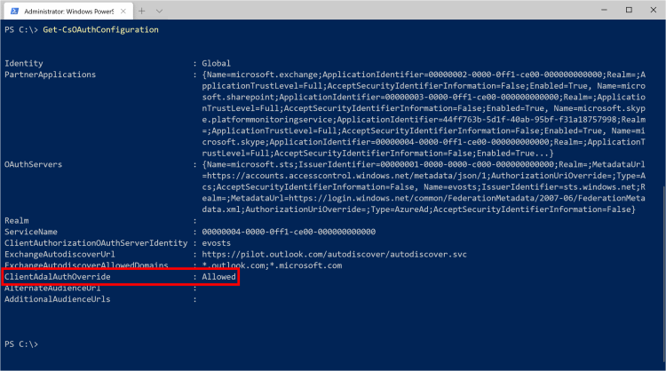
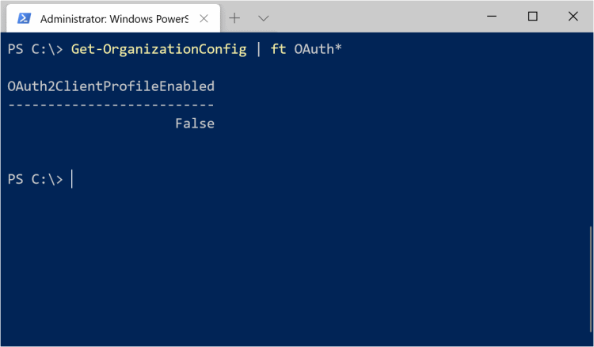
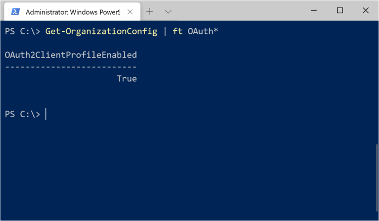

Nell'ultimo anno mi sta accadendo sempre più spesso di essere coinvolto in attività che hanno a che fare col mettere in sicurezza le identità degli utenti Azure Active Directory durante la fase di autenticazione ai vari servizi della suite Office 365.

Azure AD mette a disposizione una grande varietà di tecnologie in questo senso, tra cui la più famosa ed utilizzata è sicuramente la **Multi Factor Authentication** (d'ora in poi MFA). L'implementazione della MFA ormai è molto diffusa ed è sempre più facile attivarla ma **non è così scontato come sembra riuscire a mettere in pista una strategia efficace: ci sono alcuni elementi e configurazioni del proprio tenant che vanno attentamente valutati.**

Per questo motivo oggi vorrei guidarti in questo percorso per comprendere cosa significa in ambito Azure AD il termine **Modern Authentication** e perché è così importante verificarne lo stato prima di implementare la Multi Factor authentication.

## Cosa significa Modern Authentication

Modern Authentication (d'ora in poi MA) è un termine che indica un insieme di tecnologie e modalità di autenticazione/autorizzazione tra un client e un server, il tutto coadiuvato da meccanismi di accesso condizionale. La MA quindi comprende, tra le altre cose:
- metodi di autenticazione come ad esempio la Multi Factor Authentication (MFA);
- metodi di autorizzazione come Microsoft OAuth;
- i meccanismi e i criteri di conditional access di Azure Active Directory.

Quelli elencati sono alcuni degli strumenti a disposizione degli amministratori per implementare una strategia di gestione e messa in sicurezza delle identità del proprio ambiente, sia esso on-premises, cloud o ibrido.

***La Multi Factor Authentication quindi è un metodo di autenticazione che ricade sotto l'ombrello di tecnologie della Modern Authentication.***

## Quali servizi Office 365 utilizzano la MA?
I principali servizi per cui è opportuno verificare in quale stato di attivazione si trovi la MA sono:
- Exchange Online (EXO)
- Skype For Business Online (SFBO)
- Sharepoint Online (SPO)

## La MA è già attiva sul mio tenant?
La risposta è: dipende.  
Se il tuo tenant Azure AD è stato creato prima di Agosto 2017, lo stato di attivazione di default della MA per i servizi elencati poco sopra è il seguente:
- **EXO**: disabilitata
- **SFBO**: disabilitata
- **SPO**: abilitata

Se il tuo tenant è stato creato a partire da Agosto 2017:
- **EXO**: abilitata;
- **SFBO**: abilitata;
- **SPO**: abilitata.

Questa discrepanza tra gli stati di attivazione può avere un notevole impatto sull'implementazione della tua strategia di Multi Factor Authentication.

## In che modo la MA influisce sulla Multi Factor Authentication?
Con la MA disabilitata, nel momento in cui tu volessi implementare la Multi Factor Authentication per i tuoi utenti, questa sarebbe utilizzabile solo su OWA via browser e non sulle applicazioni client (Outlook, ecc) installate sui PC degli utenti!

**In altre parole: una qualunque applicazione installata sul tuo client che supporti nativamente le tecnologie di Modern Authentication, non sarebbe in grado di utilizzarle.**

## Perchè è importante abilitare la Modern Authentication?
**Perchè è un prerequisito per un'implementazione della Multi Factor Authentication che possa definirsi completa.**

Attivandola, sarai in grado di coprire l'intera superficie degli accessi ai tuoi servizi, proteggendo sia quelli via web sia quelli via client.

## Cose utili da considerare prima di attivare la MA
Topologie di Skype for Business supportate con MA

In molte infrastrutture coesistono ambienti di Exchange e Skype for Business ibride. In figura trovi **un esempio** di architettura ibrida.

[](01-Modern-Authentication-Topologia-1.png)

Qualunque sia la tua topologia, ti consiglio di leggere questo articolo Microsoft in cui vengono descritte tutte le topologie di Skype for Business supportate per il buon funzionamento della Modern Authentication.
- [Topologie di Skype for Business supportate con la Modern Authentication](https://docs.microsoft.com/en-us/skypeforbusiness/plan-your-deployment/modern-authentication/topologies-supported)

In alcune topologie miste è inoltre opportuno distribuire una certa chiave di registro che serve a ridurre il numero di autenticazioni richieste e a migliorare l'esperienza utente in tal senso. A questo documento tutti i dettagli:
- [Informazioni sull'impostazione di AllowAdalForNonLyncIndependentOfLync in Skype for business](https://docs.microsoft.com/en-us/skypeforbusiness/troubleshoot/hybrid-exchange-integration/allowadalfornonlyncindependentoflync-setting)

## Considerazioni sui client Outlook
Mentre Outlook 2016 ed Outlook 365 supportano nativamente le tecnologie di MA, Outlook 2013 è configurato di default per non utilizzarle. Per "risvegliare" la sua capacità di supportare la Modern Authentication è sufficiente dfistribuire 2 chiavi di registro. Qui tutti i dettagli:
- [Abilitare l'autenticazione moderna per Office 2013](https://docs.microsoft.com/en-us/office365/admin/security-and-compliance/enable-modern-authentication?view=o365-worldwide)

## Pronti... partenza... VIA!
Perfetto! ora siamo veramente pronti! Vediamo quindi come abilitare la Modern Authentication per Exchange Online e Skype for Business Online. Faremo tutto via PowerShell ma non ti preoccupare, sono pochi comandi molto semplici, non hai scuse! ;)

## Abilitare la Modern Authentication per Skype For Business Online (SFBO)
1. Se non l'hai ancora fatto, scarica e installa [il modulo PowerShell di Skype for Business Online](https://aka.ms/SkypePowerShell)
2. Connettiti all'organizzazione SFBO
3. Verifica lo stato in cui si trova la Modern Authentication sul tuo tenant col seguente comando

```
Get-CsOAuthConfiguration
```

Il risultato dovrebbe essere una cosa simile all'immagine che vedrai sotto. Se i valori della voce **ClientAdalAuthOverride** dovessero essere **NoOverride** o **Disallowed**, significa che la MA è disabilitata.

[](02-Modern-Authentication-Get-CSOauthConfiguration-Before.png)

4. Ora non ti resta che abilitare la MA con il seguente comando

```
Set-CsOAuthConfiguration -ClientAdalAuthOverride Allowed
```

Perfetto! MA Abilitata! Come sapere se ha funzionato? È sufficiente rieseguire il comando lanciato 2 passaggi fa.

```
Get-CsOAuthConfiguration
```

Come puoi vedere, l'output ora ci dice che la MA è stata abilitata sul nostro tenant.

[](03-Modern-Authentication-Get-CSOauthConfiguration-After.png)

## Abilitare la Modern Authentication per Exchange Online (EXO)
1. [Connettiti via PowerShell all'organizzazione Exchange Online](https://docs.microsoft.com/en-us/powershell/exchange/exchange-online/connect-to-exchange-online-powershell/connect-to-exchange-online-powershell?view=exchange-ps)
2. Verifica in che stato sia la MA sull'organizzazione EXO attraverso il seguente comando

```
Get-OrganizationConfig | ft OAuth*
```

Verifica il risultato: se il valore risulta essere **False**, la MA è **disabilitata**

[](04-Modern-Authentication-Get-OrganizationConfig-Before-1.png)

Perfetto, è quindi ora di abilitarla anche per Exchange Online!

```
Set-OrganizationConfig -OAuth2ClientProfileEnabled $True
```

Come sempre, ricordati di verificare che il comando abbia dato il risultato sperato.

[](05-Modern-Authentication-Get-OrganizationConfig-After.png)

Fantastico, ce l'hai fatta! :)

## Conclusioni
Abbiamo abilitato la Modern Authentication su un tenant creato prima di Agosto 2017, in modo che tutte le applicazioni installate sui PC dei tuoi utenti siano in grado di sfruttare appieno metodi di autenticazione come la Multi Factor Authentication. Questo aumenterà di molto la sicurezza delle identità sulla tua Azure Active Directory e ti permetterà di implementare una strategia di MFA completa, che copra sia gli accessi web sia quelli via client.


Grazie di aver letto questo articolo tostissimo: se hai dubbi, domande o se vuoi raccontare la tua esperienza con i metodi di autenticazione sicuri di Azure Active Directory, ti aspetto nei commenti.

Riccardo