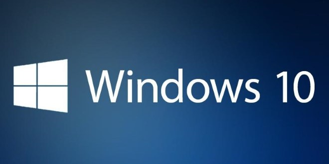
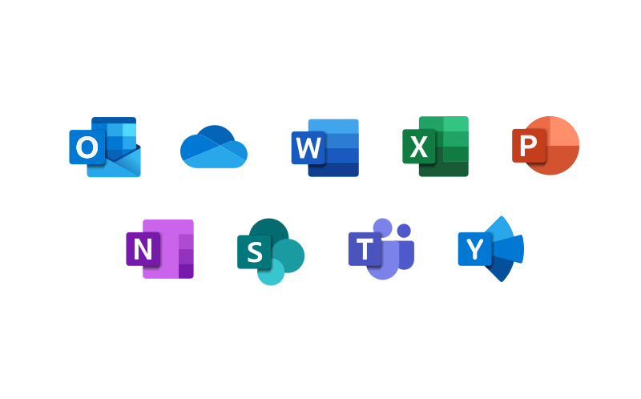
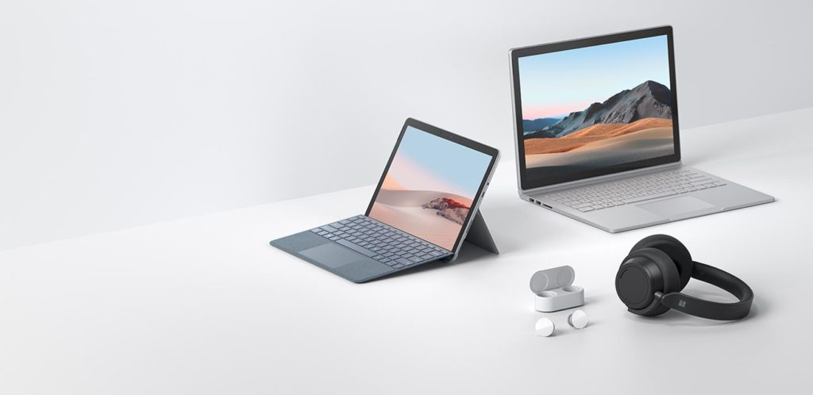
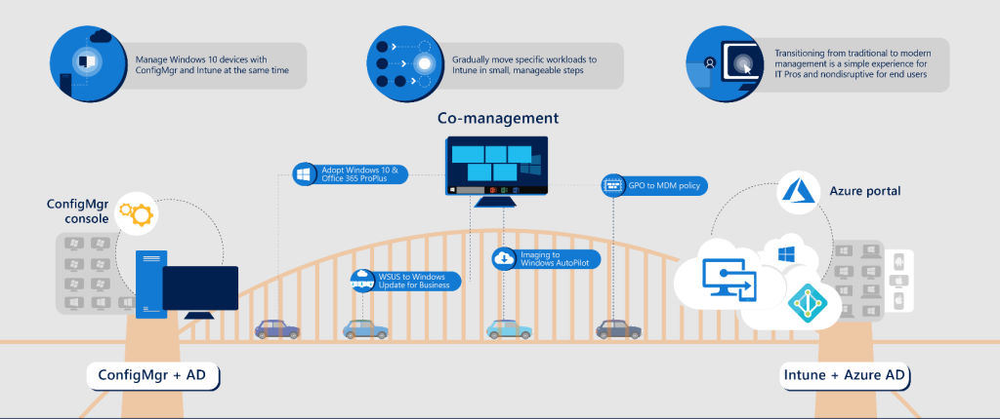

Negli ultimi 3 mesi c’è stata un’accelerazione verso soluzioni di lavoro da remoto pari a quella che solitamente c’è in due anni. Oltre a “Smart Working” c’è un altro termine che ricorre di continuo: sei pronto a scoprire cosa significa Modern Workplace?

Mentre scrivo questo articolo, è da poco passato il 3 Giugno 2020, data in cui il Paese ha riaperto in maniera quasi completa i battenti dopo l’emergenza Covid-19. Sono a casa, seduto alla mia scrivania nel mio studio, battendo tasti sul mio PC come accade quotidianamente anche per lavoro da 3 mesi a questa parte. Faccio parte di quella schiera di lavoratori che non ha mai smesso di lavorare grazie al cosiddetto “Smart Working”.

Cosa sia lo Smart Working e perché sia così prezioso ormai è un argomento che tutti hanno sviscerato. **In pochi però hanno raccontato cosa serva per riuscire a farlo: ci proverò io con una serie di articoli attraverso i quali ti racconterò quali siano gli strumenti che ti servono per poter lavorare ovunque come se fossi in ufficio, come implementarli e come gestirli.**

**In questa prima parte parliamo del Modern Workplace dal punto di vista dell’utente finale. In fondo a questo articolo trovi tutti i riferimenti e le informazioni sulla parte di Modern Workplace Management.**

## Cos’è il Modern Workplace
Oggi, com’è fatta la tua tipica postazione di lavoro? Nella maggior parte dei casi da una scrivania, un computer, un telefono, un misto di archivi elettronici e cartacei che puoi accedere e manipolare esclusivamente da un luogo fisico ovvero il tuo ufficio.

Come interviene su questo scenario un approccio **Modern Workplace**?

> *Modern Workplace consiste in una rivisitazione dei modelli organizzativi e degli strumenti informatici di un’azienda. Lo scopo di questo approccio è permettere al lavoratore di svolgere le proprie mansioni mantenendo la stessa esperienza utente, la stessa produttività e lo stesso livello di sicurezza nell’accedere ai dati aziendali e nel collaborare con i propri colleghi, indipendentemente dal luogo in cui ci si trovi, sia esso l’ufficio o casa propria.*

Perfetto! Ora che sai cosa significa Modern Workplace, sei pronto per vedere quali sono i suoi ingredienti.

## Cosa serve per poter lavorare con un Modern Workplace?
Gli ingredienti principali per implementare una strategia evolutiva verso il paradigma Modern Workplace sono:
- un **sistema operativo** moderno e orientato agli strumenti cloud: Windows 10;
- una suite di **strumenti di produttività e collaborazione** che ti permetta di produrre contenuti e collaborare con i tuoi colleghi da qualunque dispositivo e in qualunque luogo: Microsoft 365;
- un **PC con caratteristiche hardware moderne**: vedremo dopo cosa significa;
- un **dispositivo mobile** in grado di eseguire questi strumenti di produttività;
- i giusti accessori per una collaborazione efficace, come ad esempio un set di cuffie con un microfono di buona qualità;
- ultima ma non ultima, un’**ottima connettività** verso Internet!

***Nota***: hai notato che ho trattato in punti separati lo smartphone e il PC? Vuoi saperne il motivo?
Personalmente credo che poter accedere e manipolare dati e documenti da smartphone sia una grande conquista e una grande comodità in fase di consultazione o per piccole modifiche **ma, diciamoci la verità, quando hai necessità di produrre contenuti strutturati e lunghi in maniera efficace e produttiva, usi il tuo Personal Computer!**
**Il PC quindi rimane il punto focale intorno a cui ruota la tua produttività.**

Vediamo più in dettaglio gli elementi principali: **sistema operativo, strumenti di produttività e collaborazione, personal computer.**

## Sistema operativo: Windows 10

Windows 10 ormai è tra noi dal 2015 ma si è evoluto moltissimo nel corso di questi anni, diventando lo standard de facto di sistema operativo moderno che pone al centro dell’esperienza di utilizzo le persone. Perché?
- perché la profonda integrazione che Windows 10 ha con i prodotti cloud Microsoft **offre l’esperienza utente che le persone si aspettano dal proprio computer quando si tratta di produttività**;
- Windows 10 rimane coerente a livello di esperienza utente ma con cadenza costante e continua **implementa nuovi miglioramenti e aggiornamenti, in maniera trasparente**;
- è un **sistema operativo orientato ad Internet e che supporta una connettività always-on** con supporto integrato a LTE e 5G;
- è in grado di sfruttare l’**intelligenza artificiale** che le piattaforme cloud di Microsoft mettono a disposizione a tutti i livelli, **sicurezza compresa**;
- supporta modalità multiple di interazione come **penna**, **voce**, **tocco**, **sguardo**.

Queste sono caratteristiche imprescindibili per un sistema operativo che si possa definire moderno. Vediamo ora quali strumenti lo accompagnano.

## Strumenti di produttività e collaborazione: Microsoft 365

Le modalità di condivisione dati all’interno di un gruppo di lavoro o con altri dipartimenti aziendali si sono molto evolute con l’introduzione di strumenti come *SharePoint Online*, *OneDrive* e, in particolare nell’ultimo periodo, *Teams*. La combinazione di questi 3 strumenti ha inferto un durissimo colpo alle classiche VPN + *cartelle condivise su file server* (finalmente direi! 🙂 ).

Perché sono proprio questi tre gli strumenti di base che rendono l’approccio alla collaborazione *“moderno*?”
- perché puoi accedere ai documenti aziendali **da qualunque dispositivo**, sia esso uno smartphone, un tablet o un personal computer;
- su questi dati, puoi persino **collaborare in tempo reale** visualizzando lo stesso documento su cui stai lavorando con i tuoi collaboratori e vedendo le modifiche fatte proprio in quel momento;
- perché puoi **accedere a questi dati ovunque tu sia e l’esperienza di fruizione e di produzione di questi contenuti sarà esattamente la stessa**;
- perché puoi **videochiamare una o più persone contemporaneamente**, siano essi colleghi o utenti esterni, **condividendo in tempo reale dati di ogni tipo e persino la schermata del tuo computer**.

All’inizio di questa sezione ho menzionato esplicitamente tre strumenti: **Sharepoint Online**, **Teams**, **OneDrive**.
Tutti permettono di raggiungere i risultati elencati poco fa ma qual è la differenza? Servono tutti?

Per rispondere a queste domande ci vorrebbero interi articoli ma, in pochissimi punti, **ecco perché servono tutti** questi strumenti e quali sono le loro differenze di utilizzo:
- **Sharepoint Online (SHPO)**: qui ci vanno tutti **i file e i documenti di interesse generale e aziendale**! Su SHPO puoi organizzare tutti i dati in gerarchie di siti web interni o di document library; è possibile controllare in maniera centralizzata permessi e restrizioni di accesso a file e cartelle, lasciando tuttavia la possibilità di condividere velocemente e comodamente dati tra gruppi di lavoro e persone; per ottenere questi risultati è fondamentale definire delle politiche di [governance di Sharepoint Online](/governance-di-sharepoint-online/);
- **Teams**: questo è lo strumento principe per la collaborazione! Usare un team anziché una semplice cartella condivisa è **ideale per avere un’area definita e dedicata a singoli progetti o per spingere al 110% il livello di collaborazione per gruppi di lavoro che lavorano a stretto contatto sugli stessi contenuti**; anche in questo caso è importantissimo stabilire [regole, best practice e politiche di governance per Teams](/microsoft-teams-faq-consigli-governance-utilizzo/), in modo da renderne l’utilizzo efficace e produttivo;
- **OneDrive**: è il luogo ideale per conservare e sincronizzare con il cloud i **dati personali**, che tutt’al più condividerai solo al bisogno con un gruppo selezionato e ristretto di persone.

## Il “ferro”: un PC moderno con i suoi accessori

Gli smartphone e i tablet sono degli strumenti straordinari per accedere in consultazione a dati aziendali ed inoltre forniscono funzionalità comode per una produttività leggera in mobilità.

Quando però “il gioco si fa duro” e devi produrre contenuti di una certa complessità, lo strumento che usi è sicuramente il tuo Personal Computer: **nulla può sostituirlo**!
Il modo migliore per poter sfruttare un sistema operativo moderno e tutti gli strumenti di collaborazione offerti da Microsoft 365 è avere un computer con caratteristiche *“moderne“*. Cosa significa in concreto?

Significa avere un laptop con le seguenti caratteristiche:
- schermo **touch**;
- supporto all’utilizzo di una **penna**;
- supporto ai **gesti**;
- una **webcam** con una buona risoluzione;
- deve essere dotato di meccanismi di **sicurezza hardware**, come ad esempio
    - webcam in grado di rilevare la profondità e compatibile con **Windows Hello**;
    - **lettore di impronte digitali**;
    - **chip TPM** per supporto a **BitLocker**;
- una **batteria** in grado di reggere una giornata di lavoro.

**Un PC di questo tipo deve essere la dotazione standard per la buona riuscita di un’evoluzione digitale della postazione di lavoro!**

**Ugualmente importanti** sono gli accessori come ad esempio **un buon paio di cuffie con microfono**, meglio ancora se bluetooth di modo che ti lasci la giusta libertà di movimento.

## E la sicurezza?
|                                                                                             |
| :---:                                                                                       |
|                                      |
| E ora mi intrufolo nei tuoi dati… 🙂 - Immagine di [Noah Sussman](https://flic.kr/p/6VmCD6) |

Risorse, dati e applicazioni aziendali ormai non sono più contenute esclusivamente all’interno del perimetro di sicurezza costituito dalla sola rete aziendale: il cloud ha cambiato tutto, da questo punto di vista. Il paradigma di sicurezza Modern Workplace segue i principi della [Zero Trust Security](/zero-trust-security/): nell’articolo appena linkato, troverai tutti i dettagli di cosa questo significhi.

Di seguito,vorrei comunque menzionare quelli che sono i meccanismi che risultano più evidenti nella tua esperienza utente quotidiana in questo scenario moderno:
- **Multi Factor Authentication (MFA)**: è un meccanismo di autenticazione che richiede, oltre alla classica password, altri “fattori” di autenticazione per provare la tua vera identità, come ad esempio il tuo viso, le tue impronte digitali, un codice che ti arriva via SMS;
- **Conditional Access**: attraverso alcune impostazioni, sarai in grado di accedere a risorse e dati aziendali solo se la tua identità e il tuo dispositivo rispettano alcuni vincoli e requisiti.

Insieme a tanti altri, questi sono certamente i principali meccanismi di [Modern Authentication](/modern-authentication-multi-factor-authentication-exchange-online-skype-for-business-online/) che consentono di lavorare in maniera sicura sui dati aziendali da qualunque dispositivo e da qualunque luogo.

## Ok, come si gestisce tutto questo ambaradàn di Modern Workplace?

Degli aspetti di implementazione e di gestione ne ho parlato in un articolo separato ad argomento [Modern Workplace Management](/modern-workplace-management/).
L’orchestrazione di tutti gli strumenti che stanno dietro all’ottenimento di questi risultati è un mondo meraviglioso, pieno di strumenti e possibilità che mai prima d’ora si erano viste in ambito IT!

## Conclusioni
È un momento storico davvero incredibile per aiutare le persone a cambiare il modo in cui lavorano e collaborano. Far parte della schiera di professionisti IT che vi stanno partecipando attivamente è per me un grande privilegio.
Spero di essere riuscito a raccontarti in maniera chiara e semplice i motivi per cui è importante avere a disposizione un certo tipo di strumenti affinché lo smart working sia davvero “smart”.
Ti ringrazio per avermi seguito fino a qui: ci vediamo alla prossima puntata della serie “Modern Workplace” in cui parlerò di come ottenerlo dal punto di vista delle tecnologie di implementazione e gestione!

Il tuo IT Specialist, Riccardo

