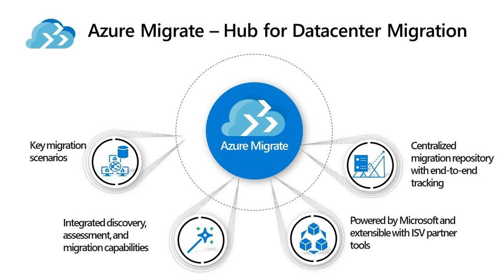

Finalmente! Da oggi (anche se solo in preview) Azure Migrate supporta l’utilizzo di più credenziali per effettuare discovery e assessment di server Windows e Linux. Al momento della configurazione dell’appliance, si avrà quindi la possibilità di inserire più credenziali.

Tra le novità anche l’aumento del numero di server per cui è possibile fare la discovery: si passa da 250 a 1000 per appliance.

Per ulteriori dettagli ecco alcuni riferimenti utili:
- [Azure Migrate now supports multiple credentials for discovery of physical servers](https://azure.microsoft.com/en-us/updates/azure-migrate-supports-multiple-credentials-for-physical-servers-discovery-and-a-scale-of-1000-servers-per-appliance/)
- [Assess physical servers with Azure Migrate: Server Assessment](https://docs.microsoft.com/en-us/azure/migrate/tutorial-assess-physical)

A presto!

Il tuo IT Specialist, Riccardo