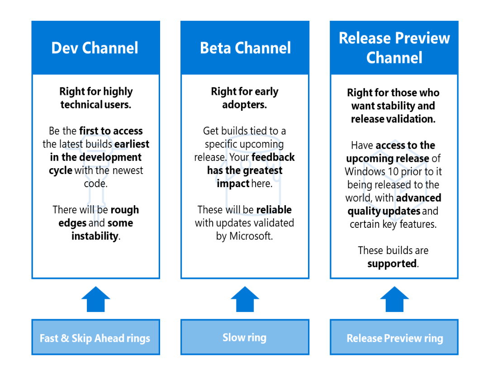

Dal programma Windows Insider ultimamente arrivano tante notizie: venerdì scorso mi è arrivata una mail in cui Microsoft dà comunicazione che il ring model dei Windows Insider Channels verrà modificato. Vediamo come.

In principio i canali erano:
- **Fast ring**: il canale per utenti molto tecnici che potevano provare immediatamente nuove funzionalità in fase di sviluppo anche se instabili;
- **Slow ring**: ricevono comunque le Insider Build di Windows con le nuove funzionalità ma con cadenza più lenta e aggiornamenti più stabili;
- **Release Preview ring**: allineato alla versione attualmente in produzione di Windows ma con un accesso ad alcune funzionalità in anteprima
- **Skip Ahead**: l’iscrizione a Skip Ahead viene offerta per un periodo di tempo limitato a un piccolo sottoinsieme di partecipanti al programma Insider; nel momento in cui viene “chiuso” lo sviluppo di una versione di Windows per portarla nel ramo di produzione, a questo sottoinsieme di utenti viene offerta la possibilità di passare alla versione successiva in fase di sviluppo.

Come cambieranno quindi i ring nel nuovo modello Windows Insider Channels? Ecco come:

- **Dev Channel**: ingloberà i ring Fast e Sklip Ahead, per gli utenti più temerari che vogliono testare le nuove funzionalità fin dal loro primo stadio di sviluppo;
- **Beta Channel**: prenderà il post dello Slow ring, ideale per early adopters che vogliono testare nuove funzionalità che però abbiano già un minimo di stabilità;
- **Release Preview Channel**: prende il posto del Release Preview ring; gli utenti in questo canale avranno accesso alle release di Windows 10 in anteprima ma nell’ambito di funzionalità ormai finalizzate, con quality update e, soprattutto, il supporto di Microsoft in caso di problemi.

Al netto del cambio di nome e dello Skip Ahead che verrà inglobato nel Dev Channel, la sostanza dei ring rimane più o meno simile a com’era prima.

Per ulteriori dettagli e approfondimenti:
- [Introducing Windows Insider Channels](https://blogs.windows.com/windowsexperience/2020/06/15/introducing-windows-insider-channels/)

Buona lettura!

Il tuo IT Specialist, Riccardo