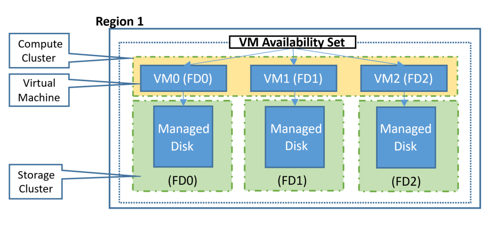

Di recente mi sono trovato a chiacchierare con alcuni colleghi e il supporto Fast Track di Microsoft a riguardo di una questione specifica: è una buona pratica inserire una singola VM all’interno di un availability set in Azure?

Un [Availability Set](/glossario-azure#AvailabilitySet) è una funzionalità di Azure che, al momento del deployment di una macchina virtuale, consente di raggruppare logicamente macchine virtuali isolandole l’una dall’altra a livello di switch di rete, storage, rack, server fisico sui quali sono allocate. Questo serve a garantire che, in caso di manutenzione da parte di Microsoft, solo una parte delle VM inserite all’interno di un Availability Set sia riavviata/indisponibile.

Se consideriamo la cosa da un punto di vista strettamente tecnico, la risposta è molto semplice ma, come molto spesso accade, è necessaria un’attenta valutazione dello scenario che si ha di fronte. Vediamo quando ha senso inserire una VM in un availability set e quando non lo ha.

## Perché non inserire una singola VM in un availability set

Questa è la soluzione più chiara e ovvia: un availability set serve a proteggere dall’indisponibilità contemporanea di più VM che svolgono la stessa funzione, come ad esempio dei front-end di un applicativo web dietro bilanciatore, dei domain controller, dei server applicativi in una configurazione active-active, eccetera. Non ha quindi molto senso inserire una singola VM all’interno di un availability set perché, in caso di manutenzione o riavvio del server fisico sul quale è allocata, il workload che viene offerto da quella VM non sarà disponibile.

Inoltre, e questo secondo motivo ignorato da molti secondo me è decisamente importante, le VM all’interno di un availability set non sono oggetto di alcuna notifica di manutenzione da parte di Microsoft. Esatto: quando Microsoft fa manutenzione, [invia una notifica di manutenzione](https://docs.microsoft.com/en-us/azure/virtual-machines/maintenance-notifications) agli amministratori avvisando quali VM saranno indisponibili. La notifica però arriva solo per le VM che non sono in un availability set! Questo consente di avere il tempo di “organizzarsi” in qualche modo o di avvisare gli utenti che, per una finestra temporale definita, un dato servizio sarà indisponibile.

Al contrario, la notifica non viene inoltrata per le VM che sono all’interno di un availability set. Questo è un problema quando al suo interno si trovano VM single instance perché potresti ritrovarti da un momento all’altro, e senza alcun preavviso, con una macchina virtuale non disponibile, causando panico e paura tra gli utenti e l’IT crew. 😉


  
<iframe src="https://giphy.com/embed/1FMaabePDEfgk" width="100%" height="100%" style="position:absolute" frameBorder="0" class="giphy-embed" allowFullScreen></iframe>

<a href="https://giphy.com/gifs/panic-stressed-1FMaabePDEfgk">via GIPHY</a>



> *Riassumendo: in linea generale, la best practice è quella di non inserire VM singole all’interno di un availability set.*

C’è un “ma”? Sì, c’è un “ma”…

## Perché inserire una singola VM all’interno di un availability set

Non sono impazzito e non voglio certo ignorare le best practice di mamma Microsoft ma, a mio parere, c’è una situazione in cui una VM singola deve essere inserita all’interno di un availability set.

**Se la tua VM che offre il tuo servizio applicativo è potenzialmente “scalabile” e “affiancabile” da una VM identica che potresti voler aggiungere in un secondo momento per gestire meglio il carico, allora devi mettere la prima VM in un availability set anche se rimarrà sola soletta per un po’ di tempo.** Questo perchè “un availabilty set è per sempre”: devi decidere se inserire una VM all’interno di un availabilty set alla sua creazione e non potrai modifcare questa scelta a posteriori. La VM nasce e muore con l’availabilty set e quindi, se prevedi anche solo vagamente in un futuro remoto, di aggiungere un secondo nodo in al tuo servizio volendo usare un availability set, dovresti distruggere la prima VM e rifare tutto da capo ricreando 2 VM. Non una grande prospettiva...

## Conclusioni
Spero di averti dato uno spunto di riflessione utile circa l’utilizzo degli availability set con VM a singola istanza. Grazie per avermi seguito fino a qui, a presto!

Il tuo IT Specialist, Riccardo