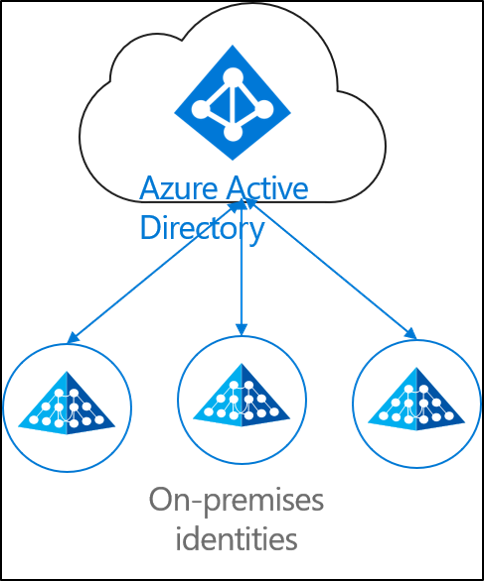
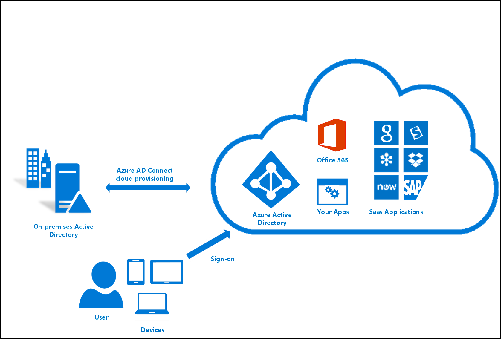
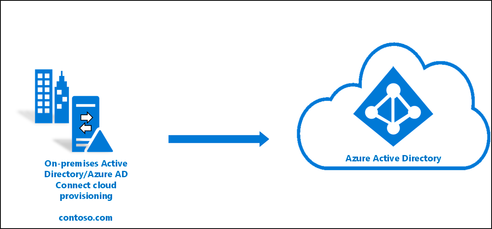
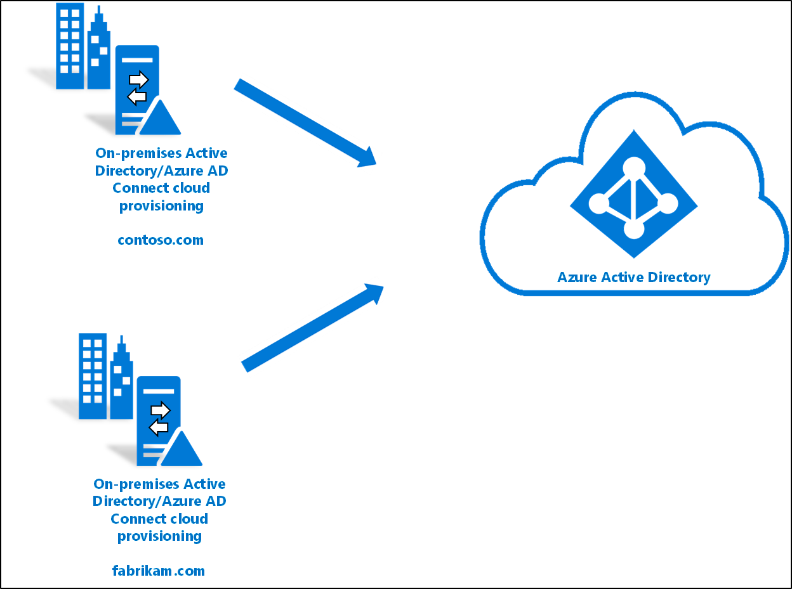
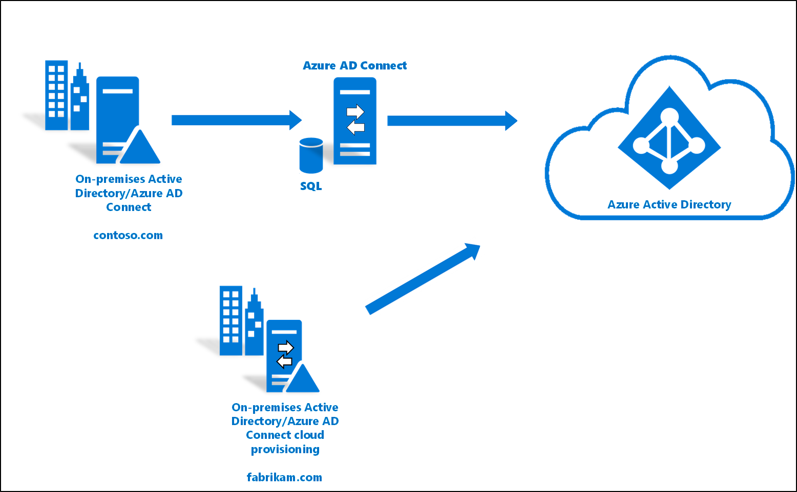

Il tema dell’identity provisioning, con l’utilizzo sempre più massiccio di servizi cloud, è sempre più importante da considerare. Il metodo più utilizzato per sincronizzare le identità tra Active Directory on-premises ed Azure AD è Azure AD Connect ma, in alcuni scenari multi-foresta e in altri casi particolari, può essere utile valutare una soluzione alternativa più leggera: Azure AD Connect Cloud Provisioning.

## Cosa significa Identity Provisioning?
L’identity Provisioning è il processo, basato su certe condizioni, di creare un oggetto, mantenendolo aggiornato dovessero occorrere delle modifiche e cancellandolo quando le condizioni di partenza non sono più rispettate. Ad esempio, quando una persona viene assunta in un’azienda, l’utenza viene creata all’interno del sistema di gestione HR. In quel momento, il flusso di provisioning crea un’utenza corrispondente in Active Directory, negli applicativi a cui la persona deve accedere, eccetera. Questo permette all’utente di poter lavorare utilizzando ciò che gli serve.

Possiamo quindi pensare il processo di sincronizzazione del classico Azure AD Connect (AAD Connect) come un provisioning di identità verso Azure AD.

## Cos’è Azure AD Connect Cloud Provisioning?

È un metodo alternativo di sincronizzazione e provisioning delle identità on-premises verso Azure AD. Può essere utilizzato anche in parallelo ad un’installazione esistente del classico AAD Connect, ed è molto utile in queste situazioni:
- permette di sincronizzare le identità in un contesto multi-foresta “disconnesso” ovvero dove le varie foreste AD non sono connesse tra loro a livello di rete e quindi risulta impossibile per il server AAD Connect raggiungere i vari domini per fare il provisioning verso Azure AD;
- quando si vuole effettuare un’installazione light-weight basata su agente anzichè su server AAD Connect dedicato;
- il deployment di più agenti Azure AD Connect permette di semplificare gli scenari di alta disponibilità, in particolare quando viene utilizzato il password hash sync.

## Quali sono le differenze con il classico Azure AD Connect?
Le principali differenze di Azure AD Connect Cloud Provisioning (d’ora in poi “AADCCP”) rispetto al classico AD Connect sono:
- AADCCP è un agente light-weight e non richiede un server dedicato;
- Inoltre:
    - non può effettuare connessioni a directory LDAP;
    - non può sincronizzare attributi personalizzati definiti dagli utenti (directory extensions);
    - non supporta la pass-through authentication;
    - non supporta il write-back di password, dispositivi, gruppi;

Altre differenze sono riportate in maniera completa nella seguente documentazione Microsoft:
- [How is Azure AD Connect cloud provisioning different from Azure AD Connect sync?](https://docs.microsoft.com/en-us/azure/active-directory/cloud-provisioning/what-is-cloud-provisioning#how-is-azure-ad-connect-cloud-provisioning-different-from-azure-ad-connect-sync)

## Scenari supportati
Quali sono gli scenari supportati di utilizzo?

### Singola foresta, singolo Azure AD tenant
Lo scenario più semplice, con una singola foresta, un singolo tenant e un utilizzo esclusivo di AADCCP.

### Multi-foresta, singolo Azure AD tenant
Scenario con più foreste e più domini per cui hai la necessità di effettuare il provisioning verso un singolo Azure AD Tenant. Anche in questo caso, al netto di alcuni compromessi da accettare, puoi usare esclusivamente Azure AD Connect Cloud Provisioning.

### Foresta AD esistente e sincronizzata con AD Connect, nuova foresta con Azure AD Connect Cloud Provisioning
Questo è lo scenario più interessante perchè vai ad affiancare il Cloud Provisioning in una foresta “B”, disconnessa dalla foresta “A”, ad un’installazione esistente di Azure AD Connect, il tutto verso un singolo tenant. Questo è sicuramente il caso in cui AADCCP è più utile.

## Cose utili da ricordare in qualunque scenario di Identity Provisioning
Alcune cose utili da ricordare sempre, qualnque sia il tuo strumento di Identity Provisioning:
- utenti e gruppi devono essere definiti e rappresentati in maniera univoca tra tutte le foreste;
- il matching degli oggetti tra tutte le foreste non viene fatto quando usi il cloud provisioning;
- l’attributo “source anchor” viene scelto automaticamente; di default viene utilizzato il ms-DS-ConsistencyGuid, se presente, altrimenti viene usato l’ObjectGUID.

## Risorse utili
Come sempre, alcune risorse Microsoft utili che riguardano questo argomento e che ti consiglio di consultare per approfondimenti:
- [What is identity provisioning?](https://docs.microsoft.com/en-us/azure/active-directory/cloud-provisioning/what-is-provisioning)
- [What is Azure AD Connect Cloud Provisioning?](https://docs.microsoft.com/en-us/azure/active-directory/cloud-provisioning/what-is-cloud-provisioning)

## Conclusioni
Grazie per avermi seguito anche in questo articolo. Tu quale soluzione di Identity Provsioning usi? Hai mai considerato l’utilizzo di Azure AD Connect Cloud Provisioning o usi solo il classico Azure AD Connect? Parliamone nei commenti o sui miei social, ti aspetto!

Il tuo IT Specialist, Riccardo