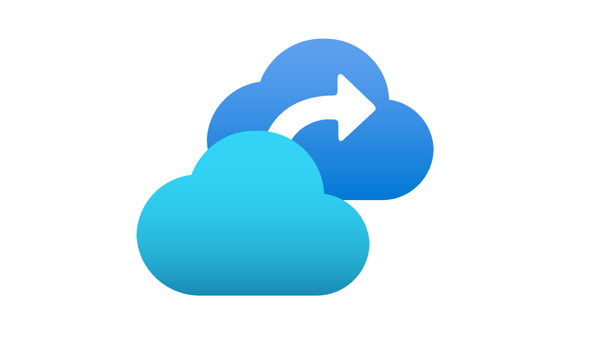

Periodo caldissimo per [Azure Private Link](/azure-private-link-general-availability/): ogni settimana il supporto a Private Link viene esteso a sempre più tecnologie di Azure ed oggi è il turno di… ASR! Esatto, Azure Site Recovery supporta Azure Private Link per la replica delle VM.

La funzionalità sarà disponibile in West Europe presumibilmente entro Agosto 2020 e consentirà di replicare macchine virtuali Azure, Vmware e Hyper-V, assicurando una connettività privata al recovery services vault. Saranno richiesti due endpoint.

Per approfondimenti:
- [Azure Site Recovery now supports replication with private links](https://azure.microsoft.com/en-us/updates/site-recovery-now-supports-replication-with-private-links/)
- [About Azure Site Recovery](https://docs.microsoft.com/en-us/azure/site-recovery/site-recovery-overview)

Buona lettura!

Il tuo IT Specialist, Riccardo