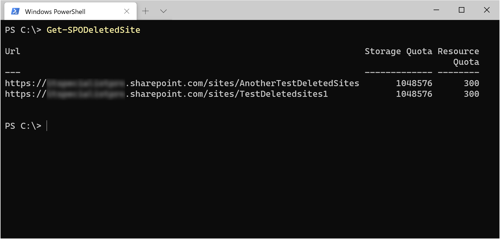
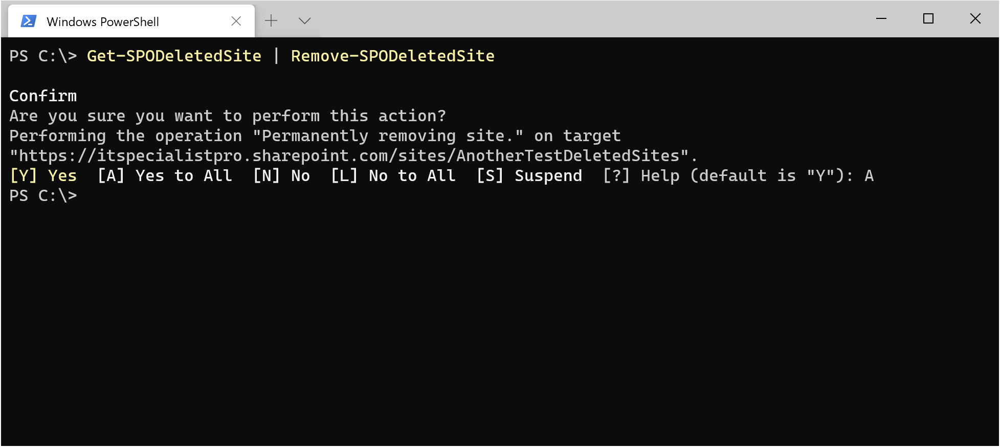
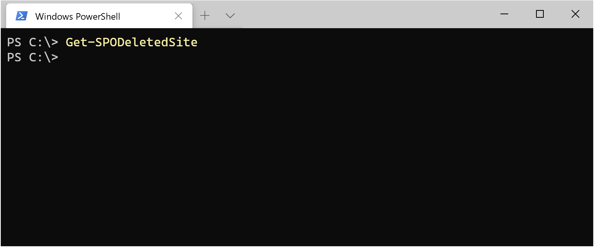

I siti eliminati di Sharepoint Online vengono mantenuti in una sorda di cestino chiamato “Deleted Sites” e lì rimangono per 93 giorni, prima di essere cancellati del tutto. Potresti però avere la necessità di eliminare i siti eliminati di Sharepoint Online immediatamente e definitivamente: ti racconto come farlo con Powershell, in modo da automatizzare questa operazione se ti va. Lancia il nuovo [Windows Terminal](https://www.microsoft.com/it-it/p/windows-terminal/9n0dx20hk701) (l’hai mai provato? A me piace un sacco!) oppure Windows Powershell e, se non l’hai ancora fatto, installa e importa il [modulo PowerShell di Sharepoint Online](https://docs.microsoft.com/it-it/powershell/sharepoint/sharepoint-online/connect-sharepoint-online?view=sharepoint-ps).

    Install-Module -Name Microsoft.Online.SharePoint.PowerShell
    Import-Module -Name Microsoft.Online.SharePoint.PowerShell

Connettiti al workspace amministrativo di Sharepoint Online del tuo tenant, sostituendo nel comando seguente il nome del tuo tenant dove leggi *ilnomedeltuotenant*

    Connect-SPOService -Url https://ilnomedeltuotenant-admin.sharepoint.com

Verifica se ci sono dei siti all’interno dei Deleted Sites

    Get-SPODeletedSite

Se ci sono siti eliminati all’interno dei Deleted Sites dovresti ottenere un risultato simile a questo.

Perfetto! Se vuoi rimuoverli **tutti**, è sufficiente digitare questo comando:

    Get-SPODeletedSite | Remove-SPODeletedSite

Ti verrà chiesta conferma di questa azione e, dopo averla data, si scatenerà un inferno distruttivo di cancellazione dei siti cancellati di Sharepoint (mi sta quasi venendo il mal di testa, sembra un gioco di parole 🙂 ) A schermo dovresti vedere qualcosa di simile alla seguente figura.

Perfetto! Dopo aver lanciato napalm sui siti eliminati, verifica che non ce ne siano più con il solito comando.

    Get-SPODeletedSite

Se il comando Powershell di cancellazione ha fatto il suo dovere, non ci saranno più siti eliminati all’interno dei Deleted Sites.

Perfetto, ora il cestino di Sharepoint Online è perfettamente pulito! Questa operazione è realizzabile anche da portale ma, utilizzando PowerShell, diventa facilmente automatizzabile e pianificabile per un’esecuzione periodica, togliendoti il pensiero di dovertene ricordare.

## Quando è utile farlo?
Eliminare i siti eliminati di Sharepoint Online è una pratica che potresti trovare utile quando vuoi riciclare/riutilizzare un URL che avevi precedentemente utilizzato per un sito Sharepoint Online: infatti, fino a quando il sito cancellato sarà nei Deleted Sites, non potrai riciclare quell’URL. Oppure, potresti semplicemente implementare un flusso per fare pulizia 🙂

## Conclusioni
Grazie di avermi seguito fino a qui e buona eliminazione dei siti eliminati di Sharepoint Online 😀

Il tuo IT Specialist, Riccardo
