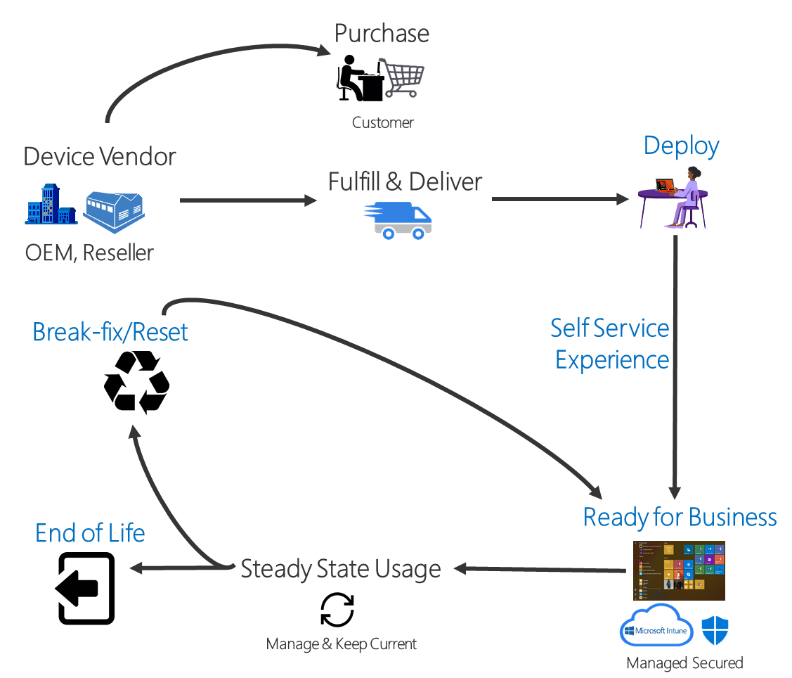
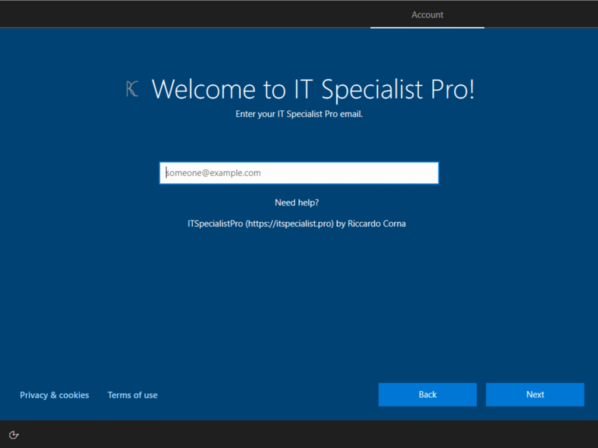

Uno dei processi più importanti ed onerosi, in termini di tempo e risorse investite da un’azienda, è quello dell’installazione, della distribuzione e della configurazione del sistema operativo sui client degli utenti: Windows Autopilot è un insieme di tecnologie che permette di cambiare totalmente questo processo. Ti racconto come.

## Cos’è Windows Autopilot?

**Windows Autopilot è un insieme di tecnologie che viene utilizzato per installare e configurare nuovi dispositivi in modo che siano pronti a supportare la produttività dell’utente**. La fase di deployment sfrutta la versione OEM di Windows 10 pre-installata sul PC.

Quindi, più che un processo di re-imaging vero e proprio, Autopilot è un insieme di strumenti e automatismi che puoi utilizzare per:
- configurare nuovi client con policy, applicazioni, [join automatico ad Azure AD con Azure AD Join o ad Active Directory con Hybrid Azure AD Join](/differenza-azure-ad-registered-azure-ad-joined-hybrid-azure-ad-joined/);
- resettare client che vuoi reinstallare per un nuovo utilizzo.

Il tutto viene fatto tramite le tecnologie cloud di Microsoft.

## Come funziona Autopilot e qual è l’esperienza utente?

Una volta collegato il nuovo PC al cavo di rete (ti ricordo che i deployment con Autopilot non si possono fare via WiFi), anziché la solita schermata di configurazione tipica delle nuove installazioni di Windows 10, l’utente si ritroverà davanti ad una schermata molto simile a questa, che potrai personalizzare con il branding della tua azienda (più o meno come ho fatto io nel mio laboratorio).

Sarà sufficiente inserire le tue credenziali Microsoft 365 e da lì comincerà la magia! Basandosi sull’utenza e sulle profilazioni ad essa assegnate via Autopilot e Intune, in qualche minuto il PC sarà:
- **joinato ad Azure AD** e, se hai configurato l’Hybrid Azure AD Join e l’Intune connector, anche al dominio Active Directory on-premises;
- **registrato in Intune come dispositivo gestito** e con tutti i suoi profili di configurazione, come ad esempio la WiFi, la VPN e altre impostazioni di sistema operativo che hai definito;
- **dotato di tutte le applicazioni** che hai configurato l’installazione da portale Intune/MEM.

Insomma, un’installazione col “pilota automatico”. 🤣 Potenzialmente, il PC non deve nemmeno passare dall’ufficio IT per la preparazione.

## Come si configura Autopilot?

Difficile fare un deep-dive in un solo articolo ma, almeno ad alto livello, puoi immaginare questi passaggi:
1. compra i PC che vorrai dare ai tuoi utenti 🙂
2. lo staff IT configura a dovere Intune, in particolar modo la parte di [autoenrollment](https://docs.microsoft.com/en-us/mem/intune/enrollment/windows-enroll#enable-windows-10-automatic-enrollment) e di [company branding](https://docs.microsoft.com/en-us/azure/active-directory/fundamentals/customize-branding);
3. sui PC che hai comprato, è necessario recuperare alcune informazioni ([Hardware ID](https://docs.microsoft.com/en-us/windows/deployment/windows-autopilot/demonstrate-deployment-on-vm#configure-microsoft-intune-auto-enrollment)) che dovranno essere caricate sul portale di Intune / Microsoft Endpoint Manager (MEM); questo passaggio, in molti casi, è svolto dal vendor dei PC, il quale estrarrà le informazioni necessarie con un apposito tool e ti eviterà questa seccatura;
4. sul portale MEM viene caricato un file CSV contenente i dati estratti al punto precedente; questo passaggio è a tutti gli effetti [il censimento dei tuoi PC all’interno di Autopilot](https://docs.microsoft.com/en-us/windows/deployment/windows-autopilot/demonstrate-deployment-on-vm#configure-microsoft-intune-auto-enrollment);
5. sul portale MEM lo staff IT crea il [profilo di distribuzione di Autopilot](https://docs.microsoft.com/en-us/windows/deployment/windows-autopilot/demonstrate-deployment-on-vm#create-and-assign-a-windows-autopilot-deployment-profile); in questo step sostanzialmente si definiscono i parametri dell’esperienza utente di Autopilot;
6. sempre da portale MEM, assegni il profilo di deployment ad un security group di Azure AD all’interno del quale avrai inserito i dispositivi che vuoi installare con Autopilot;
7. ora, se vuoi configurare altri dettagli su Intune come ad esempio le [applicazioni per gli utenti](https://docs.microsoft.com/en-us/windows/deployment/windows-autopilot/demonstrate-deployment-on-vm#appendix-b-adding-apps-to-your-profile) o altri profili di configurazione, questo è il momento;
8. ci siamo, Autopilot è ora pronto per entrare in azione su uno dei tuoi client!

## Esistono modalità di Autopilot in cui il processo di deployment inizi come sempre dallo staff IT? (Spoiler: Sì!)

Per molti, il fatto che il PC non “passi” prima dalle mani dell’IT è un freno, per vari motivi: percezione di perdere il controllo dei deployment, utenti non molto “smart” che potrebbero rimanere spaesati dall’esperienza di login con Autopilot oppure che non hanno una connessione sufficiente a casa per svolgere il deployment in maniera liscia.

Se vuoi mantenere un certo controllo sul deployment, Autopilot viene incontro a quest’esigenza con la [modalità di deployment White Glove](https://docs.microsoft.com/en-us/windows/deployment/windows-autopilot/white-glove), facilmente impostabile dal portale MEM:
1. il PC anzichè essere consegnato direttamente all’utente, viene prima dato in pasto all’IT crew;
2. l’IT crew lancia il deployment ma, anzichè il flusso visto prima, partirà un flusso di *pre-provisioning* denominato “**Technician Flow**“, che configurerà:
    - policy e profili del dispositivo;
    - app assegnate al dispositivo;
    - app assegnate all’utente al quale sarà assegnato il dispositivo;
3. una volta fatto tutto questo, l’IT crew “risigillerà” il PC e lo consegnerà all’utente per l’ultima parte di provisioning.

L’utente, quando riaccenderà il PC, farà partire ciò che viene denominato lo “**User flow**” di Autopilot, all’interno del quale verranno applicate:
- policy per cui l’utente è in scope;
- configurazioni assegnate all’utente.

Fine! La cosa che mi piace molto di White Glove è il fatto di avere questo pre-provisioning che consente di mantenere un certo controllo sul deployment e quindi di avere un approccio più graduale ad Autopilot. È sicuramente il modo migliore per approcciare la [distribuzione di Windows 10 in salsa Modern Workplace](/modern-workplace-management/) perché parte da un flusso che hai già (preparazione del PC da parte dell’IT e successiva consegna all’utente), migliorandolo e semplificandone gli strumenti.

## Scenari in cui un’evoluzione ad Autopilot è utilissima
Se ti riconosci nel flusso di installazione e distribuzione di Windows 10 che descrivo nei punti qui di seguito, **Autopilot fa per te**:
- per installare Windows 10 sui client usi una custom image che mantieni e riapri di tanto in tanto per iniettare aggiornamenti e quant’altro;
- la custom image ovviamente deve essere declinata sui vari modelli di client che possiedi, con driver differenti;
- la custom image nel tempo è cresciuta ed ora è molto pesante, nell’ordine di decine di GB;
- se usi un metodo di distribuzione online (MDT/WDS, SCCM o equivalente), devi creare e mantenere delle task sequence, testarle, e sei vincolato a fare tutto all’interno della rete aziendale; inoltre devi anche curarti del mantenimento dei server SCCM in sè;
- se invece installi l’OS a mano (ad esempio partendo da un’immagine Acronis o simili), devi fare una serie di operazioni manuali oltre ad organizzare ed orchestrare la presa in carico e la restituzione del PC con l’utente;
- in ogni caso, potrebbe comunque esserci una prima fase di configurazione del client, anche questa manuale.

Ti ci sei riconosciuto a gestire tutto questo popò di roba manualmente o quasi? **Allora è il momento automatizzare, snellire, semplificare il processo di deployment dei client: come IT manager o membro dello staff IT, il tuo tempo è prezioso ed è uno spreco spenderlo in operazioni ripetitive e a basso valore**.

## I 5 motivi per cui adottare Intune
1. sfruttando l’installazione OEM di Windows 10, Autopilot elimina la custom image e la gestione dei driver dall’equazione del processo di deployment dei client. Hai idea di quanto tempo risparmiato questo significhi?
2. non c’è alcuna infrastruttura on-premises da mantenere e gestire e quindi diminuisce la tua dipendenza da infrastrutture che devi gestire;
3. i PC possono essere installati e configurati indipendentemente dalla rete in cui ti trovi, ovunque essi siano e potrai gestirli da un unico portale;
4. con Autopilot diventa facilissimo resettare e reinstallare i PC;
5. preconfigura e salta tutti quei passaggi di configurazione che consumano tempo: la selezione tra Home e Work, la registrazione OEM, la configurazione di Cortana e OneDrive, l’impostazione della privacy, della tastiera, eccetera eccetera. Anche in questo caso, hai idea del tempo che risparmierai?

## Cosa serve per poter iniziare ad utilizzare Windows Autopilot?
**Risposta breve**: una licenza Intune e dei PC Windows 10.

**Risposta completa**: ti consiglio di leggere questo articolo Microsoft in cui vengono riportati per filo e per segno tutti gli ingredienti che ti servono per cucinare Autopilot alla perfezione.
- [Windows Autopilot requirements](https://docs.microsoft.com/en-us/windows/deployment/windows-autopilot/windows-autopilot-requirements)

## Conclusioni
Come sempre, grazie per avermi seguito fino a qui. Spero di averti chiarito come funziona Autopilot e perché può essere molto importante per la tua evoluzione verso un Modern Workplace. Se stai pensando di iniziare ad usare Autopilot o lo usi già e ti va di parlarne, ti aspetto sui miei social o nei commenti qui sotto. A presto!

Il tuo IT Specialist, Riccardo
