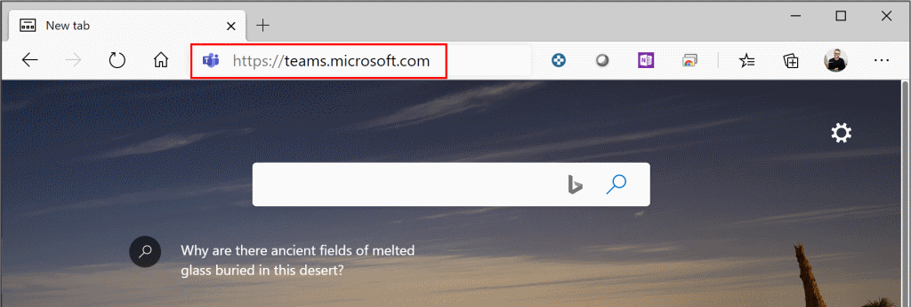
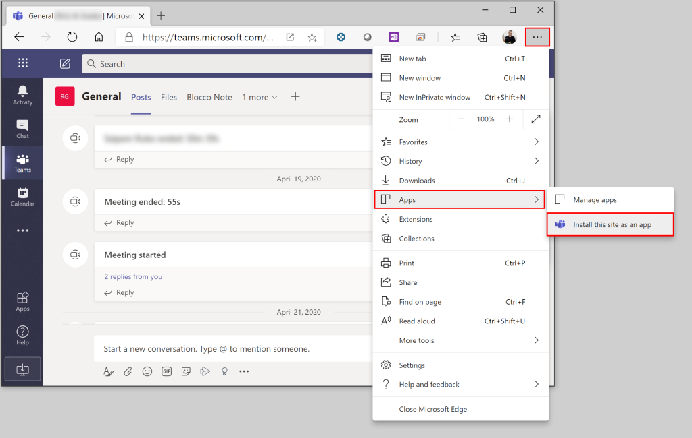
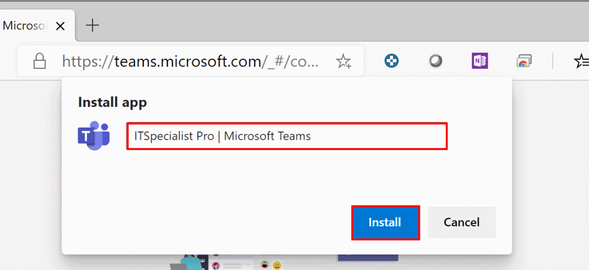
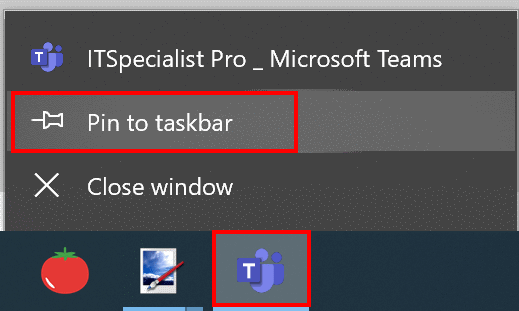
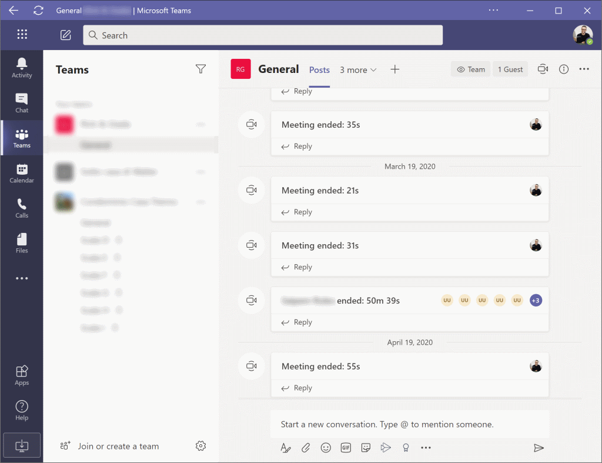

Microsoft Teams è uno strumento straordinario ma con un grande limite con cui anch’io mi scontro: se sei registrato in più tenant di Teams oltre al tuo oppure hai più utenze Azure AD su tenant diversi, non è possibile essere attivo contemporaneamente su tutti e, nativamente, non si possono lanciare due istanze separate dell’applicazione. Quindi, come usare Teams con due account contemporaneamente senza mettere in campo barbatrucchi rischiosi e arzigogolati? È molto più semplice di quanto pensi e serve solo un browser: Microsoft Edge (quello nuovo basato su Chromium).

> *Rick, grazie del consiglio ma ci potevo arrivare anch’io ad aprire Teams via browser!*

So che è stata la prima cosa che hai pensato e, in realtà, hai ragione perché sfrutteremo il browser per avere un altro account di Microsoft Teams attivo.

Però... però... **esiste una funzionalità del nuovo Edge** che trovo fantastica: **la possibilità di installare un sito web come fosse un’applicazione di Windows, appuntandola persino alla taskbar di sistema**. È esattamente questo che faremo!

Come prima cosa, se non l’hai ancora fatto, [scarica ed installa il nuovo Microsoft Edge](https://www.microsoft.com/en-us/edge) basato su Chromium: è una bomba e funziona davvero bene, non c’è davvero più alcuna necessità di usare Google Chrome con un Edge così in forma.

Lancia Edge e apri Teams via Web (https://teams.microsoft.com)

Autenticati con l’utenza che vuoi affiancare al normale client di Teams che hai installato sul tuo PC. I casi sono due:
- se sei *Guest* in un’altra organizzazione con la stessa email che usi per il tuo account aziendale e solitamente “switchavi” sulle altre organizzazioni, allora autenticati con la tua utenza aziendale solita e, una volta autenticato, seleziona in alto a destra il tenant su cui vuoi essere attivo;
- se, per accedere al tenant su cui vuoi essere attivo oltre al tuo, hai proprio un’altra utenza di un altra Azure AD, allora autenticati con quella.

Perfetto! Ora che sei autenticato, mancano solo 3 passaggi.
Il primo è cliccare in alto a destra sulla barra di Edge dove ci sono i tre pallini e selezionare:

**Apps** –> **Install this site as an app**

Nel menu che comparirà, dai un nome alla tua app: io ho optato per dargli il nome dell’organizzazione con cui userò questa web app, in modo che sia sempre chiaro e visibile a quale tenant ci si collega. Dopo aver scritto il nome, premi **Install**.

Finito! La tua app ora è stata automaticamente inserita sulla taskbar di Windows. Per comodità, se vuoi mantenerla, clicca col destro sull’icona e seleziona **Pin to taskbar**.

Che aspetto ha l’app? Molto simile al client, ti troverai sicuramente in un ambiente familiare. 😉

Che ne pensi? Io da quando ho scoperto questo piccolo trucco, non riesco a farne più a meno ed è davvero davvero comodo poter usare Teams con due account contemporaneamente.

Spero che Microsoft trovi presto una soluzione per fare in modo che si possa essere attivi su più tenant contemporaneamente ma, nell’attesa, questo è sicuramente il modo più semplice, veloce ed efficace per ottenere lo stesso risultato.

Ti aspetto nei commenti per sapere cosa ne pensi o se hai altri piccoli trucchi di Teams che aiutano la produttività. A presto!

Il tuo IT Specialist, Riccardo
