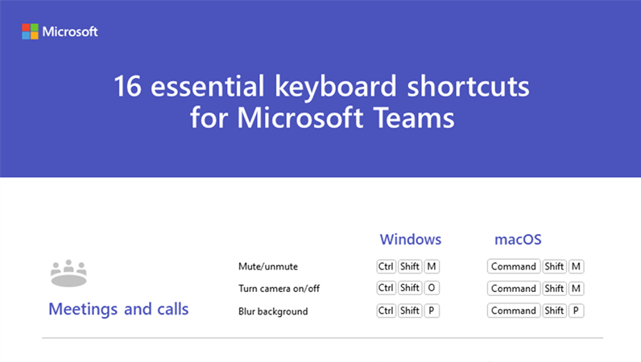

Quando usi un software per molto tempo continuativamente, viene spontaneo chiedersi se ci siano dei modi per velocizzare alcune operazioni. Questa domanda me la sono posta a riguardo di Teams e, cercando per la Rete, ho trovato per te le 16 scorciatoie da tastiera di Microsoft Teams di cui non potrai fare più a meno.

Sono raccolte in una presentazione Powerpoint che mamma Micfrosoft ha messo a disposizione liberamente per il download.

La mia preferita? Quella per attivare/disattivare il microfono (Ctrl + Shift + M) perché, quando sono in call, per evitare di trasmettere rumori di fondo solitamente lo tengo muto ma puntualmente, quando mi interpellano e devo replicare, per la fretta di riattivarlo col mouse faccio dei click a caso ottenendo risultati inaspettati e disastrosi. 🤣

Puoi scaricare il Powerpoint con tutte le scorciatoie da tastiera di Microsoft Teams da questa pagina:
- [16 essential keyboard shortcuts for Microsoft Teams](https://templates.office.com/en-us/16-essential-keyboard-shortcuts-for-microsoft-teams-tm00575249)

E tu, conosci altre scorciatoie? Se sì, segnalamele e parliamone insieme nei commenti o sui miei profili social.

Il tuo IT Specialist, Riccardo