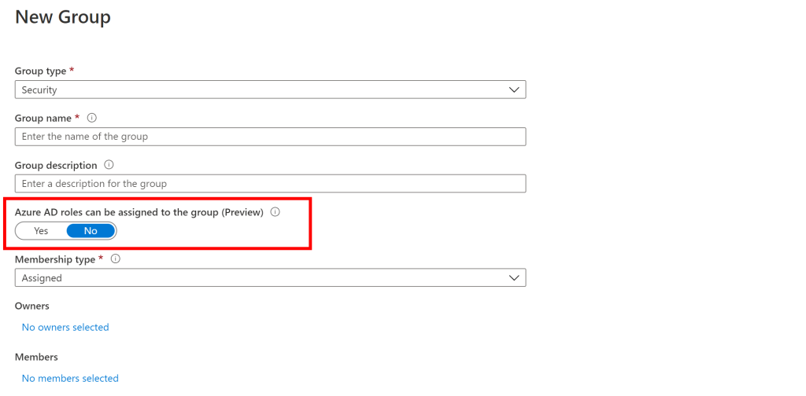

Mentre ero in ferie è stata resa disponibile in anteprima pubblica una funzionalità molto interessante: la possibilità di assegnare gruppi ai [ruoli di Azure AD](https://www.softjam.it/ruoli-amministrativi-di-azure-active-directory-consigli-e-linee-guida-di-utilizzo/).

Molti clienti lo chiedono da anni e, oggettivamente, le logiche di best practice, quando si assegnano abilitazioni e permessi, portano sempre verso l’utilizzo di gruppi. Mi è capitato molte volte di vedere abilitazioni disordinate e un po’ troppo numerose ai ruoli di Azure AD e, soprattutto, era anche scomodo farlo perché, non potendo usare i gruppi, la procedura era diversa dal semplice aggiungi/rimuovi membri da un gruppo. Finalmente anche i ruoli di Azure AD si potranno gestire attraverso i gruppi! È anche un’ottima occasione per fare un po’ di pulizia e consolidare le abilitazioni ai ruoli Azure AD della tua directory!

La funzionalità richiede una licenza Azure AD Premium P1.
Interessante anche l’integrazione con PIM che richiede però licenza Azure AD Premium P2.

Puoi leggere tutti i dettagli della nuova funzionalità all’articolo dell’annuncio:
- [Assigning groups to Azure AD roles is now in public preview!](https://techcommunity.microsoft.com/t5/azure-active-directory-identity/assigning-groups-to-azure-ad-roles-is-now-in-public-preview/ba-p/1257372)

Per ulteriori approfondimenti ecco un po’ di documentazione molto interessante:
- [Use cloud groups to manage role assignments in Azure Active Directory](https://docs.microsoft.com/en-us/azure/active-directory/users-groups-roles/roles-groups-concept)
- [Management capabilities for privileged access Azure AD groups](https://docs.microsoft.com/en-us/azure/active-directory/privileged-identity-management/groups-features)

Userai questa nuova funzionalità di poter assegnare gruppi ai ruoli di Azure AD? Parliamone nei commenti o sui miei profili social, ti aspetto!

Il tuo IT Specialist, Riccardo