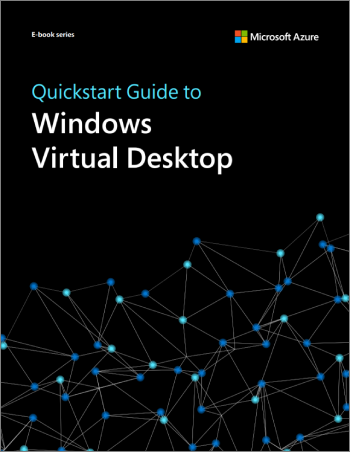

Nuova settimana, nuova lettura gratuita da gustare in queste sere di lockdown (almeno per me, dato che abito in una zona rossa): l’ebook Windows Virtual Desktop Quickstart Guide.

Windows Virtual Desktop è una tecnologia che sta maturando ad un ritmo impressionante: l’integrazione col portale Azure, l’app attach e le tonnellate di funzionalità che Microsoft sta implementando in questi mesi rendono WVD un qualcosa di impossibile da ignorare! Quindi, perché non farsi una cultura?

**A questo proposito, ti ricordo che l’1 Dicembre 2020 parteciperò come speaker al [2° meetup del Windows Virtual Desktop Italian User Group](/windows-virtual-desktop-italian-user-group-meetup-1-dicembre-2020/), dove parlerò di come mettere in sicurezza le identità su WVD.**

Torniamo a noi: cosa troverai su questo eBook?

Imparerai come implementare un ambiente Windows Virtual Desktop in modo che gli utenti possano avere un’esperienza sicura e produttiva indipendentemente da dove essi siano. Troverai concetti di design, pianificazione, dimensionamento delle macchine virtuali Windows 10, oltre a consigli su come ottimizzarle per dirurre i costi e migliorare le performance.

Chicca finale, che non guasta mai, consigli ed esperienze note di troubleshooting in ambiente WVD.

Insomma, secondo me vale la pena! 😉 Potrete scaricarlo al seguente URL, è sufficiente avere un Microsoft Account o un account GitHub:
- [Quickstart Guide to Windows Virtual Desktop](https://azure.microsoft.com/en-us/resources/quickstart-guide-to-windows-virtual-desktop/)

Buona lettura! Ti aspetto nei commenti o sui miei social per sapere cosa ne pensi di questo ebook Windows Virtual Desktop Quickstart Guide.

Il tuo IT Specialist, Riccardo