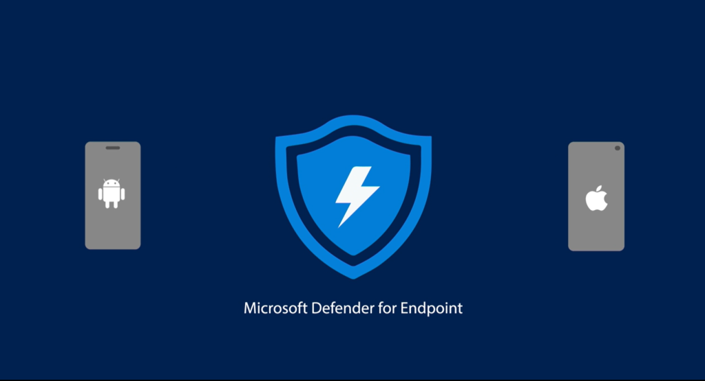

Finalmente! Da un paio di giorni (7 dicembre 2020) la gamma delle soluzioni di sicurezza per dispositivi si completa con l’uscita di Microsoft Defender for Endpoint su iOS!

La centralità del PC in uno scenario aziendale è fuori di dubbio quando si devono produrre contenuti ma gli smartphone ormai sono dei compagni di lavoro sempre presenti e che sono sempre più utilizzati per consultare in mobilità i dati aziendali

**Proteggere anche questo tipo di dispositivi ormai è indispensabile!**

Perché? Perchè i vettori di attacco sono sempre più vari e fantasiosi: oltre che dalla solite mail di phishing, le minacce possono arrivare da app fittizie e malevole sugli app store, dalle app di messaggistica, eccetera.

Dopo l’annuncio dell’[app Defender per Android](https://techcommunity.microsoft.com/t5/microsoft-defender-for-endpoint/announcing-microsoft-defender-atp-for-android/ba-p/1480787) dello scorso giugno 2020, ecco che ora finalmente tocca ad iOS, completando così la gamma di tutti i dispositivi supportati, insieme a Windows, macOS, Linux.

Per ulteriori dettagli, vi lascio alcuni link utili per il download dell’app e alla documentazione.
- [Microsoft Defender for Endpoint on iOS is generally available](https://techcommunity.microsoft.com/t5/microsoft-defender-for-endpoint/microsoft-defender-for-endpoint-on-ios-is-generally-available/ba-p/1962420)
- [Scarica da qui l’app per iOS dall’App Store di Apple](https://apps.apple.com/us/app/microsoft-defender-atp/id1526737990)
- [Documentazione tecnica di Defender for Endpoint per iOS](https://docs.microsoft.com/en-us/windows/security/threat-protection/microsoft-defender-atp/microsoft-defender-atp-ios)

Il tuo IT Specialist, Riccardo