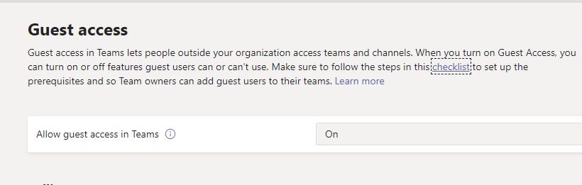

📣 A partire dall’8 febbraio 2021, il Guest Access di Microsoft Teams sarà abilitato di default sui nuovi tenant e sui tenant esistenti che non hanno mai configurato questa impostazione.

⚠ Questa impostazione ha un impatto notevole su come controllare e verificare l’accesso alle risorse dei tuoi team: se prima non avevi mai configurato questa impostazione, ora è il momento di pensarci e di implementare una strategia di governance per Teams.

Ho scritto e raccolto per te alcune risorse utili: un articolo ad argomento governance che avevo scritto qualche tempo fa e un documento ufficiale di Microsoft sul Guest Access.

➡ [Teams Governance FAQ](/microsoft-teams-faq-consigli-governance-utilizzo/)  
➡ [Turn on or turn off guest access to Microsoft Teams](https://docs.microsoft.com/en-us/microsoftteams/set-up-guests)

Hai già implementato una strategia di Governance per Teams o stai pensando di farlo? Parliamone insieme nei commenti!

Il tuo IT Specialist, Riccardo