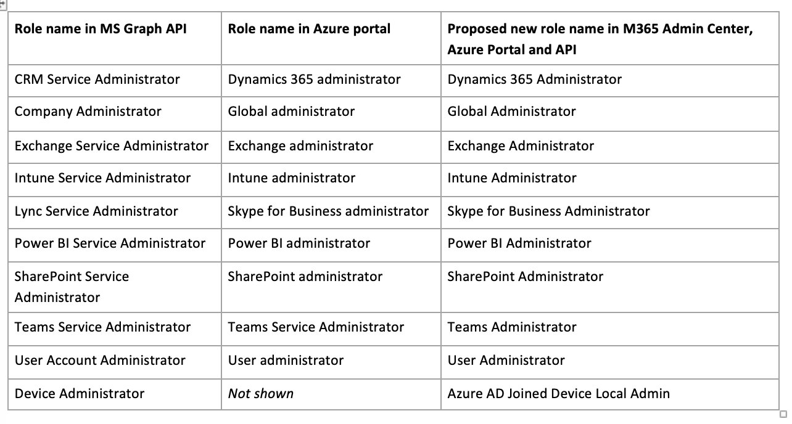

Lo scorso Luglio 2020 Microsoft aveva inviato un primo avviso circa la ridenominazione di 10 ruoli di Azure AD. Ora, Gennaio 2021, la ridenominazione è stata effettuata ed è effettiva. Vediamo insieme perché è una novità importante e che impatti può avere sul tuo ambiente.

In figura i ruoli di Azure Active Directory che sono stati ridenominati. Queste sono le nuove diciture che compaiono su:
- Microsoft 365 admin center
- Azure AD Portal
- Microsoft Graph API

**Quest’ultimo punto (Graph) può causare impatti importanti nel caso in cui tu abbia in produzione degli script o delle applicazioni nel cui codice hai utilizzato il display name del ruolo, anziché il Role Template ID.**

Ecco perché è importante che tu verifichi quanto prima i tuoi script e applicazioni che si appoggiano a questi ruoli di Azure AD, se sospetti che sia stato usato il display name.

Microsoft (e anch’io) **sconsiglia fortemente** l’uso dei display name dei ruoli in script e, in generale, nel codice delle applicazioni: meglio usare il Role Template ID. Per facilitarti nella cosa, ho raccolto per te la lista completa dei ruoli e dei Role Template ID:
- [Role template IDs](https://docs.microsoft.com/en-us/azure/active-directory/roles/permissions-reference#role-template-ids)

Già che ci sono, vado anch’io a controllare i miei script... non si sa mai. 🤣
A presto!

Il tuo IT Specialist,  
Riccardo