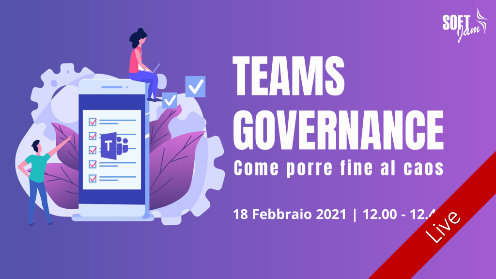

❓ Vuoi sapere come domare il lato selvaggio Microsoft Teams definendo una governance che regoli a 360° tutte le funzionalità di questo strumento?

📣 Te lo racconterò nel prossimo webinar di SoftJam! Ebbene sì, ci sto prendendo gusto a fare da speaker 😊

📅 Quando? 🌐 Dove?  



18 Febbraio 2021 alle ore 12.00

<a href="https://www.softjam.it/teams-governance-come-porre-fine-al-caos/" target="_blank">REGISTRATI QUI!</a>



Ti aspettiamo!

Il tuo IT Specialist, Riccardo