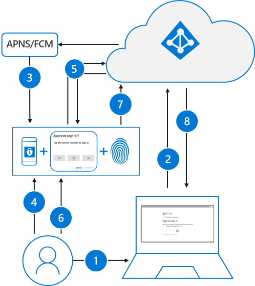

In questi ultimi giorni sto testando le possibilità di autenticazione passwordless offerte da Microsoft, in particolare quella via Microsoft Authenticator.

Ho cambiato la mia password personale mettendo una stringa di 20 caratteri assolutamente senza senso, con maiuscole, minuscole, numeri, caratteri speciali: in pratica non la so a memoria, non l’ho imparata e, credo, nemmeno ci riuscirei anche volendo. 😉
Ora sono curioso di vedere cosa succederà alla prossima modifica della password: se va come credo, sono finiti i tempi dei dolori da cambio password. 😄

La funzionalità è ancora in preview ma, ti anticipo, sembra già essere abbastanza matura.
Ne parlerò in un articolo, stay tuned!

Il tuo IT Specialist, Riccardo