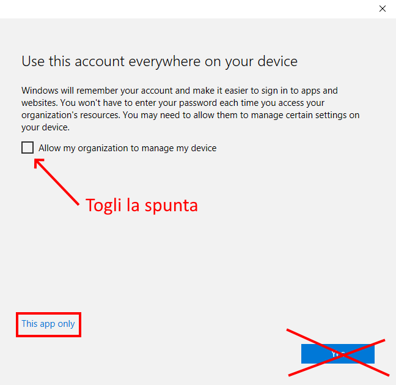

Il tuo tenant Azure AD scoppia di dispositivi in stato “Azure AD Registered” e non sai perché? Ecco il motivo!

Quando installi Office e, in generale, in alcune situazioni in cui devi autenticarti con il tuo work account per usare applicazioni Microsoft, compare spesso questa schermata.

Se lasci la spunta attiva e clicchi “Yes”, il dispositivo che stai usando si registrerà su Azure AD!

Non ci sono effetti collaterali particolari ma il conto da pagare arriva dopo: se stai pianificando, in una fase successiva, di abilitare l’Hybrid Azure AD Join e il tenant è già “inquinato” di centinaia di dispositivi Azure AD Registered censiti inconsapevolmente, dovrai prevedere un’attività di “bonifica” e conversione del loro stato di registrazione. Questo non sempre è facile ed immediato.

Quindi? Nel caso si presentasse questa schermata, nel dubbio, istruisci gli utenti a togliere la spunta e a cliccare “This app only”, specialmente se stanno usando dispositivi personali.

Se vuoi rinfrescarti la memoria su cosa significhi “Azure AD Registered”, ti consiglio il mio articolo di qualche tempo fa sugli [stati di registrazione dei dispositivi in Azure AD](/differenza-azure-ad-registered-azure-ad-joined-hybrid-azure-ad-joined/) e le loro differenze.

## Come posso bloccare l’aggiunta di work account sui dispositivi Windows 10?
Per evitare questo “popup del male” 😉 ed impedire di aggiungere ulteriori work account su un dispositivo Windows 10, è sufficiente impostare una chiave di registro (manualmente o, meglio, distribuendola via GPO):

    HKLM\SOFTWARE\Policies\Microsoft\Windows\WorkplaceJoin, "BlockAADWorkplaceJoin"=dword:00000001

Per ulteriori dettagli, fai riferimento a questa documentazione:
- [Azure Active Directory device management FAQ | Microsoft Docs](https://docs.microsoft.com/en-us/azure/active-directory/devices/faq#how-can-i-block-users-from-adding-additional-work-accounts--azure-ad-registered--on-my-corporate-windows-10-devices)

Inoltre, ecco un altro documento tecnico interessante direttamente targato Microsoft:
- [What is device management in Azure AD?](https://docs.microsoft.com/en-us/azure/active-directory/devices/overview)

E tu hai adottato degli accorgimenti particolari per evitare di registrare inutilmente i dispositivi che usano i servizi di Microsoft 365 ed Azure AD? Parliamone, ti aspetto nei commenti o sui miei social. A presto!

Il tuo IT Specialist, Riccardo