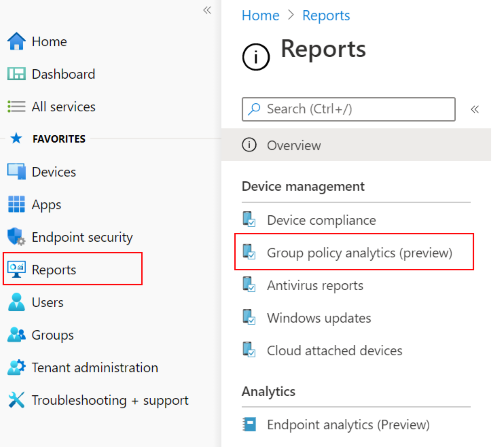

Quando si approccia un MDM in cloud come MEM (Intune) per macchine Windows 10, una delle prime problematiche da affrontare è il confronto con le GPO di Active Directory on-prem.

Da oggi, capire come spostare la gestione delle macchine Windows 10 a MEM è un po’ più facile grazie a Group Policy Analytics, un tool che ti aiuterà a:
- valutare le GPO attualmente applicate da AD;
- tradurle (nei limiti di quanto offre la piattaforma attualmente) in logica cloud.

Se stai pianificando di migrare la gestione dei tuoi endpoint verso Microsoft Endpoint Manager, questo tool ti darà un grande aiuto nel mettere a terra la tua strategia di [Modern Workplace e Modern Workplace Management](/modern-workplace-management/)!

## Come funziona?
- si esportano le GPO in formato XML;
- le si dà in pasto al tool;
- si analizzano i risultati 😉

## Dove trovo Group Policy Analytics?
È una funzionalità in preview all’interno del portale amministrativo di Microsoft Endpoint Manager.

Se vuoi saperne di più, ecco un comodo link alla documentazione ufficiale Microsoft:
- [Use group policy analytics to import GPOs in Microsoft Intune – Azure](https://docs.microsoft.com/en-us/mem/intune/configuration/group-policy-analytics)

Che ne pensi? È una funzionalità ancora in preview ma è davvero molto interessante!

Il tuo IT Specialist, Riccardo