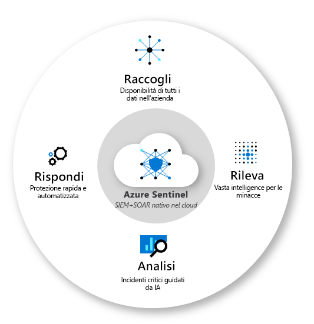

Microsoft Sentinel in 5 passi? Si può fare, basta creare “fil rouge” da seguire all’interno delle sue funzionalità. All’inizio può sembrare un prodotto difficile e spiazzante ma, una volta compreso come collegare tra di loro i vari “puntini” dei suoi strumenti, emerge in maniera chiarissima e potente la sua utilità. Oggi ti aiuterò ad unire proprio quei puntini. 😉 Cominciamo!

***Come leggere i punti di seguito***: *in grassetto i nomi delle sezioni di Microsoft Sentinel. Concentrati sul capire come sono collegati tra loro, focalizzandoti sui riferimenti che ho inserito in ogni punto rispetto agli altri.*

Ok, ora si parte davvero!

1. Attiva i **Data Connector**: sono le sorgenti dei dati da cui attinge Sentinel. Connetti le sorgenti che vuoi (Office365, Azure AD, i tuoi server on-premises, i tuoi apparati di rete, ecc.) per iniziare a raccogliere i dati.

2. Individua i **Workbook** più utili all’interno dei **Data Connector** che hai attivato. Vuoi un cruscotto dinamico da interrogare per comprendere come “vive” la tua infrastruttura? Naviga tra i workbook inclusi nei Data Connector e divertiti ad interpretare i tanti dati che offrono.

3. Attiva le **Analytics Rules** dei **Data Connector** o crea un’analytics rule tutta tua con le query KQL, se vuoi che i log raccolti vengano analizzati e correlati tra loro in maniera intelligente, in modo da avere a portata di mano le informazioni che servono per individuare “chi è coinvolto in cosa” quando viene rilevata un’anomalia di sicurezza.

4. Esplora la sezione **Incidents** per avere evidenza degli alert e delle anomalie rilevate dalle **Analytics Rules** che hai attivato.

5. Vuoi scatenare delle azioni di remediation automatiche in seguito ad un Incident? Crea un **PlayBook** e lascia che sia lui ad occuparsi di tutto, agganciandolo come automazione da eseguire in seguito ad un **Incident**.

Che ne dici? È più chiaro? Spero di sì 🙂

Se ho stuzzicato la tua curiosità, sappi che sto scrivendo un articolo molto più approfondito di questo a riguardo, quindi rimani sintonizzato su questo blog.

Se, invece, sei davvero curioso e non stai più nella pelle di saperne di più, ecco un buon punto da cui partire per studiare Azure Sentinel:
- [Azure Sentinel documentation | Microsoft Docs](https://docs.microsoft.com/en-us/azure/sentinel/)

A presto per un articolo più approfondito!

Il tuo IT Specialist, Riccardo