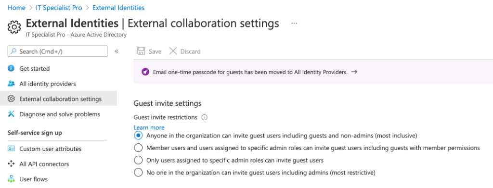
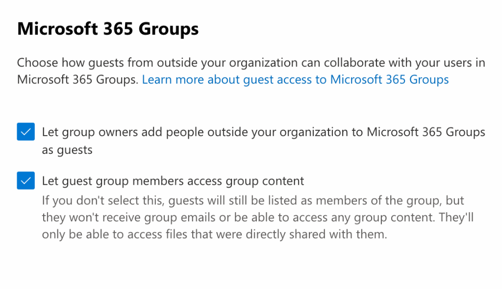

Abilitare il Guest Access per Teams ed Azure AD richiede di verificare ed implementare alcune configurazioni che, purtroppo, si trovano su portali diversi di Microsoft 365: può risultare un po’ dispersivo. Ho creato per te una guest access checklist completa per verificare tutte queste impostazioni, oltre a quelle di external sharing, in modo che nessuno sia mai più costretto a vagare tra i portali di amministrazione, alla ricerca del settaggio perduto.

Ecco, sezione per sezione e portale per portale, dove verificare ed impostare la tua strategia di guest access ed external sharing. Si comincia!

## Impostazioni Azure External Collaboration
Comincia dal portale di Azure (https://portal.azure.com), navigando tra le blade fino alla sezione:

**Azure Active Directory** –> **External Identities** –> **External Collaboration Settings**

Qui troverai le impostazioni di chi, a livello di Azure AD, ha i permessi per poter invitare dei guest nella tua organizzazione. L’impostazione di default è *“Anyone in the organization can invite guest users...“*, il che sta a significare che chiunque (anche i guest), all’interno del tenant, può invitare utenti esterni.  
Se ti va bene così, lascia questa impostazione.  
Se vuoi avere maggiore controllo su chi può invitare guest, seleziona una delle altre impostazioni (non l’ultima che, come vedi, nega a chiunque la possibilità di invitare i guest). Ricordati poi di assegnare il ruolo Azure AD di Guest Inviter alle utenze a cui vorrai permettere di invitare persone esterne.

**Attenzione: queste impostazioni sovrascrivono eventuali altre impostazioni di condivisione impostate in Microsoft 365.**

## Impostazioni di Guest Access su Teams
La guest access checklist prosegue con il portale di amministrazione di Microsoft Teams (https://admin.teams.microsoft.com). Naviga fino alla sezione:

**Org-wide Settings** –> **Guest Access**

Qui l’impostazione da verificare è molto semplice ed intuitiva: **On** oppure **Off**. 😃
Da notare che, da qualche tempo a questa parte, per i nuovi tenant [l’impostazione di default del guest access](/microsoft-teams-attiva-il-guest-access-di-default/) è cambiata ed è “On”.

Attenzione: l’impostazione è globale e quindi avrà effetto su tutti i team. Se desideri inibire il guest access (e altre impostazioni) sui singoli Team, puoi ottenere questo risultato applicando delle label sui gruppi:
- [Use sensitivity labels with Microsoft Teams, Microsoft 365 groups, and SharePoint sites – Microsoft 365 Compliance | Microsoft Docs](https://docs.microsoft.com/en-us/microsoft-365/compliance/sensitivity-labels-teams-groups-sites?view=o365-worldwide)

## Impostazioni di guest access sui Microsoft 365 Group
Come sai, i Microsoft 365 Groups sono il motore sotto ogni team ma non è detto che, all’interno del tenant, ad ogni Microsoft 365 group corrisponda un Team. In altre parole: **un team non può esistere senza un gruppo Microsoft 365 collegato. I gruppi Microsoft 365, invece, possono non avere un Team collegato**. L’immagine seguente spiega molto bene la relazione tra i gruppi e i team. Come vedi, alla creazione di un Microsoft 365 group, vengono create (**sempre** e **automaticamente**) alcune risorse, come ad esempio un sito Sharepoint, una casella Exchange, eccetera. **Non un team**. I Microsoft 365 group, quindi, possono avere un’esistenza a sè stante, indipendentemente dal fatto che tu gli abbia agganciato un team o meno.

**Perdonami se insisto molto su questo concetto ma è davvero importante, perché devi comprendere che agire sulle impostazioni dei Microsoft 365 groups, significa impattare non solo i team ma anche i tuoi siti Sharepoint, i Planner, Yammer, Exchange Online, eccetera.**

Ad ogni modo, se vuoi impostare una strategia di guest access ed external sharing, tra le cose che dovrai impostare e verificare, ci sono anche i Microsoft 365 groups, per forza. Per vedere com’è impostato il guest access sui gruppi, devi andare sul portale amministrativo di Microsoft 365 (https://admin.microsoft.com), alla sezione:

**Settings** –> **Org Settings** –> **Microsoft 365 Groups** (nella tab “Services“)

Cosa significano queste opzioni?
- con la prima, dai (o meno) il permesso agli owner dei gruppi Microsoft 365 di aggiungere guest;
- con la seconda, dai (o meno) il permesso ai guest di accedere ai contenuti dei gruppi Microsoft 365.

Attenzione: mi ripeto per l’ennesima volta! Qui si parla espressamente di gruppi Microsoft 365, non per forza di team.

Vuoi approfondire il tema? Ecco un link fresco fresco, per te:
- [Microsoft 365 Groups and Microsoft Teams – Microsoft Teams | Microsoft Docs](https://docs.microsoft.com/en-us/MicrosoftTeams/office-365-groups)

## Impostazioni globali di condivisione di SharePoint Online
Come abbiamo visto poco fa, ogni team ha sotto il motore un gruppo Microsoft 365 e quindi anche un sito SharePoint. Se vuoi che la tua guest access checklist sia completa ed esaustiva, devi controllare anche le impostazioni globali di condivisione di SharePoint online. Per fare questo, parti dal portale amministrativo di Microsoft 365 (https://admin.microsoft.com) e naviga tra le sue sezioni fino a raggiungere il centro amministrativo di SharePoint:

**Admin centers** –> **SharePoint** –> **Policies** –> **Sharing**

Verifica e seleziona i valori che rispecchiano il risultato che desideri ottenere. I comportamenti in base alle impostazioni sono descritti in maniera chiara ed esaustiva in corrispondenza dei “canali del mixer”.

## Impostazioni di default per i link di condivisione
Per una volta tanto, non dovremo andare su un altro portale. Queste impostazioni si trovano immediatamente dopo quelle viste al punto precedente e riguardano la configurazione di default dei link di condivisione creati dal sito SharePoint collegato al team.

Vediamo cosa significano le varie opzioni:
- **Specific people**: è quello che, nell’audit log di Microsoft 365 viene chiamato “PrivateLink”, ovvero un link che è utilizzabile solo dalle persone esplicitamente indicate nell’invito di condivisione del dato;
- **Only people in your organization**: questo link è utilizzabile e visualizzabile da chiunque all’interno del tuo tenant. È quello che, nell’audit log è classificato come “CompanyLink”;
- **Anyone with the link**: chiunque, anonimo, anche al di fuori del tuo tenant potrà utilizzare e visualizzare i contenuti presenti al link creato.

## Utenti guest e autenticazione
Un’ultima chicca prima di concludere: se i tuoi utenti guest hanno indirizzi di posta Google o appartengono ad altri tipi di organizzazioni che non siano Offi ce 365, invitarli sul tuo tenant significa costringerli a registrare un Microsoft Account. Se vuoi permettere loro di usare le credenziali che già hanno, senza costringerli a registrare un nuovo account, ti suggerisco di valutare la [collaborazione B2B di Azure AD External Identities](/azure-ad-b2b-azure-ad-external-identities-prova-sul-campo/).

## Conclusioni
Fantastico, siamo arrivati alla fine di questa checklist di attivazione e di configurazione del guest access per Teams. Il tuo tenant ora è pronto per collaborare in maniera controllata e consapevole con i guest user!

Che ne pensi? Eri a conoscenza di tutte queste impostazioni sparse tra i vari portali? Fammi sapere la tua esperienza sul campo e se hai trovato altre best practice da seguire nel configurare il guest access. Ti aspetto sui miei social!

Il tuo IT Specialist, Riccardo