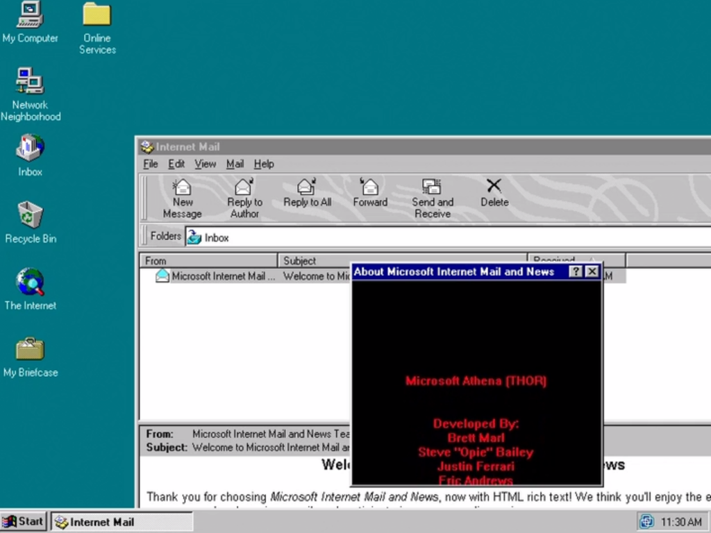

Non è Pasqua senza Easter Egg e non è mai troppo tardi per scoprirne uno: dopo 25 anni, è stato scoperto un nuovo Easter Egg su Windows 95 😆

Per riprodurlo, è sufficiente lanciare **Internet Mail** (sigh... quanti ricordi! 🥲), cliccare su **Help** e poi su **About**. Una volta comparsa la finestra, cliccate su **comctl32.dll** in modo che sia evidenziato e, senza fare altro, scrivete **MORTIMER** sulla tastiera. 😀

Per saperne di più o vedere l’Easter Egg all’opera:
- [il video con l’Easter Egg: Easter egg in Windows 95 Internet Mail on Vimeo](https://vimeo.com/529718129)
- [l’articolo dove se ne parla: Windows 95 Easter egg discovered after being hidden for 25 years (bleepingcomputer.com)](https://www.bleepingcomputer.com/news/microsoft/windows-95-easter-egg-discovered-after-being-hidden-for-25-years/)

Buona Pasqua a tutti!

P.S.: sono curioso di sapere se installerai una VM di Windows 95 solo per provarlo… io ci sto pensando 🤣

Il tuo IT Specialist, Riccardo