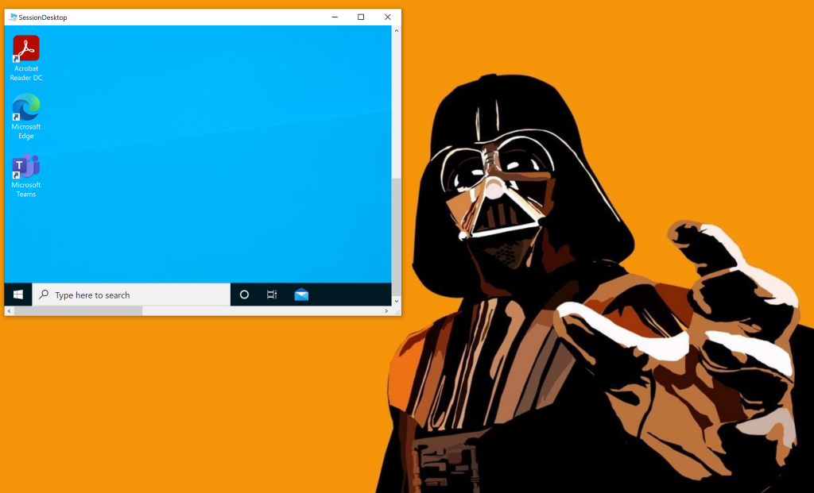
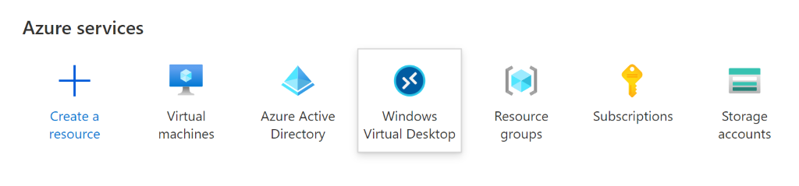
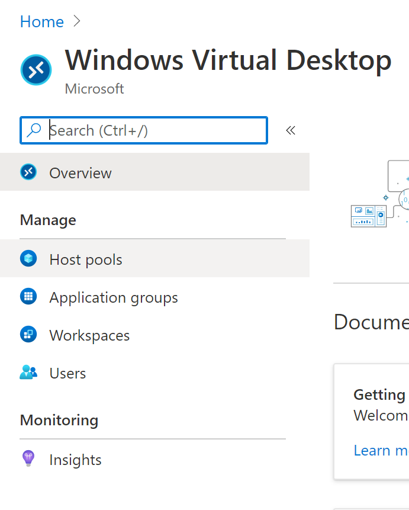
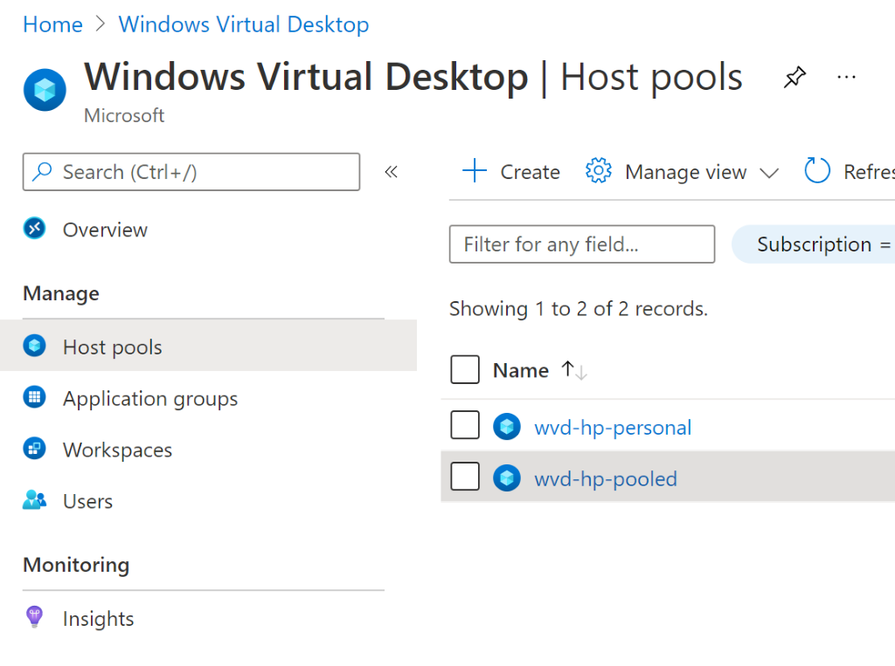
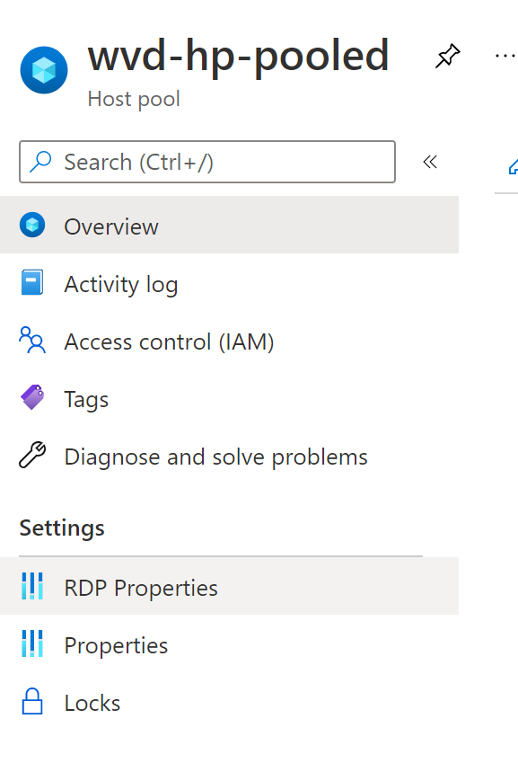
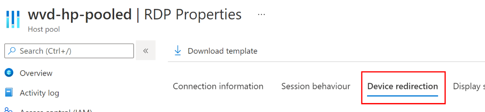
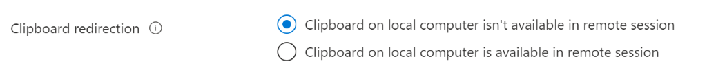

Per un progetto che sto seguendo ultimamente, un cliente mi ha chiesto se ci sia la possibilità di disabilitare il copia e incolla su Windows Virtual Desktop, bloccando la clipboard della sessione RDP. La risposta è “sì”! Vediamo come.

||
|:---:                                                                                                                        |
|“Trovo la mancanza del copia/incolla insopportabile...” (cit.)                                                               |

Solitamente, in un ambiente on-premises, per bloccare la clipboard bisognerebbe configurare una GPO di Active Directory o una policy locale di macchina. Su Windows Virtual Desktop, disabilitare il copia/incolla è semplice ed immediato: basta abilitare una spunta all’interno delle configurazioni dell’host pool!

Primo passo, vai sul portale Azure e seleziona la blade di **Windows Virtual Desktop**

La configurazione che ti interessa si deve fare a livello di host pool: seleziona quindi **Host Pools**

Ora seleziona l’host pool per il quale ti interessa disabilitare il copia e incolla

La configurazione è, a tutti gli effetti, una proprietà della sessione Remote Desktop. Nel menu di sinistra, quindi, seleziona **RDP Properties**.

Ci siamo quasi: clicca sulla sezione **Device Redirection** nella blade delle proprietà RDP.

Ci siamo! Scorri la lista delle varie proprietà che si possono impostare fino a che trovi la voce **Clipboard redirection**. Impostala al valore **Clipboard on local computer isn’t available in remote session**

Voilà! Hai bloccato la possibilità di fare copia e incolla tra la VM Windows Virtual Desktop e il tuo client fisico da cui stai lanciando la sessione.

In quali casi può essere utile? Se vuoi rendere più difficile portare dati fuori dalla VM WVD, questo è sicuramente un buon inizio ma non è sufficiente: devi affiancare questo blocco ad altre strategie come, ad esempio, bloccare OneDrive o bloccare la redirezione dei dischi locali nella sessione RDP. È possibile ottenere lo stesso risultato in altri modi ma prevedono l’utilizzo di MEM (Intune): ne parlerò in un nuovo articolo!

Prima di salutarti, vorrei farti notare altre proprietà RDP utili che è possibile impostare per Windows Virtual Desktop. Le più interessanti e richieste dai clienti sono:
- redirezione delle stampanti locali;
- blocco della redirezione dei dischi locali del tuo client fisico verso la sessione RDP;
- la redirezione dei dispositivi USB.

Se vuoi approfondire l’argomento, ecco un po’ di documentazione Microsoft croccante e appena sfornata:
- [Customize RDP properties with PowerShell – Azure | Microsoft Docs](https://docs.microsoft.com/en-us/azure/virtual-desktop/customize-rdp-properties)

Come vedi, l’evoluzione di Windows Virtual Desktop è velocissima e inarrestabile! E tu, quali proprietà RDP utilizzi nel tuo ambiente Windows Virtual Desktop? Ti aspetto nei commenti o sui miei profili social per parlarne. Grazie di avermi seguito fino a qui, a presto!

Il tuo IT Specialist, Riccardo