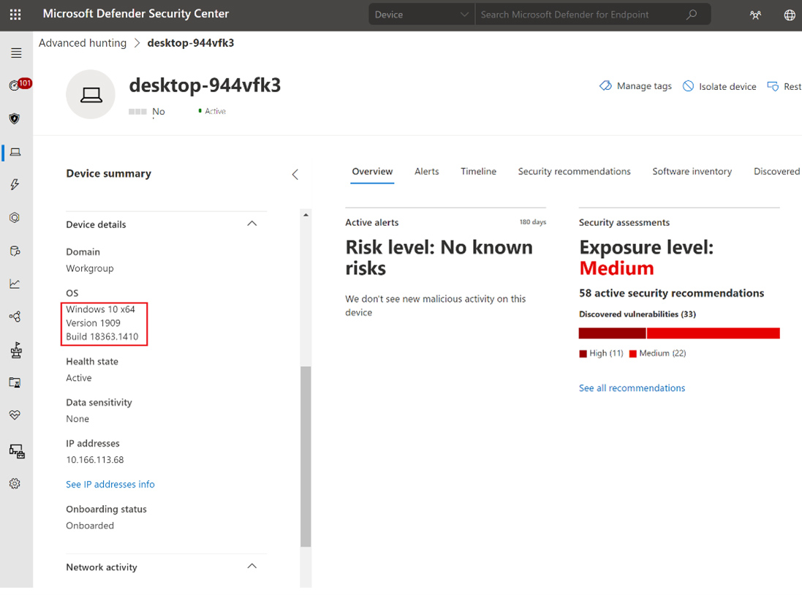

Il percorso di Microsoft Defender for Endpoint nell’ultimo anno è stato impressionante: dopo il supporto a Linux, ad Android, a macOS e iOS, ora, finalmente è arrivato il turno di Windows 10 su dispositivi ARM.

Microsoft ha annunciato quindi il supporto a Windows 10 su dispositivi ARM per la soluzione di protezione degli endpoint inclusa nella licenza Microsoft 365 E5 o disponibile come pacchetto stand-alone.

Leggendo l’annuncio, pare che tutte le funzionalità più interessanti e utili di questo prodotto siano supportate e disponibili:
- device inventory;
- response;
- alerts;
- advanced hunting;
- antivirus e antimalware capabilities.

Questo tool è ormai completo e offre un ampio spettro di protezione che copre qualunque tipo di endpoint presente tipicamente in azienda.

Per approfondire l’argomento, ecco alcune risorse utili: 
- [Microsoft Defender for Endpoint now supports Windows 10 on Arm devices – Microsoft Security](https://www.microsoft.com/security/blog/2021/04/05/microsoft-defender-for-endpoint-now-supports-windows-10-on-arm/)
- [Microsoft Defender for Endpoint | Microsoft Docs](https://docs.microsoft.com/en-us/microsoft-365/security/defender-endpoint/microsoft-defender-endpoint?view=o365-worldwide)

E tu, l’hai mai provato? Se sì, anche su dispositivi non Windows 10? Raccontami la tua esperienza, ti aspetto sui miei profili social!

Il tuo IT Specialist, Riccardo