In questi infiniti giorni di zona rossa, mi sono divertito a giocare con Azure AD B2B. Se ti stai domandando: “Per quale motivo ?”, ecco la risposta. Durante il primo lockdown del 2020, per puro svago e in preda alla follia, avevo creato un concept per [usare Microsoft Teams in condominio](/concept-microsoft-teams-in-condominio/), allo scopo di aumentare la collaborazione e la condivisione di documenti e materiale utile. Diciamoci la verità: la maggior parte delle persone, quando si tratta di indirizzi di posta elettronica personali, usa Google GMail. Pochi hanno un Microsoft Account. E qui casca l’asino: quando ho iniziato ad invitare i primi condomini per fare un test, mi sono accorto che oltre il 90% di loro aveva una casella GMail e, aggiungendoli come guest al mio tenant Azure AD, tutti sono stati costretti a registrare ex-novo un Microsoft Account. Era una bella seccatura: una nuova registrazione, una nuova password da gestire, insomma le solite resistenze di quando bisogna chiedere alle persone di cambiare abitudini o di fare qualcosa di nuovo. 😉

Come riuscire a semplificare il tutto permettendo agli ospiti di:
- accedere a Teams e alle risorse del team in maniera semplice, accedendovi come se stessero facendo sign-in ad un servizio per il quale erano già registrati;
- usare la loro identità GMail, autenticandosi con Google e senza dover registrare un Microsoft account?

A quel punto la lampadina sopra la mia testolina si è accesa: la soluzione era **Azure AD B2B**!

## Cos’è Azure AD B2B?
La collaborazione B2B di Azure AD è un insieme di funzionalità della soluzione **Azure AD External Identities**. Questa soluzione mette a disposizione degli strumenti che consentono di dare accessi e permessi alle tue risorse ad entità/utenze al di fuori della tua organizzazione, **sfruttando credenziali e autenticazione del loro Identity Provider**. Una sorta di “Bring Your Own Identity”. Questa era la spiegazione più formale: passiamo alle cose più concrete e semplici, per capire meglio.

## Come funziona Azure AD B2B?
Ad alto livello, semplificando, funziona così:
- configuri, una tantum, gli opportuni settaggi sul tuo tenant Azure AD e su Google/Facebook (o qualunque sia il tuo identity provider);
- crei un nuovo guest user sul tuo tenant Azure AD per l’utente esterno, mandandogli un invito via mail o inviandogli direttamente un link;
- il collaboratore esterno riscatta l’invito;
- aggiungi e abilita l’ospite alle applicazioni e alle risorse a cui desideri che acceda;
- perfetto, l’utente esterno ora è pronto per accedere alle applicazioni/risorse alle quali è stato abilitato!

## Come si configura? Come aggiungo Google come Identity Provider?
**Quella che sto per descrivere di seguito è una configurazione fatta a puro titolo esemplificativo e che funziona solo con gli utenti di GMail. Ripeto, solo per gli utenti con indirizzo di posta gmail.com.**

Per gli utenti GSuite, è necessario fare una **federazione diretta**, il che è al di fuori degli scopi di questo articolo. Se però ti conosco almeno un po’, so di averti incuriosito e quindi ecco un documento Microsoft tecnico freschissimo, così fresco che è ancora in preview, al momento in cui scrivo questa guida:
- [Direct federation with an identity provider for B2B – Azure AD | Microsoft Docs](https://docs.microsoft.com/en-us/azure/active-directory/external-identities/direct-federation)

Fatte le dovute precisazioni, possiamo partire con questa prova sul campo!

## Passo 1: configura un Google developer Project
Accedi alla tua [Google Developers Console](https://console.developers.google.com/) con un’utenza gmail.com (possibilmente di team e non personale) e crea un nuovo progetto.

[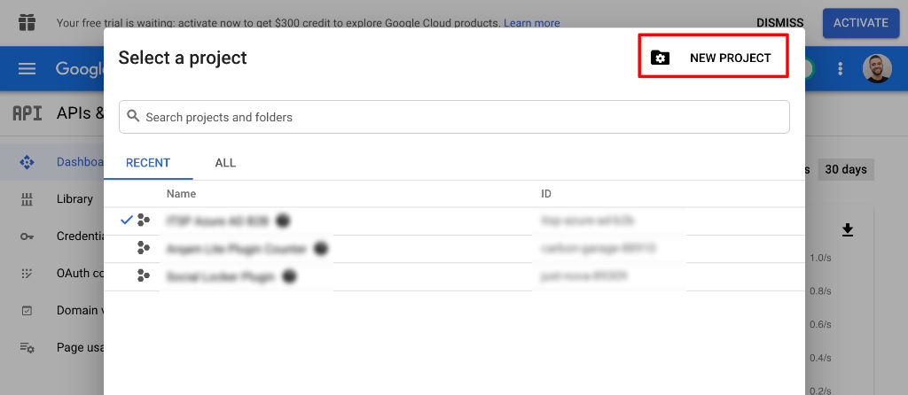](03-Azure-AD-B2B-External-Identities-Google-Dev-Console-1.jpg)

Ora, segui passo passo le istruzioni di questa guida:
- [Step 1: Configure a Google developer project](https://docs.microsoft.com/en-us/azure/active-directory/external-identities/google-federation#step-1-configure-a-google-developer-project)

***Nota:*** *solo per questo primo step, ti faccio seguire una guida esterna, perché riguarda i passaggi da svolgere sulla piattaforma di Google. Seguendo una documentazione esterna, avrai la garanzia che la procedura sarà sempre aggiornata.*

Alla fine di questa procedura sul portale Google, dovrai conservare due informazioni molto importanti:
- **il client ID**;
- **il client secret**.
Queste due informazioni ti serviranno perché le inserirai sul portale di Azure AD nel prossimo passaggio: annotale con cura.

## Passo 2: configura la federazione del tuo tenant Azure AD con Google
Accedi al tuo tenant Azure AD e, alla sezione **Azure Active Directory** –> **External Identities** –> **All Identity Providers**, aggiungi Google come Identity Provider

[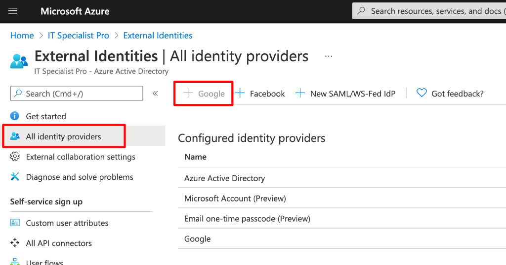](02-Azure-AD-B2B-External-Identities-All-Identity-Providers.jpg)

Una volta cliccato su **+ Google**, comparirà la seguente blade, all’interno della quale dovrai inserire le due informazioni che dovresti aver annotato dal passaggio precedente:
- client ID;
- client secret.

[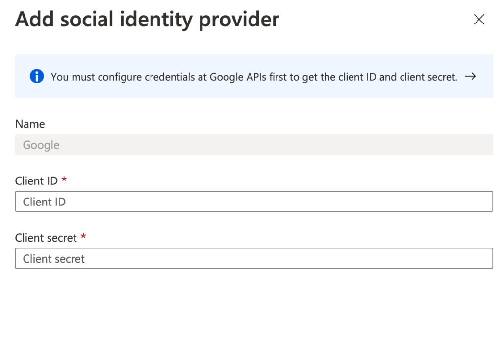](05-Azure-AD-B2B-External-Identities-Add-Google-2.jpg)

Perfetto! È tutto pronto per iniziare ad invitare i guest GMail!

## Passo 3: crea un utente guest con indirizzo GMail su Azure AD e mandagli l’invito
È ora di popolare il tuo tenant, invitando il primo guest con indirizzo @gmail.com. 😉
Come? In questo modo:

Naviga il portale fino alla sezione **Azure Active Directory** –> **Users** e clicca su **+ New guest user**

[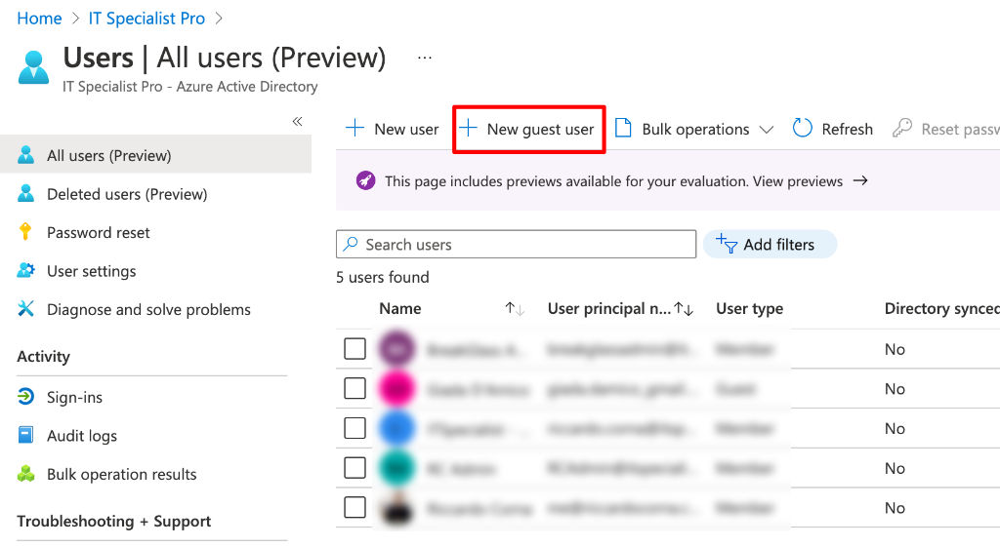](06-Azure-AD-B2B-External-Identities-New-Guest-User.jpg)

Comparirà una schermata all’interno della quale dovrai inserire i dettagli del tuo ospite:
- Invite User;
- Full Name / Display Name;
- indirizzo di posta @gmail.com;
- se vuoi, nome e cognome;
- un messaggio di benvenuto.

Infine, clicca su **Invite**.

[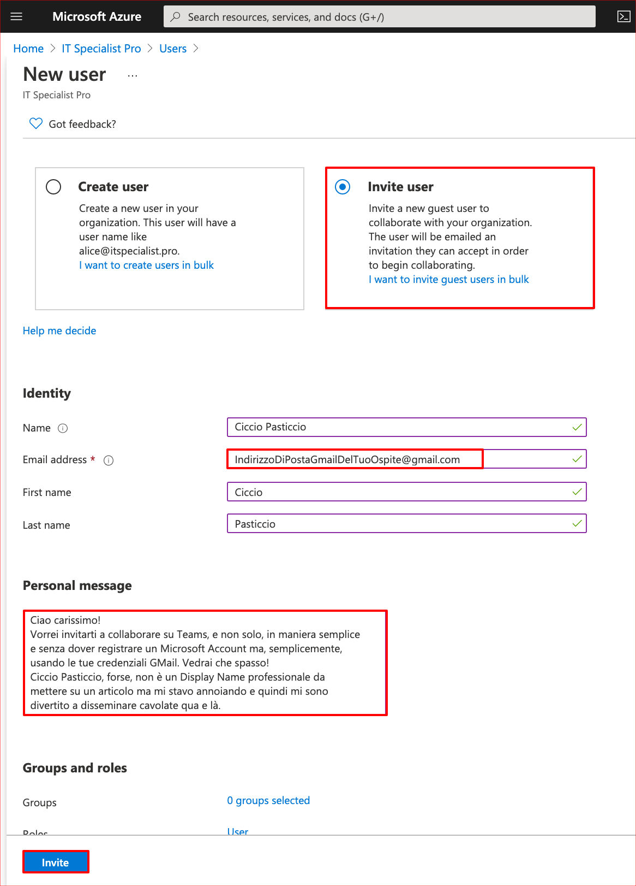](07-Azure-AD-B2B-External-Identities-New-Guest-User-Details.jpg)

Perfetto: **invito partito**!

## Passo 4: il tuo guest user riscatta l’invito
Ora ti chiedo, solo per un attimo 😄, di metterti nei panni di Ciccio Pasticcio, il tuo guest user 🙂 Gli è sicuramente arrivata un’email che ha un aspetto simile:

[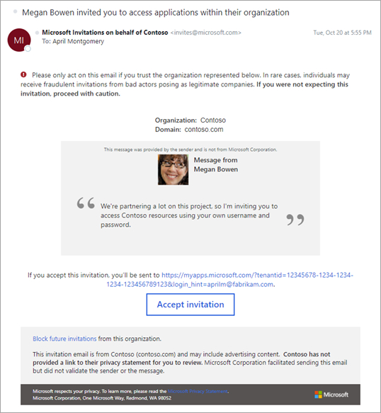](08-Azure-AD-B2B-External-Identities-Invitation-Mail.jpg)

Tutto quello che dovrà fare Ciccio Pasticcio, sarà cliccare sul pulsantone **Accept Invitation** e seguire passo per passo le istruzioni.
Alla fine di questa procedura, è a tutti gli effetti a bordo del tuo tenant Azure AD!

## Passo 5: abilita l’ospite ad un’applicazione
Puoi smettere i panni di Ciccio Pasticcio e tornare in te! In questo esempio, aggiungerai l’ospite GMail ad un Team.

[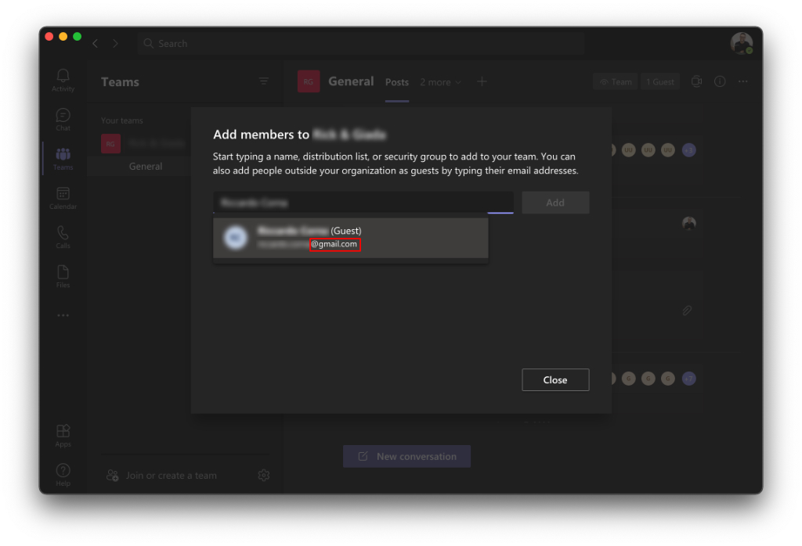](09-Azure-AD-B2B-External-Identities-Add-guest-to-Team.jpg)

Perfetto! Ora viene la parte divertente...

## Passo 6: il guest user si autentica per utilizzare l’applicazione
Qui viene il pezzo più interessante e, al contempo, non proprio intuitivo per il tuo guest. Ti chiedo, nuovamente, di rimetterti nei panni dell’ospite, per capire cosa succede d’ora in poi.

Come farà il guest ad autenticarsi per utilizzare l’applicazione? Dove lo farà? A quale URL?

Un guest user GMail federato tramite Azure AD B2B ha **2 modalità per autenticarsi**, vediamole una per una.

### 1. Endpoint di autenticazione comuni

Il tuo ospite GMail, può usare un endpoint di autenticazione Microsoft di quelli “comuni”, ovvero i classici URL dei vari portali, senza alcuna personalizzazione o specificazione di quale sia il tenant a cui ci si sta autenticando:
- https://portal.office.com;
- https://portal.azure.com;
- https://teams.microsoft.com;
- https://myapps.microsoft.com;
- ecc.

In questo caso, la procedura è poco intuitiva e prevede che, prima di inserire l’indirizzo GMail, si debba in qualche modo “selezionare” il tenant su cui autenticarsi, in modo da “attivare” in maniera corretta la federazione. Trovo questo metodo un po’ macchinoso e poco intuitivo. Se decidi di usarlo, dovrai pensare ad una campagna di comunicazione coi fiocchi verso i tuoi utenti, in cui dovrai documentare i vari passaggi.
Ecco uno screenshot con la sequenza di operazioni che ti ho descritto poco fa:
- il guest seleziona Sign-in options;
- il guest seleziona Sign-in to an organization;
- il guest inserisce uno dei domini associati al tenant di destinazione: è questo che non mi piace! Un ospite non è per forza tenuto a sapere questa informazione e questo rende poco intuitivo il processo di autenticazione.

[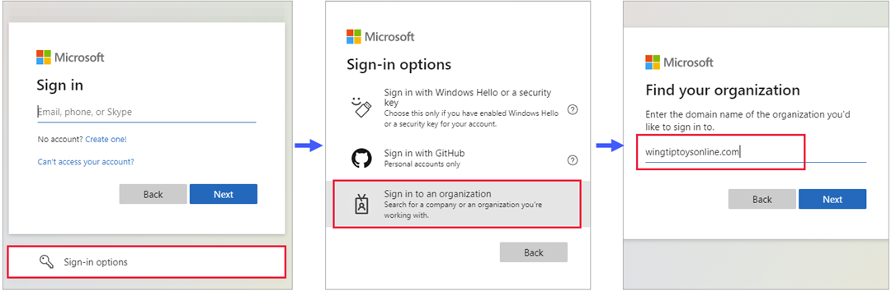](10-Azure-AD-B2B-External-Identities-Auth-Common-Endpoint.png)

A questo punto, comparirà una maschera di login specifica del tenant Azure AD dove effettivamente sta il nostro guest: gli basterà inserire la sua email GMail e aspettare che accada la magia... **che però ti racconto nel prossimo paragrafo** perché mi piace molto di più fornire agli ospiti i cosiddetti endpoint di autenticazione “tenant-specific”. 😉

Cosa sono gli endpoint “tenant-specific”? Te lo racconto subito.

### 2. Endpoint di autenticazione Azure AD B2B tenant-specific
Proviamo a rendere le cose più semplici, accedendo a quello che si chiama un **endpoint specifico di autenticazione**. Che cos’è? È un semplice URL, tra quelli disponibili per accedere ai servizi Azure o M365, che però contiene già al suo interno le informazioni per far “atterrare” l’utente ospite sul **tuo** tenant, evitando quindi quel passaggio macchinoso di cui ti raccontavo nel paragrafo precedente.

Come sono fatti questi URL tenant-specific?  
Quali sono gli endpoint di autenticazione tenant-specific?  
Eccone alcuni:
- **https://myapps.microsoft.com/?tenantid=*<l’ID del tuo tenant Azure AD>***
- **https://myapps.microsoft.com/*<uno dei domini verificati del tuo tenant>***

Nel nostro caso specifico, visto che vogliamo accedere a Microsoft Teams, il link tenant-specific è:
- **https://teams.microsoft.com/?tenantId=*<l’ID del tuo tenant Azure AD>***

Gli endpoint di autenticazione specifici sono molto più immediati e comodi per gli utenti ospiti!
**Il mio consiglio è di fornire direttamente ai tuoi ospiti gli endpoint specifici, in modo che l’autenticazione sia il più possibile liscia e semplice!**

E ora, finalmente, dopo tutto questo lavoro, vediamo la magia, perchè è proprio qui che accade.
Una volta atterrato su un link tenant-specific, a prima vista, sembra ci sia la solita maschera di autenticazione di M365. Il tuo ospite inserirà il suo indirizzo GMail e cliccherà **Next**.

[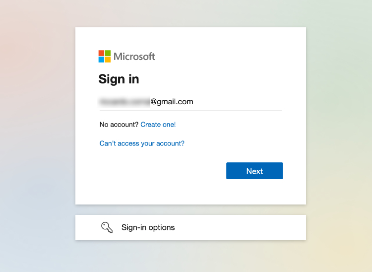](11-Azure-AD-B2B-External-Identities-M365-login.jpg)

**Ecco la magia! Anziché autenticarsi su microsoftonline.com, come accadrebbe di solito, il tuo ospite GMail verrà autenticato direttamente da Google e potrà usare le sue solite credenziali GMail!**

[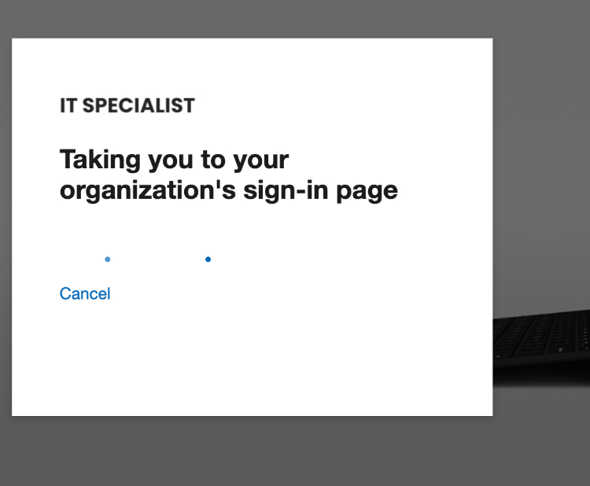](12-Azure-AD-B2B-External-Identities-Redirection.jpg)

... e voilà! Ecco la maschera di autenticazione di GMail! Al nostro amico guest Ciccio Pasticcio non resta che autenticarsi su GMail come è abituato da sempre, senza traumi o ulteriori registrazioni.

[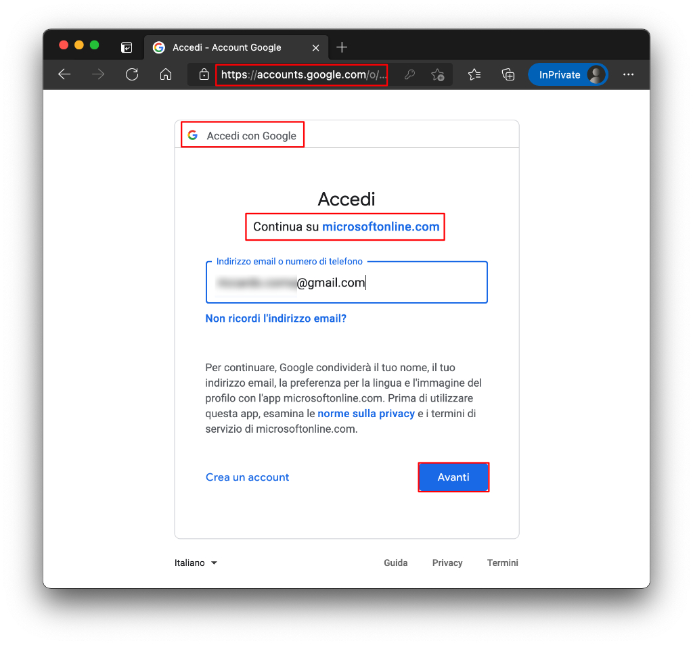](13-Azure-AD-B2B-External-Identities-Google-form.jpg)

Di seguito, alcuni link che fanno sicuramente al caso tuo se vuoi approfondire tutte le tematiche legate agli inviti e al loro riscatto e come abilitare gli ospiti alle applicazioni registrate sul tuo tenant Azure AD:
- [Invitation redemption in B2B collaboration – Azure AD | Microsoft Docs](https://docs.microsoft.com/en-us/azure/active-directory/external-identities/redemption-experience)
- [Add B2B collaboration users in the Azure portal – Azure AD | Microsoft Docs](https://docs.microsoft.com/en-us/azure/active-directory/external-identities/add-users-administrator)
- [Add B2B collaboration users as an information worker – Azure AD | Microsoft Docs](https://docs.microsoft.com/en-us/azure/active-directory/external-identities/add-users-information-worker)

## Passo 7: autenticazione Azure AD B2B fatta! È ora di collaborare…
Ed infine… finalmente, eccoci nel team! Come vedi, il nostro ospite è correttamente classificato come guest.

[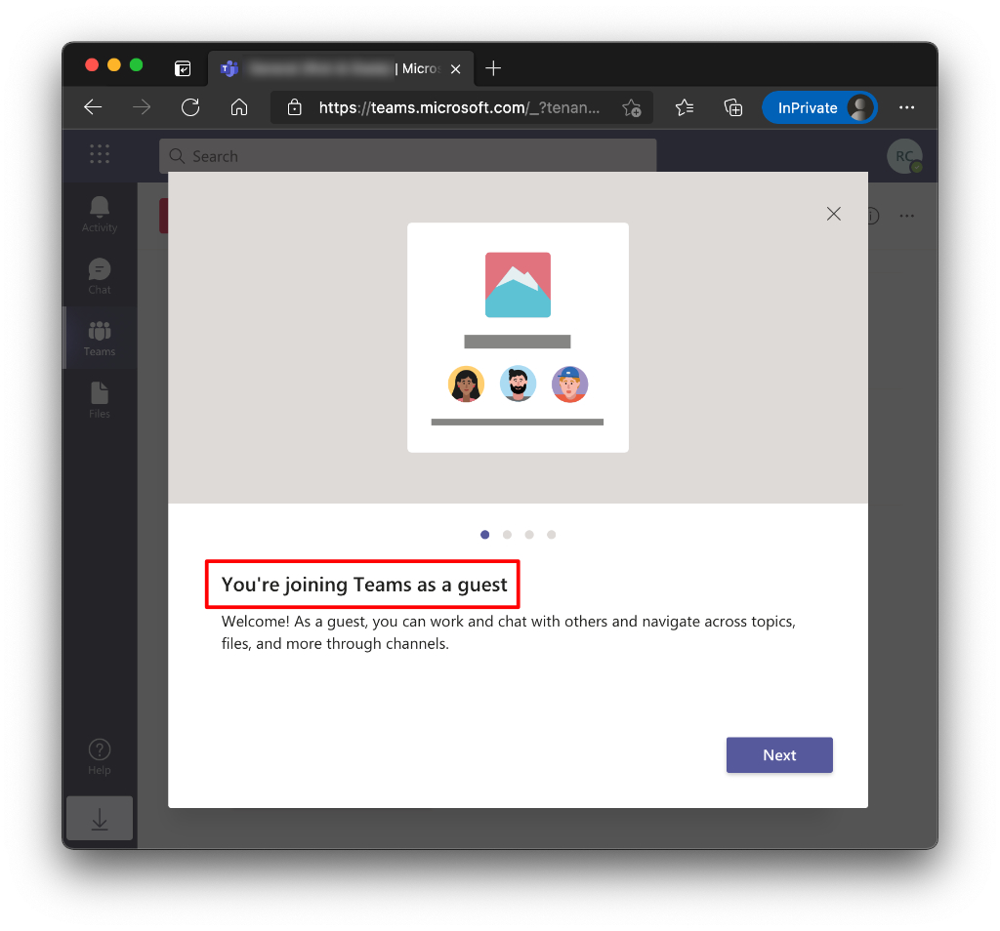](14-Azure-AD-B2B-External-Identities-Teams-Guest.jpg)

Ok, è stato un lavoro lunghissimo e sono giusto un po’ sudato...


  
<iframe src="https://giphy.com/embed/4bWWKmUnn5E4" width="100%" height="100%" style="position:absolute" frameBorder="0" class="giphy-embed" allowFullScreen></iframe>

<a href="https://giphy.com/gifs/sweat-sweating-airplane-4bWWKmUnn5E4">via GIPHY</a>



Vorrei dirti che è finita ma… non è ancora finita. 😝 Prima di aggiungere guest come se non ci fosse un domani, è meglio fissare alcuni concetti basilari ed importantissimi, in modo da fare le cose in maniera consapevole, mantenendo un buon controllo su Azure AD e sulle utenze guest e sulla configurazione del guest access.

## Quali sono le differenze tra Azure AD B2B e B2C?
Probabilmente, ti starai chiedendo:

> Rick, GMail è un prodotto consumer, perché non hai usato le funzionalità Azure AD B2C?

Domanda interessante! La dicitura “Consumer”, però, inganna. Ecco una tabella riassuntiva, che descrive quali siano le differenze tra Azure AD B2B e B2C e che ti aiuterà a decidere senza alcun dubbio in quale situazione devi usare l’una piuttosto che l’altra.


  


|                                           | Azure AD B2B                                                                                                                                                                                                                                                              | Azure AD B2C                                                                                                                                                                                   |
|-------------------------------------------|---------------------------------------------------------------------------------------------------------------------------------------------------------------------------------------------------------------------------------------------------------------------------|------------------------------------------------------------------------------------------------------------------------------------------------------------------------------------------------|
| **Scenari di utilizzo**                   | **Collaborazione con le applicazioni Microsoft**  (Microsoft 365, Teams, ecc) o con le proprie applicazioni (app SaaS, app personalizzate e così via).                                                                                                                    | Gestione delle identità e dell’accesso per applicazioni SaaS moderne o personalizzate (**non per le app Microsoft**).                                                                          |
| **Destinatari**                           | Collaborazione con partner commerciali di organizzazioni esterne, come fornitori e partner.  Gli utenti vengono visualizzati come utenti guest nella directory. Questi utenti possono o meno avere un’identità gestita.                                                   | Clienti del prodotto. Questi utenti vengono gestiti in una directory di Azure AD separata.                                                                                                     |
| **Gestione degli utenti esterni (guest)** | **Gli utenti esterni vengono gestiti nella stessa directory dei dipendenti** , ma vengono in genere contrassegnati come utenti guest. Gli utenti guest possono essere gestiti allo stesso modo dei dipendenti, possono essere aggiunti agli stessi gruppi e così via.     | **Gli utenti esterni vengono gestiti nella directory di Azure AD B2C** . Vengono gestiti separatamente rispetto alla directory di dipendenti e partner dell’organizzazione (se disponibile).   |

Ecco spiegato perché ho usato B2B: perché volevo dare accesso al nostro guest Ciccio Pasticcio su Teams, ovvero un’applicazione Microsoft.
Se vuoi approfondire ulteriormente l’argomento:

- [Compare External Identities Solutions](https://docs.microsoft.com/en-us/azure/active-directory/external-identities/compare-with-b2c#compare-external-identities-solutions)

## Best practice per la collaborazione su Microsoft Teams
Per gestire correttamente la collaborazione via Teams con ospiti esterni, è necessario verificare ed impostare alcune impostazioni, a livello di tenant e di piattaforma applicativa, che sono sparse tra vari portali. Ho scritto un articolo a riguardo giusto poco tempo fa:
- [Collaborare su Teams: guest access checklist ed external sharing](/teams-guest-access-checklist-external-sharing/)

Assicurati di aver verificato tutto quello che ho elencato nell’articolo!

## Disclaimer
Ho già accennato questa precisazione ma preferisco ripeterla in maniera ancora più chiara ed esplicita.

**La configurazione che ho descritto in questo articolo è solo una delle possibilità di federazione con Identity Provider esterni.**
**Ho scelto Google a puro scopo esemplificativo.**
**Se vuoi replicare una configurazione simile, fallo in un ambiente di test oppure, se si tratta di un ambiente di produzione, fallo fare ad un esperto. In ogni caso, prima di procedere, analizza la tua situazione e la tua configurazione, in modo da trovarne eventuali peculiarità che possano inficiare o rendere più complessa l’implementazione di Azure AD B2B.**
**Non sono responsabile di alcun danno o problematica che tu possa aver causato nel tuo ambiente di produzione seguendo questa guida.**

## Conclusioni su Azure AD B2B

Se mi hai seguito fino a qui, prima di tutto devo dirti grazie, davvero. L’attenzione è qualcosa di molto prezioso in questo web che brulica di post, informazioni, immagini: sono grato di essere riuscito ad avere la tua lungo tutto questo post di oltre 2000 parole e che, quindi, ti ha richiesto anche tempo e molta concentrazione.
Come hai visto, Azure AD B2B e le External Identities sono uno strumento potente e molto comodo se vuoi dare accessi a fornitori o collaboratori esterni. E tu, che accorgimenti hai adottato per collaborare con loro? Se hai già implementato Azure AD B2B, hai qualche osservazione o esperienza sul campo da raccontarmi? Mi piacerebbe saperlo: ti aspetto sui miei profili social per fare quattro chiacchiere a riguardo. Grazie ancora e a presto!

Il tuo IT Specialist, Riccardo