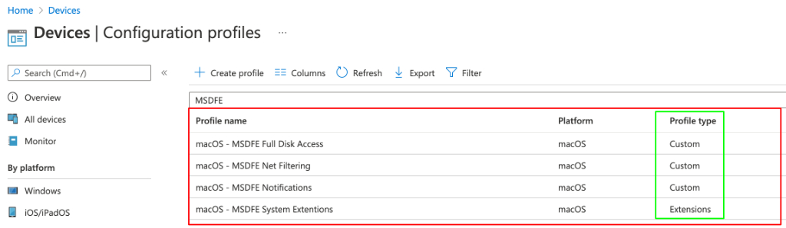
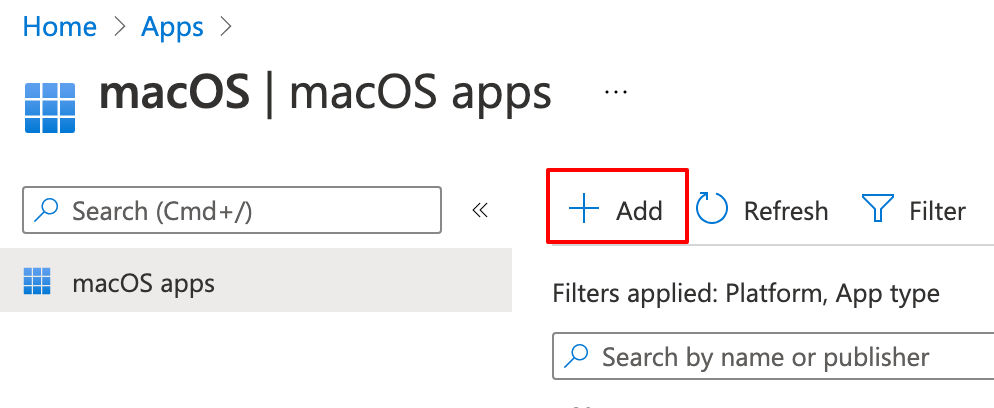
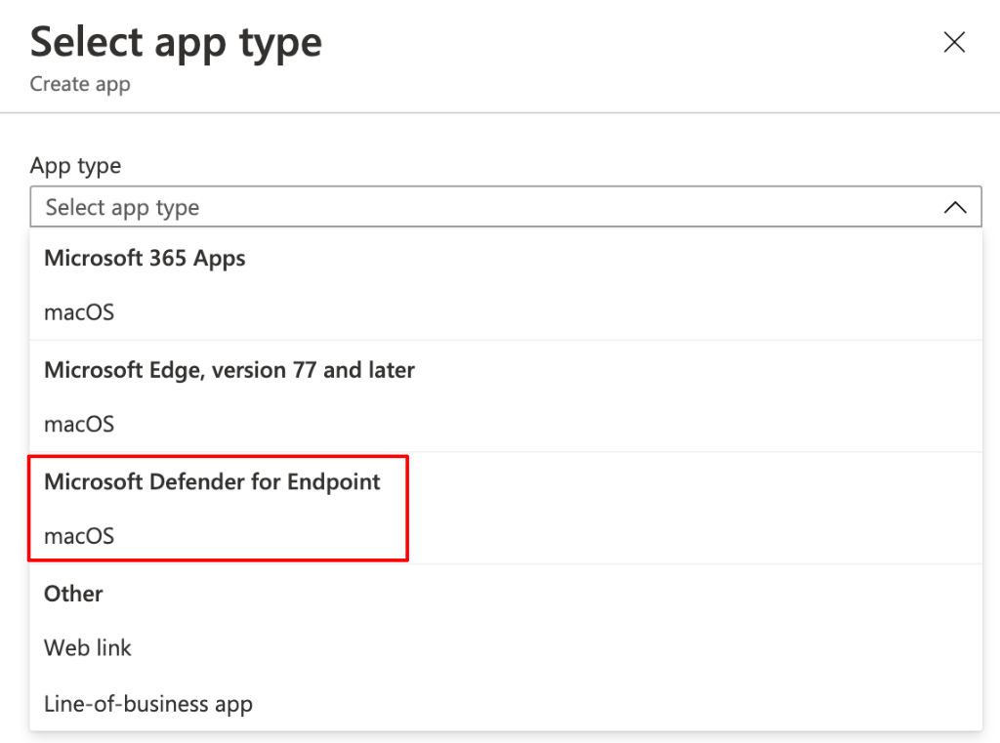
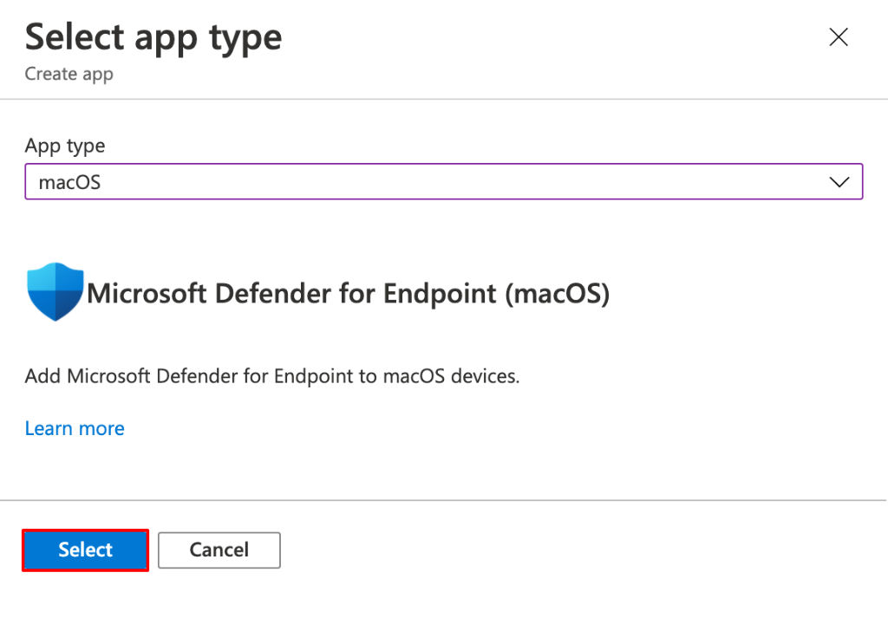
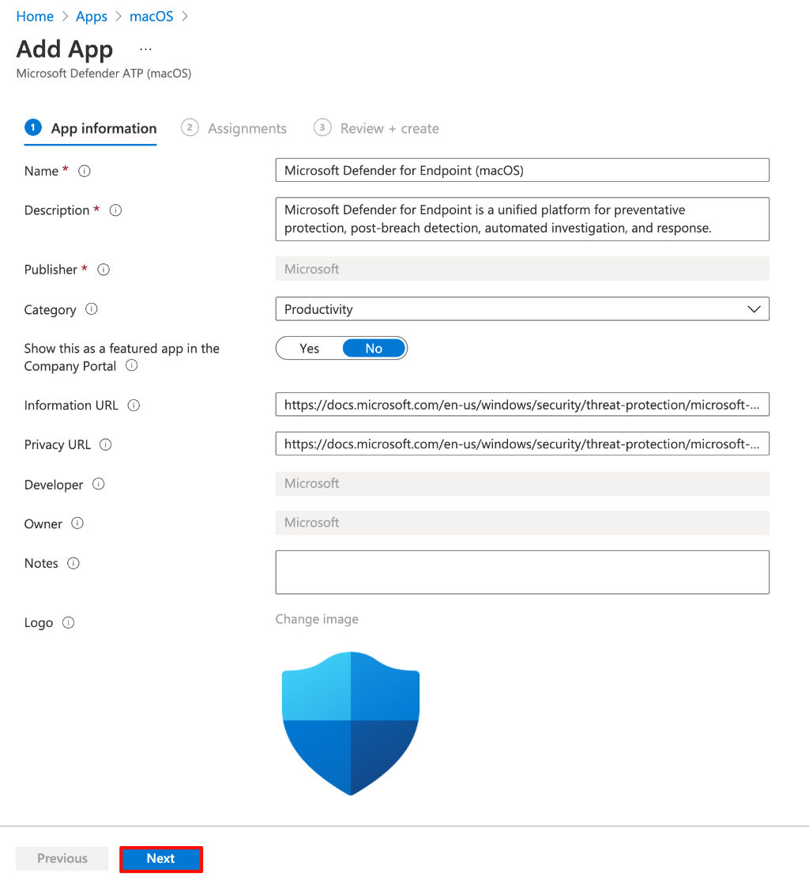
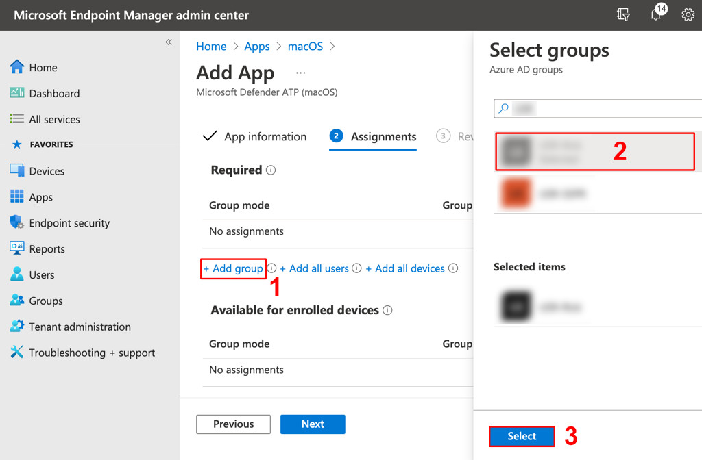
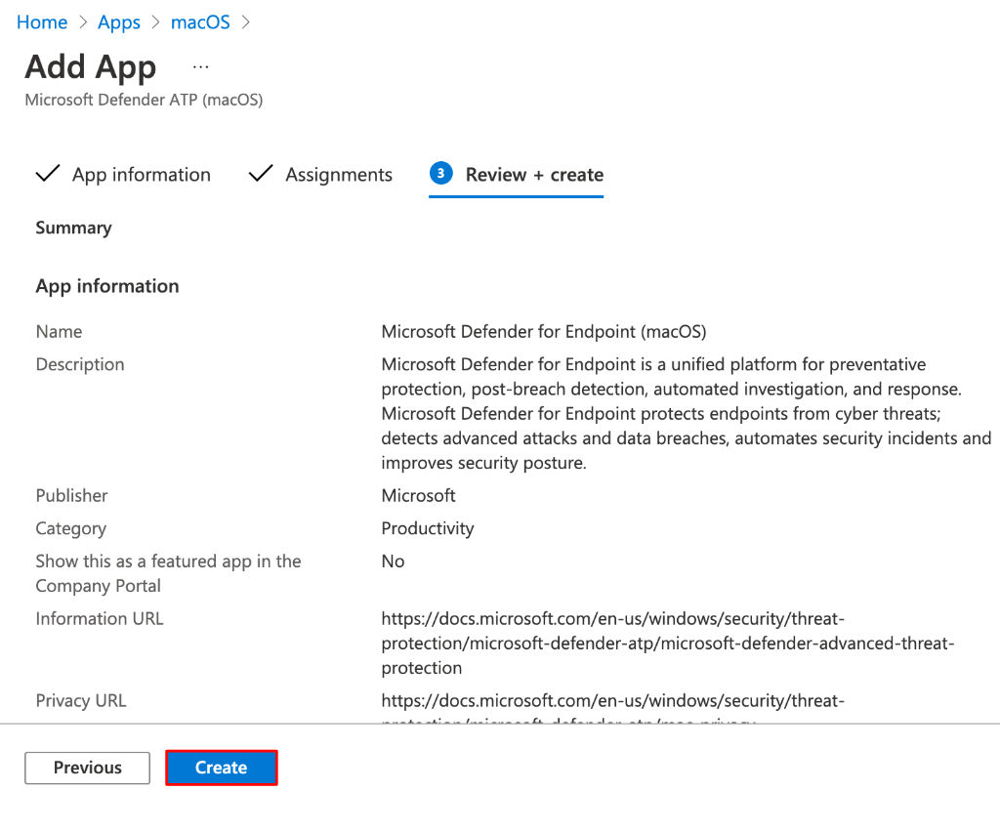

La protezione degli endpoint è un punto fondamentale in un approccio [Modern Workplace](/cosa-significa-modern-workplace/): ad oggi, Defender for Endpoint supporta qualunque tipo di dispositivo, anche quelli di Apple. Oggi ti racconto come installare Microsoft Defender for Endpoint su macOS, distribuendolo via Microsoft Endpoint Manager (MEM oppure Intune, per gli amici di vecchia data).

## Disclaimer
**Quando si tratta di informazioni di licensing e di procedure un po’ più strutturate del solito, preferisco fare riferimento alla documentazione ufficiale.**
**Questo perché i requisiti, i prodotti e i loro nomi sono in perenne divenire e una loro qualunque modifica renderebbe obsoleto l’articolo in breve tempo, se elencati "staticamente" qui.**
**Perdonami se ti chiedo un click in più per andare a vedere la documentazione Microsoft ma ritengo sia il modo migliore per avere sempre informazioni e procedure aggiornate.**
**Grazie.**

## Requisiti di licenza
Come sempre, prima di partire a testa bassa, verifica i requisiti minimi di licenza e di ambiente per Microsoft Defender for Endpoint:
- [Minimum requirements for Microsoft Defender for Endpoint | Microsoft Docs](https://docs.microsoft.com/en-us/microsoft-365/security/defender-endpoint/minimum-requirements?view=o365-worldwide#licensing-requirements)

Ok: se hai la licenza giusta e tutto il resto in ordine, possiamo partire... con altri requisiti 🤣

## Requisiti di sistema
Microsoft Defender for Endpoint (d’ora in poi MSDE), essendo un antivirus, ha necessità di interagire in maniera profonda ed integrata col sistema operativo macOS. Per questo, a partire da macOS Catalina, prima di poter installare l’antivirus vero e proprio, è necessario distribuire via Intune alcuni profili di configurazione che rendono la distribuzione delle app più trasparente e sicura per l’utente finale.
**Mentre per le System Extension esiste un template nativo di Intune, per le le altre 3 impostazioni servirà creare un template custom**. Io ho creato un profilo per impostazione, in modo da poter essere assolutamente sicuro di andare a fare modifiche granulari e circostanziate in caso di problemi.
Ho raccolto per te tutte le fonti da cui trovare queste informazioni e configurare il tutto:
- [creare il profilo per le System Extension con i bundle e gli ID di Microsoft](https://docs.microsoft.com/en-us/microsoft-365/security/defender-endpoint/mac-sysext-policies?view=o365-worldwide#system-extensions-policy-1);
- [come creare un profilo custom su Intune](https://docs.microsoft.com/en-us/mem/intune/configuration/custom-settings-configure);
- [payload del profilo custom di MSDFE per poter pubblicare notifiche su macOS](https://raw.githubusercontent.com/microsoft/mdatp-xplat/master/macos/mobileconfig/profiles/notif.mobileconfig);
- [payload per l’accesso pieno e completo al disco del Mac](https://raw.githubusercontent.com/microsoft/mdatp-xplat/master/macos/mobileconfig/profiles/fulldisk.mobileconfig);
- [payload per il net filtering](https://raw.githubusercontent.com/microsoft/mdatp-xplat/master/macos/mobileconfig/profiles/netfilter.mobileconfig).

Il risultato, sul portale, sarà questo.

Quando verrà installato, quindi, il tuo Microsoft Defender for Endpoint potrà accedere al disco del Mac, pubblicare notifiche, installare delle System Extention ed, eventualmente, applicare le impostazioni di net filtering senza alcuna richiesta di interazione verso l’utente.

Perfetto, ora sei pronto per installare il vero e proprio antivirus!

## Installare Microsoft Defender for Endpoint su macOS via Intune
Per installare MDE, si parte sempre dal portale di Microsoft Endpoint Manager. Una volta dentro, naviga fino alla sezione **Apps** –> **macOS** e seleziona il pulsante **+ Add**.

Nella blade che compare a destra, seleziona **macOS** come tipologia e, successivamente, vai alla sezione di **MDE**, confermando la scelta.

Nella schermata successiva, lascia tutto come già impostato e prosegui cliccando **Next**.

Ora assegna l’applicazione che stai pubblicando al gruppo di utenti che desideri e conferma la scelta premendo Select e **Next**.

Ci siamo quasi! Ora non ti resta che creare la pubblicazione, confermando col tasto **Create**.

Fatto! Ora non resta che aspettare i tempi tecnici di pubblicazione e di sincronizzazione delle impostazioni del tuo Mac. Dopo qualche minuto, ecco cosa compare sulla taskbar!

E anche questa volta hai fatto un gran lavoro: applicazione perfettamente pubblicata ed installata sul Mac. 😉 Grazie al lavoro fatto ad inizio articolo sui requisiti, inoltre, l’installazione è stata trasparente e totalmente silente per i tuoi utenti.

Se vuoi approfondire tutti gli aspetti di funzionamento di Microsoft Defender for Endpoint su macOS, ecco un po’ di documentazione (10 volte meglio che contare le pecore!):
- [Microsoft Defender for Endpoint on Mac | Microsoft Docs](https://docs.microsoft.com/en-us/microsoft-365/security/defender-endpoint/microsoft-defender-endpoint-mac?view=o365-worldwide)
- [What’s new in Microsoft Defender for Endpoint on Mac | Microsoft Docs](https://docs.microsoft.com/en-us/microsoft-365/security/defender-endpoint/mac-whatsnew?view=o365-worldwide)
- [Microsoft Endpoint Manager simplifies deployment of Microsoft Defender ATP for macOS – Microsoft Tech Community](https://techcommunity.microsoft.com/t5/microsoft-endpoint-manager-blog/microsoft-endpoint-manager-simplifies-deployment-of-microsoft/ba-p/1322995)

E tu, che prodotto o metodo usi per la protezione del tuo Mac in azienda? Ti aspetto nei commenti o sui miei social per parlarne insieme. A presto!

Il tuo IT Specialist, Riccardo