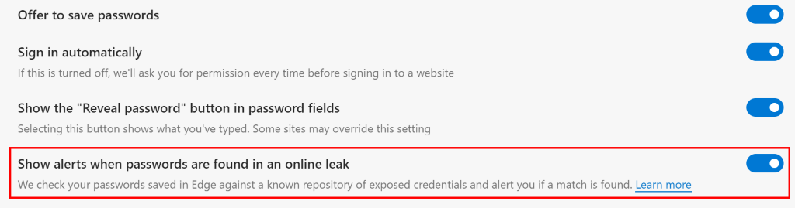
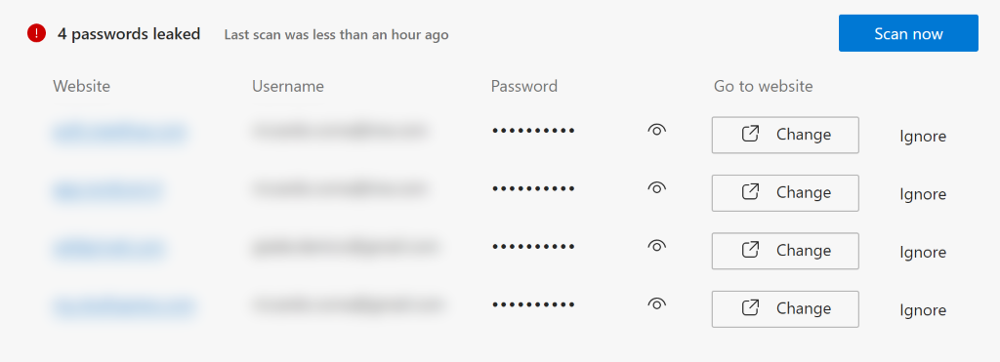
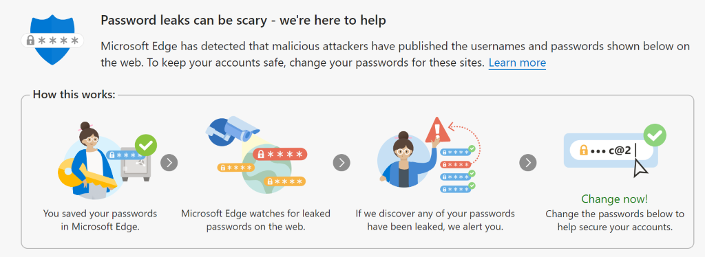

Finalmente una funzionalità che aspettavo da molto: Edge Password Monitor! Finalmente il browser in grado di rilevare se le tue password salvate sono sicure o meno. Ti racconto come funziona.

Il concetto è molto semplice: Edge analizza le password che hai salvato nel tuo profilo e, incrociando le informazioni recuperate da database pubblici di password compromesse, ti dice se la password che hai scelto per un certo servizio online è sicura o meno. Come abilitare questa funzione e verificare se le tue password sono sicure?

Apri Edge e vai nelle impostazioni, alla sezione **Settings** –> **Profiles** –> **Passwords**.
Troverai un’opzione che recita **Show alerts when passwords are found in an online leak**. Abilita la funzione!

Una volta fatta l’analisi, se verranno trovate password ad alto rischio o che sono comparse in database pubblici di credenziali compromesse, comparirà un elenco.

Cosa fare per cambiare le password? Semplice! Segui le istruzioni dell’infografica e cambia la password del servizio a rischio, sfruttando la funzionalità di suggerimento di password forti di Edge.

Vuoi saperne di più su Edge Password Monitor? Come sempre, ecco un po’ di documentazione ufficiale, che non fa mai male:
- [Protect your online accounts using Password Monitor (microsoft.com)](https://support.microsoft.com/en-us/topic/protect-your-online-accounts-using-password-monitor-6f660aae-65aa-476c-871a-7fe2bcb0c4c1)

Io ho provato questa funzione e ho avuto qualche anomalia: le ho risolte in 15 minuti circa. E tu, quante anomalie hai avuto? Parliamone nei commenti o sui miei social!

Il tuo IT Specialist, Riccardo