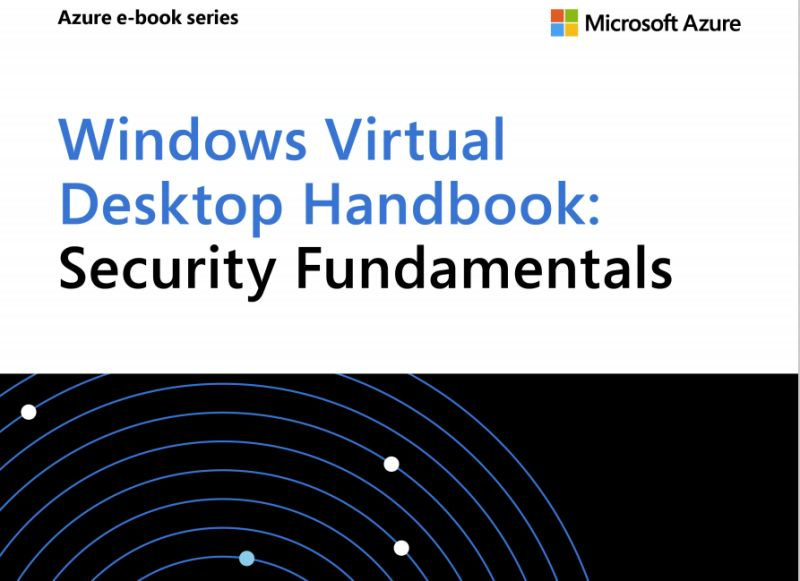

Dopo gli aggiornamenti massivi di Luglio 2020, [Windows Virtual Desktop](https://itspecialist.pro/tag/windows-virtual-desktop/) sta maturando sempre di più. Progettare un’infrastruttura virtuale con WVD, richiede di pensare by design alle questioni di sicurezza. Con questo ebook **Windows Virtual Desktop Handbook: Security Fundamentals**, potrai acquisire ed imparare quali sono gli elementi da tenere in considerazione per una progettazione a regola d’arte.

Scarica e leggi questo ebook per:
- prendere confidenza su cosa voglia dire implementare un’infrastruttura Windows Virtual Desktop;
- capire quali sono le “responsabilità” di sicurezza in carico a Microsoft e quali sono in carico a te, nel tipico contesto di responsabilità condivisa tipico delle piattaforme cloud;
- implementare le opportune tecnologie di sicurezza per proteggere la tua infrastruttura client virtuale, le identità i session host, la rete;
- apprendi le best practice di utilizzo di Azure Security Center e aumenta il tuo punteggio di sicurezza.

L’eBook è gratuito e, per scaricarlo, è richiesta la compilazione di un semplice form di contatto.

Ecco qui la pagina da cui partire per registrarsi e scaricare l’ebook:
- [Windows Virtual Desktop Security Handbook | Microsoft Azure](https://azure.microsoft.com/en-us/resources/windows-virtual-desktop-handbook-security-fundamentals/)

Ti attendo nei commenti per sapere cosa ne pensi averlo letto. A presto!

Il tuo IT Specialist,  
Riccardo