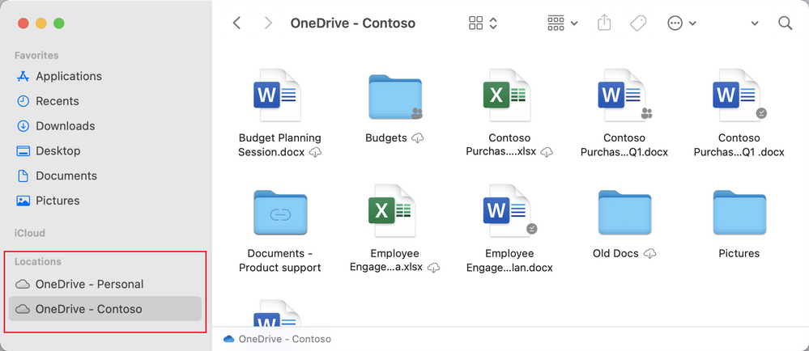

In un articolo di qualche tempo fa ([Opinione: Mac in azienda con Microsoft 365](/mac-in-azienda-opinione-macos-microsoft365/)), avevo raccontato della mia esperienza di utilizzo dei servizi Microsoft 365 con un MacBook Air M1. Chi ha letto quell’articolo, probabilmente, ricorderà che c’era stata solo una cosa che mi aveva fatto storcere il naso: **OneDrive**.

Ebbene, da oggi il naso è meno “storto” 😉: ci sono enormi novità per OneDrive su macOS! Mi limito a riportare quelle salienti perché, come leggerete più avanti, c’è un blog post ufficiale di Microsoft che è già super completo e ricco di dettagli. Vediamoli in maniera sintetica:
- **supporto nativo ad M1** (finalmente!!!);
- **redirezione delle Known Folders**: Desktop, Documenti, Immagini;
- **un rinnovamento completo e radicale della funzionalità Files On Demand e del plugin di integrazione col Finder**: questo è esattamente quello che volevo sentire, dato che era la parte in assoluto più problematica nella release attuale;
- **miglioramento delle performance**: anche questo era un punto dolente della release attuale per macOS;
- **possibilità di escludere alcune tipologie di file dalla sincronizzazione**.

Come vedi, c’è tanta carne al fuoco e i miglioramenti vanno esattamente nella direzione di risolvere i problemi che avevo rilevato durante la mia esperienza. Non vedo l’ora di provare la nuova versione di OneDrive, e tu?

Se vuoi avere tutti i dettagli approfonditi dei miglioramenti, delle novità e della nuova esperienza di OneDrive su macOS, ecco alcuni link che ho raccolto per te:
- [Microsoft works to ensure a great OneDrive experience on Apple products – Microsoft Tech Community](https://techcommunity.microsoft.com/t5/microsoft-onedrive-blog/microsoft-works-to-ensure-a-great-onedrive-experience-on-apple/ba-p/2400803?ocid=usoc_LINKEDIN_M365_spl100002164207229)
- [Microsoft OneDrive Blog – Microsoft Tech Community](https://techcommunity.microsoft.com/t5/microsoft-onedrive-blog/bg-p/OneDriveBlog)
- [OneDrive release notes – Office Support (microsoft.com)](https://support.microsoft.com/en-us/office/onedrive-release-notes-845dcf18-f921-435e-bf28-4e24b95e5fc0?ui=en-us&rs=en-us&ad=us)

Considerazione finale: Microsoft ed Apple stanno facendo insieme un lavoro davvero enorme per portare ad un nuovo livello l’esperienza di utilizzo dei prodotti Microsoft 365 su macOS. Tu che ne pensi? Ti aspetto nei commenti per parlarne!

Il tuo IT Specialist, Riccardo