Se mi segui su Linkedin, probabilmente hai letto che nell’ultimo periodo sto parlando molto spesso di autenticazione passwordless su Microsoft Azure AD. Dopo aver provato [l’accesso passwordless con Microsoft Authenticator App](/autenticazione-passwordless-con-microsoft-authenticator-prova-sul-campo/), ero curioso di fare un giro di prova anche con delle security key FIDO2. Detto fatto, il destino ha bussato alla mia porta e, grazie a [Feitian](https://www.ftsafe.com/?utm_source=KOL&utm_medium=RiccardoCorna&utm_campaign=MainPage) e [Marco Moioli](https://www.linkedin.com/in/marcomoioli/) di Microsoft, ho avuto l’opportunità di testarne alcune.

Come dice il titolo dell’articolo, ti racconterò il tutto come una prova sul campo, senza soffermarmi troppo sugli aspetti teorici e formali, di cui ho già fatto alcuni accenni nell’articolo citato qualche riga fa. Il racconto sarà fatto da due punti di vista:

1. quello dell’IT crew:
    - abilitazione dell’esperienza “enhanced” di registrazione dei contatti e dei metodi di autenticazione per gli utenti;
    - abilitazione delle security key FIDO2 come metodo di autenticazione;
2. quello dell’utente finale:
    - pairing della chiavetta bluetooth con Windows;
    - registrazione della stessa su Azure AD;
    - prova di autenticazione passwordless.

Siamo quasi pronti per partire: come sempre, definiamo alcuni dati di ambiente e la lista della spesa 😉

## Scenario della mia prova sul campo
Il mio ambiente di test ha delle particolarità che, in un certo senso, semplificano l’implementazione di questo tipo di autenticazione passwordless. Di seguito eccone le caratteristiche:

- dato che è la “protagonista” di questa prova sul campo, vorrei dedicare un focus in particolare sulla security key: è una [Feitian K13](https://www.ftsafe.com/products/fido/multi) ed è una chiavetta di tipo “Multipass”, ovvero mette a disposizione differenti metodi di accoppiamento e verifica del fattore di autenticazione: USB-A, Bluetooth, NFC.
Nel campo delle tecnologie di identity & security Feitian è sicuramente uno tra i maggiori player, con una lunga esperienza che parte dal 1998. La K13 è una chiavetta che, personalmente, definirei “VIP”, data la sua natura eclettica, la qualità costruttiva, le finiture: è bella da vedere, comoda da agganciare ad un portachiavi ed è **perfettamente compatibile con Azure AD**. Oltre a questa security key multipass, Feitian produce anche altre soluzioni in ogni segmento di costo: chiavette USB-A, USB-C, biometriche, con NFC, persino chiavette compatibili con interfaccia Lightning di Apple per iOS e chi più ne ha, più ne metta.
    - Per una panoramica completa delle security key Feitian e dei loro prodotti in generale: [FEITIAN – A professional Security Hardware and Solution Provider for PKI token, OTP (One Time Password) token and card, Smart Card and Reader, Software Protection Dongle, and Mobile Solution for Financial, Government, Enterprise, and Payment. (ftsafe.com)](https://www.ftsafe.com/store/?utm_source=KOL&utm_medium=RiccardoCorna&utm_campaign=OnlineStore)
    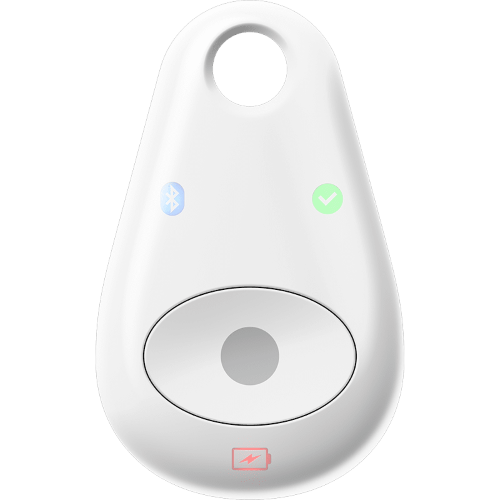
- utenza full cloud, senza nessuna Active Directory on-premises;
- la mia utenza è già configurata per effettuare la MFA e, quindi, ho già registrato i miei contatti e i miei fattori di verifica (requisiti necessario);
- Azure AD Premium P1 (requisito necessario per l’utilizzo dei metodi di autenticazione passwordless);
- per comodità e per non avere la seccatura di dover usare un cavo USB-A / microUSB, ho deciso di sfruttare appieno il potenziale della Feitian K13, usando le sue funzionalità Bluetooth. Quindi, la accoppierò al mio PC Windows 10 e l’autenticazione avverrà premendo solo un tasto, senza collegare alcun cavo.

Perfetto, direi che abbiamo a disposizione tutti gli ingredienti. Si parte!

## Come preparare Azure AD per l’autenticazione passwordless con security key (lo fa l’IT crew)
Cominciamo con alcune attività preparatorie di Azure AD, a cura dello staff IT. Ad alto livello, i passi da fare sono i seguenti (verranno poi dettagliati uno per uno):
1. Verificare di aver abilitato la nuova esperienza “enhanced” di registrazione dei metodi di autenticazione su Azure AD
2. Abilitare FIDO2 come Authentication Method su Azure AD

## Abilitare l’esperienza di registrazione “enhanced” su Azure AD
Da qualche tempo Microsoft ha integrato l’esperienza di registrazione dei metodi di contatto e di autenticazione degli utenti in un unico portale che, secondo me, è molto comodo. Questa esperienza “integrata” è però da abilitare sul portale di Azure AD (https://aad.portal.azure.com), alla sezione:

&nbsp;&nbsp;&nbsp;&nbsp;**Azure Active Directory** –> **Users** –> **User settings** –> **Manage User Feature Settings**

Qui troverai un interruttore alla voce **Users can use the combined security information registration experience**. Io, per comodità e dato che sono in un ambiente di test, ho selezionato **All** ma, se vuoi, puoi limitare l’esperienza integrata ad un gruppo scegliendo **Selected**.

[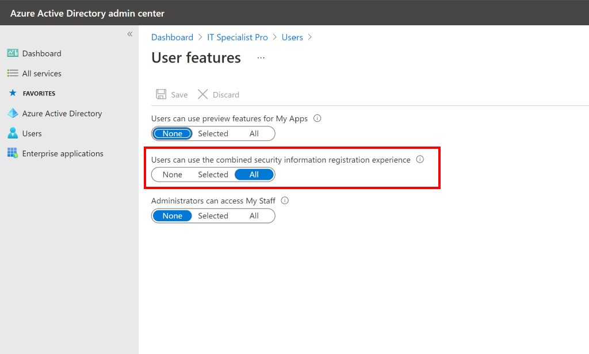](02-Accesso-passwordless-Azure-AD-FIDO2-Enhanced-Registration.png)

Perfetto, ora abilitiamo la possibilità di utilizzare una chiavetta FIDO2 come metodo di autenticazione.

## Abilitare le security key FIDO2 come metodo di autenticazione
Sempre da portale Azure AD, naviga fino alla sezione:

&nbsp;&nbsp;&nbsp;&nbsp;**Azure Active Directory** –> **Security** –> **Authentication Methods**

Per comodità, ho preso un unico screenshot “guidato” passo per passo. Lo screenshot è a dimensione naturale (4K) ma qui potresti vederlo troppo piccolo. Nel caso, clicca sull’immagine e dovrebbe aprirsi a grandezza naturale, per una migliore leggibilità.

[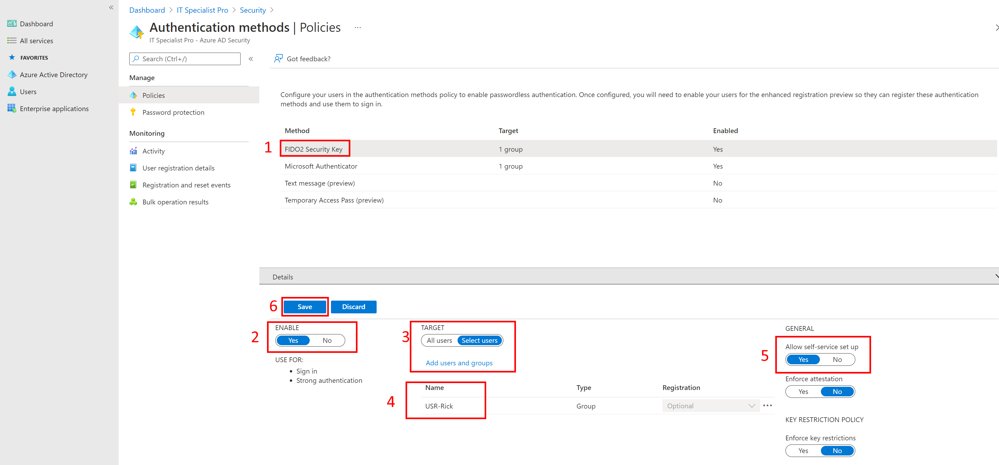](03-Accesso-passwordless-Azure-AD-FIDO2-Enable-Security-Key.png)

1. clicca sul metodo di autenticazione che vuoi configurare: FIDO2 Security Key;
2. abilitalo posizionando l’interruttore su Yes;
3. anche qui puoi selezionare All oppure gruppi/utenti specifici: il mio consiglio è di selezionare un gruppo, come ho fatto in questo esempio;
4. erifica di aver selezionato il gruppo giusto;
5. abilita la possibilità di impostare il metodo di autenticazione in modalità self-service;
6. salva le modifiche.

Fatto! Lato Azure AD, quindi, sei pronto per utilizzare le security key FIDO2 come metodo di autenticazione passwordless.

## Accoppiare la chiavetta col PC Windows 10 via Bluetooth (lo fa l’utente finale o l’help desk)
**Prima di documentare questa parte di procedura, una nota. In una situazione normale con una chiavetta che non abbia una funzionalità Bluetooth, questo passaggio si può tranquillamente saltare. Le chiavette Feitian, se usate in modalità USB, sono completamente driverless e non c’è bisogno di alcuna procedura di installazione sul PC! La mia scelta di utilizzare il Bluetooth è dettata dalla volontà di testare la Feitian K13 sfruttandone tutte le funzionalità.**

Perfetto, ora mettiamoci nei panni dell’utente finale e accoppiamo la chiavetta dalle impostazioni di Windows, alla sezione Bluetooth e, dopo aver premuto a fondo il tastone centrale della chiavetta, aggiungiamo il dispositivo cliccando su **Add Bluetooth or other device**.

[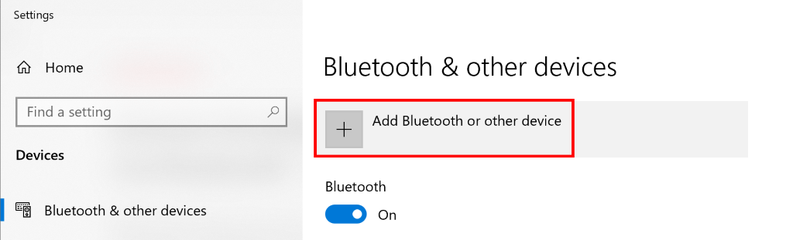](04-Accesso-passwordless-Azure-AD-FIDO2-Add-Bluetooth.png)

Una volta “intercettata” la chiavetta, basterà confermare e terminare il pairing.

[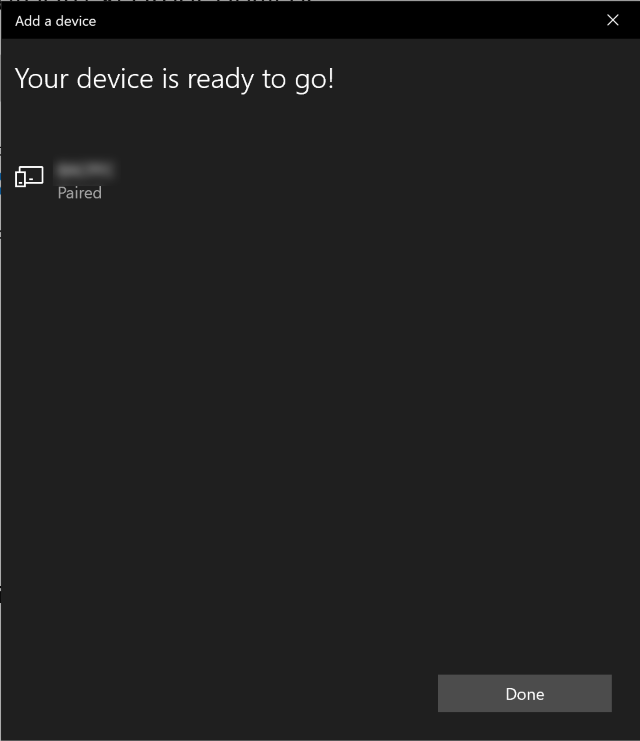](05-Accesso-passwordless-Azure-AD-FIDO2-Bluetooth-Done.png)

Perfetto, la chiavetta è pronta per essere registrata su Azure AD!

## Registrare la security key su Azure AD (lo fa l’utente finale o l’help desk)
Qui entra in gioco il portale di registrazione “enhanced” che hai abilitato prima, ricordi? Per registrare la chiavetta, l’utente andrà a questo indirizzo:

- https://aka.ms/setupsecurityinfo

Questo, come vedi, è il portale dove compaiono tutti i contatti e i metodi di autenticazione per l’utente. Per aggiungere la chiavetta, l’utente dovrà cliccare su **+ Add method**

[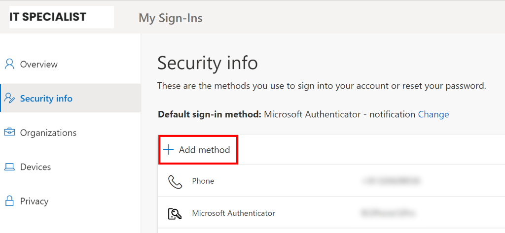](06-Accesso-passwordless-Azure-AD-FIDO2-Add-Security-Key.png)

Ora si seleziona **Security Key** e si clicca **Add**

[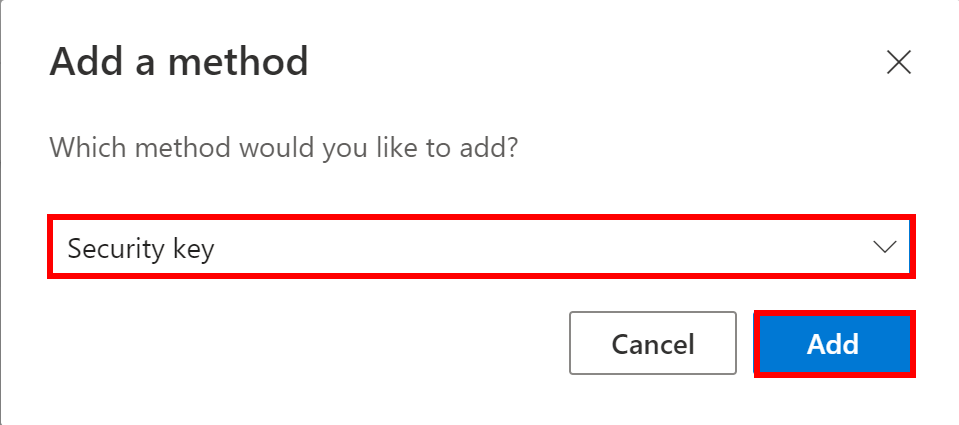](07-Accesso-passwordless-Azure-AD-FIDO2-Add-Security-Key-b.png)

Ricordi che nei requisiti avevo indicato che la MFA deve già essere pronta e configurata per l’utente? Perfetto, questo è il momento della MFA challenge, che è necessaria per proseguire con l’aggiunta della Security key come metodo di accesso passwordless ad Azure AD. L’utente ora premerà **Next** e affronterà la MFA challenge che gli verrà proposta.

[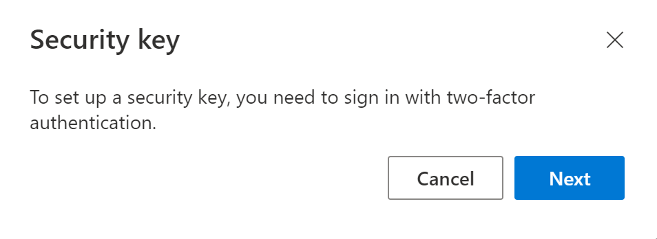](08-Accesso-passwordless-Azure-AD-FIDO2-MFA-Challenge.png)

Se l’utente ha superato correttamente la MFA challenge, sì troverà a questa schermata, dove selezionerà la voce USB Device (anche se si tratta di BLuetooth in questo caso particolare).

[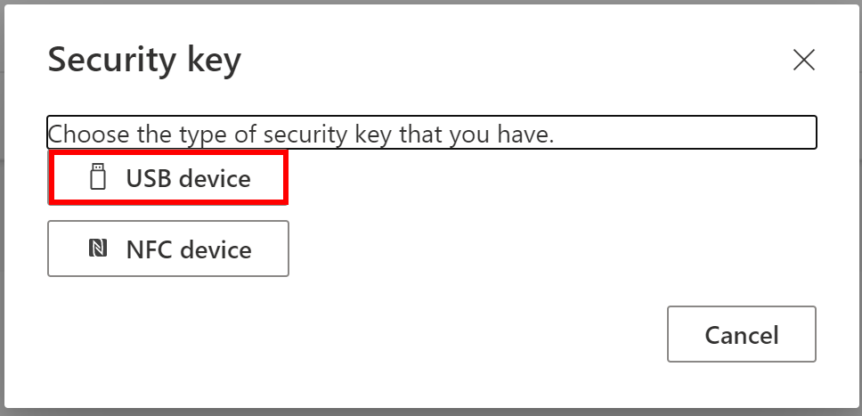](09-Accesso-passwordless-Azure-AD-FIDO2-USB.png)

Ora preparati con la chiavetta in mano, pronto a schiacciare il tastone centrale quando il browser te lo chieder. Premi premi **Next...**

[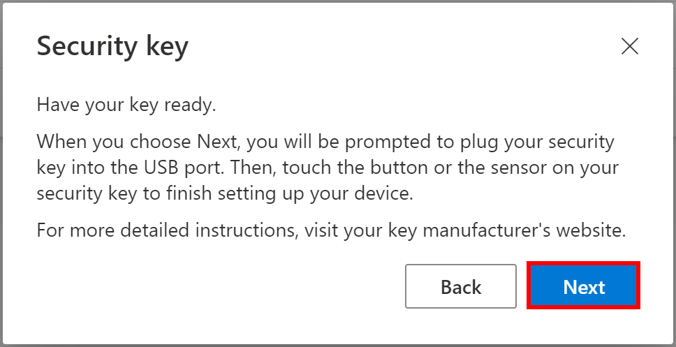](10-Accesso-passwordless-Azure-AD-FIDO2-Security-Key-Prompt-a.png)

... e immediatamente dopo OK sul prompt del browser...

[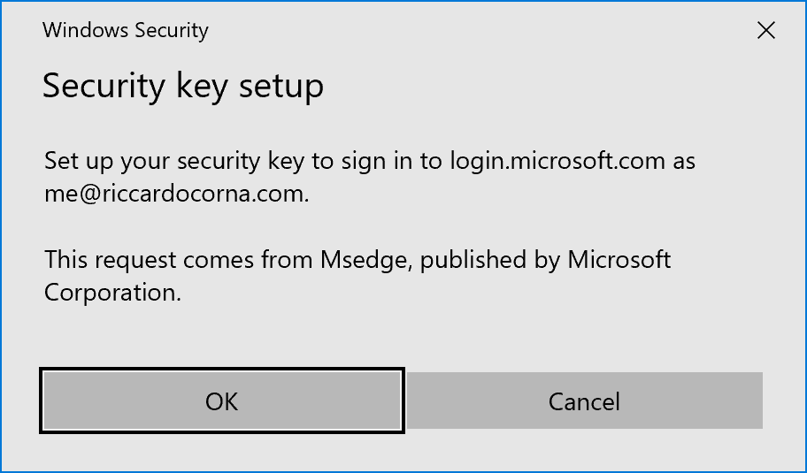](11-Accesso-passwordless-Azure-AD-FIDO2-Security-Key-Prompt-b.png)

... e ancora una volta **OK**.

[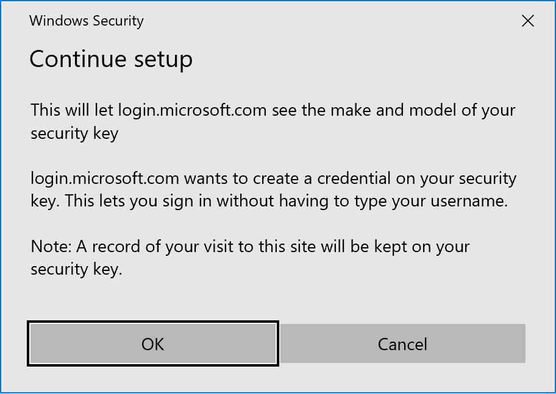](12-Accesso-passwordless-Azure-AD-FIDO2-Security-Key-Prompt-c.png)

È il momento! Il sistema ora chiederà di inserire la chiavetta USB ma, dal momento che il tuo utente ne ha una VIP col Bluetooth 😁, basterà premere il tastone centrale.

[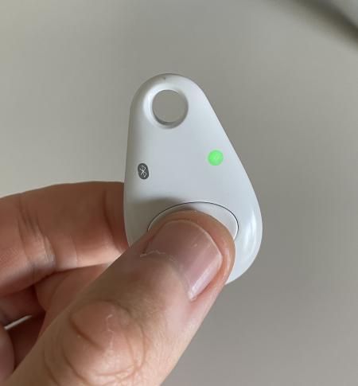](14-Accesso-passwordless-Azure-AD-FIDO2-Security-Press-Key-b.png)

Imposta un PIN per la chiavetta e premi **OK**

[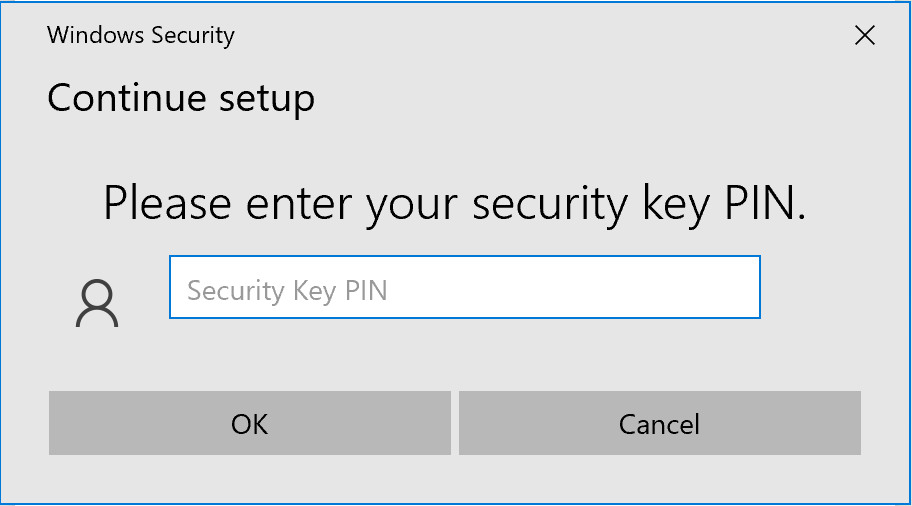](15-Accesso-passwordless-Azure-AD-FIDO2-Setup-PIN.png)

Lasciamo qualche momento ad Azure AD e alla Feitian K13 affinchè la magia accada... 🧙🏻‍♂️

[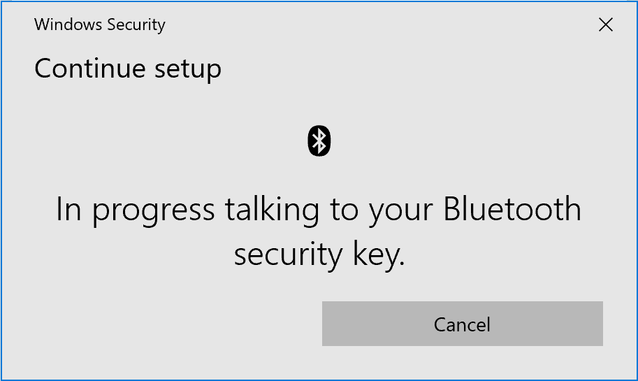](16-Accesso-passwordless-Azure-AD-FIDO2-Talking-Bluetooth.png)

**Perfetto! Magia avvenuta! L’utente ha registrato la security key!**
Ora bisogna darle un nome e confermare gli ultimi passaggi.

[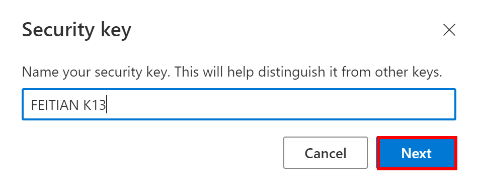](17-Accesso-passwordless-Azure-AD-FIDO2-Name.png)

[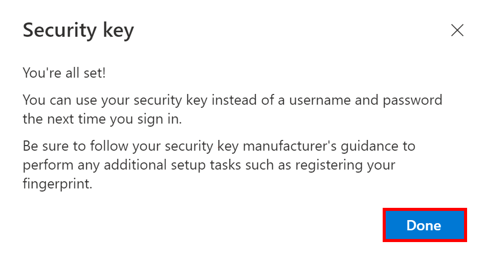](18-Accesso-passwordless-Azure-AD-FIDO2-Done.png)

Non resta che verificare che la security key appena registrata sia effettivamente presente in elenco nei metodi di autenticazione registrati per l’utente: direi di sì!

[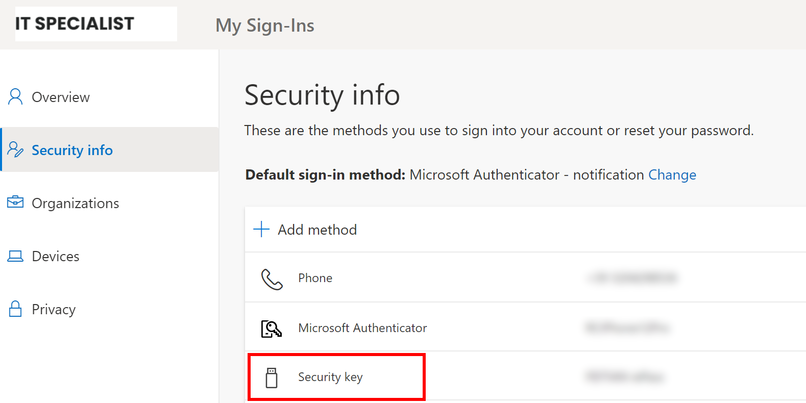](19-Accesso-passwordless-Azure-AD-FIDO2-Auth-Methods-b.png)

E ora? Ora viene il bello! Facciamo una prova di autenticazione passwordless su Microsoft 365!

## Autenticazione passwordless su Microsoft 365 per l’utente finale
Ora che tutto è pronto, è il momento di fare (finalmente) un’autenticazione passwordless ad Azure AD!

Punta il browser su https://portal.office.com e seleziona la voce **Sign-in options**

[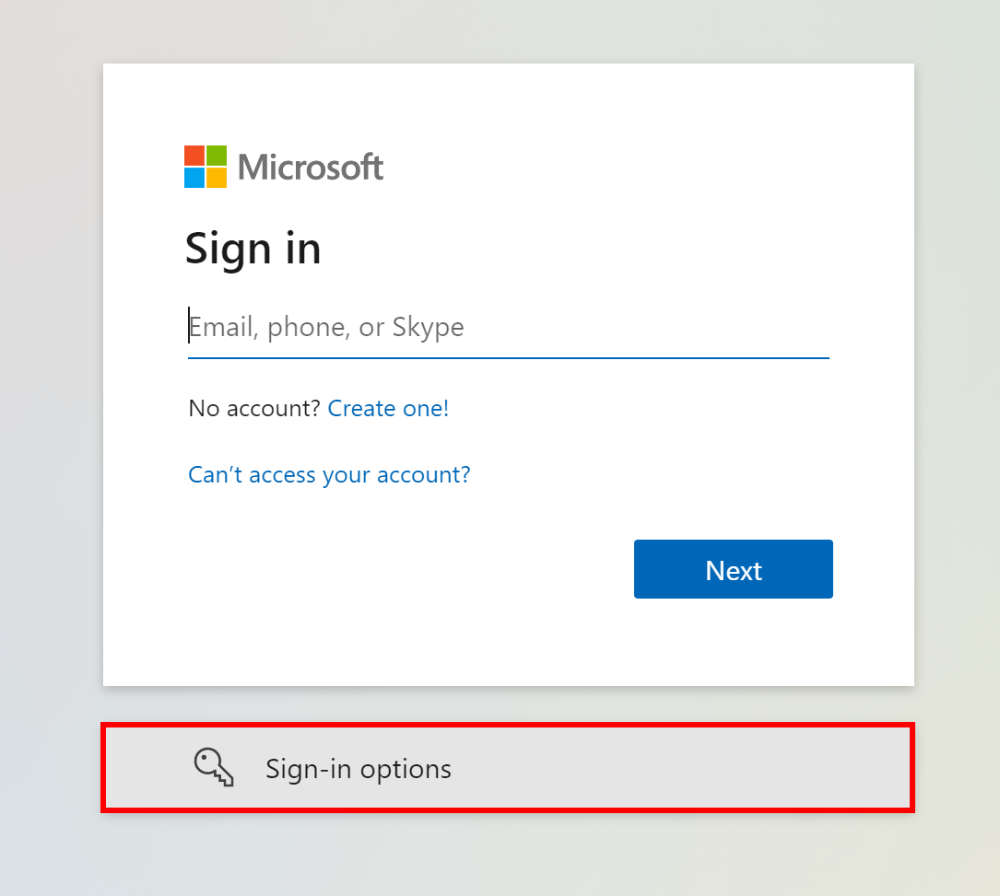](20-Accesso-passwordless-Azure-AD-FIDO2-sign-in-options.png)

Ora seleziona l’opzione **Sign in with a security key**.

[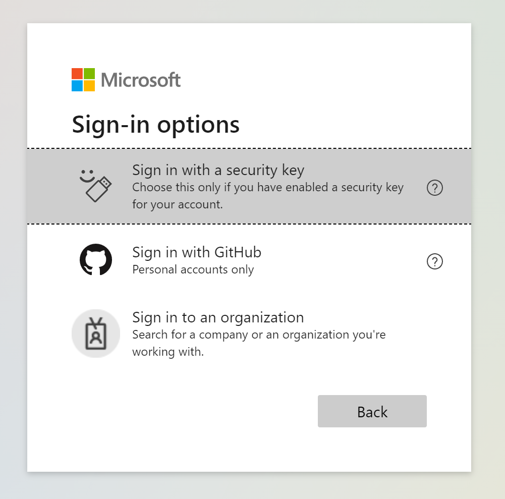](21-Accesso-passwordless-Azure-AD-FIDO2-sign-in-options.png)

Come prima, il browser ti proporrà di inserire la chiavetta di sicurezza: tu, come prima, al comparire del prompt, premi il tasto della chiavetta!

[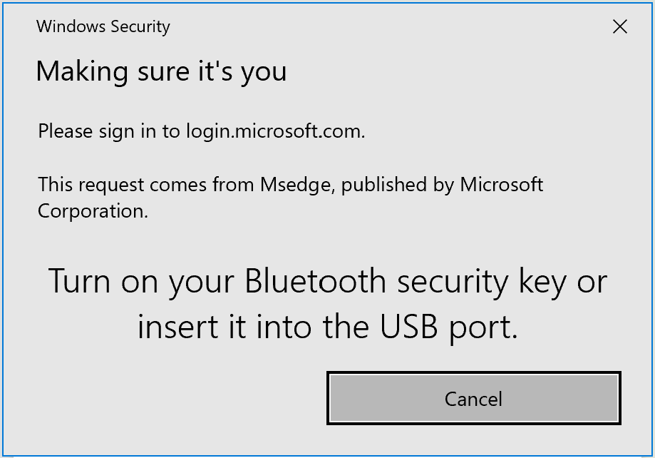](22-Accesso-passwordless-Azure-AD-FIDO2-insert.png)

Perfetto, ora inserisci il **PIN** che hai impostato nei passaggi precedenti e conferma cliccando su **OK**.

[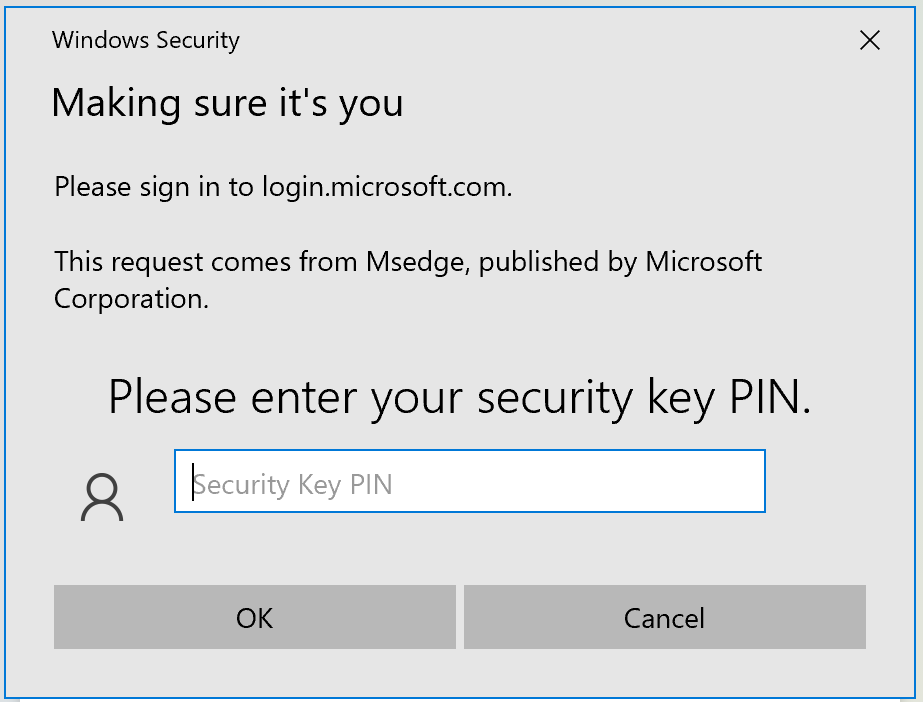](23-Accesso-passwordless-Azure-AD-FIDO2-insert-PIN.png)

Attendi qualche secondo... voilà!

[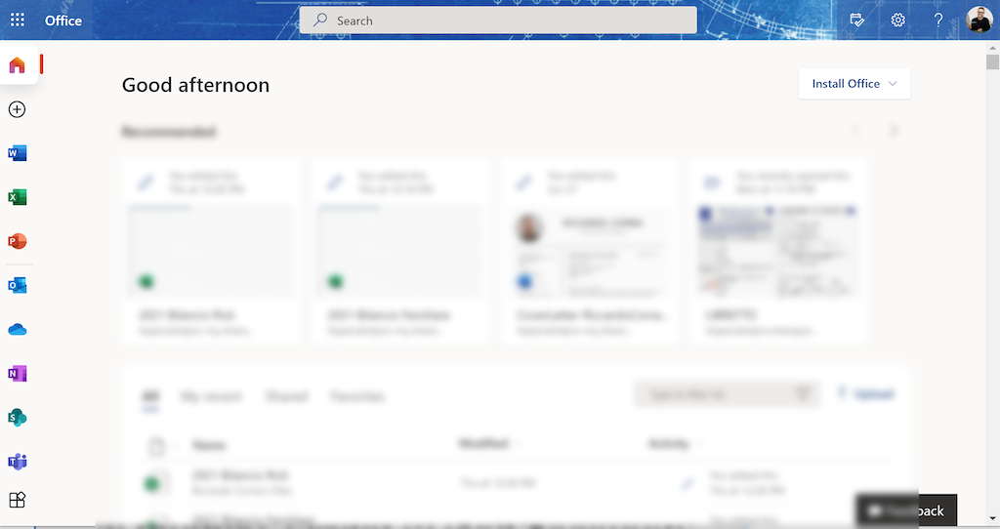](24-Accesso-passwordless-Azure-AD-FIDO2-login-successful-1.png)

Hai notato una cosa? **Il login è stato fatto senza inserire alcuna utenza o password!**

## Conclusioni, documentazione, ringraziamenti
Come hai visto, dopo una fase preparatoria su Azure AD e anche lato utente finale, l’autenticazione passwordless è un qualcosa di concreto ed utilizzabile anche nelle attività di tutti i giorni, non servono infrastrutture incredibili o attività complesse per implementarla. Certo, la procedura di registrazione potrebbe non essere del tutto intuitiva ma, con una buona campagna di formazione/educazione degli utenti e con un buon piano di implementazione in cui venga coinvolto anche l’help desk di primo livello, l’autenticazione passwordless su Azure AD con security key FIDO2 può diventare realtà!

Oltre alla chiavetta Fetian K13 oggetto della mia prova sul campo, ho avuto modo di testarne altre con interfaccia USB-A, USB-C, NFC, Lightning: si sono comportate tutte **molto bene** ed è stato fatto un gran lavoro intorno agli standard FIDO2, tanto è vero che Feitian compare come "Supported Provider" per Azure AD in ambito di autenticazione passwordless con FIDO2.

Se ho stuzzicato la tua curiosità di provare una security key o qualunque altro prodotto di sicurezza, puoi dare un’occhiata ai prodotti Feitian qui:
- [FEITIAN – A professional Security Hardware and Solution Provider for PKI token, OTP (One Time Password) token and card, Smart Card and Reader, Software Protection Dongle, and Mobile Solution for Financial, Government, Enterprise, and Payment. (ftsafe.com)](https://www.ftsafe.com/store/?utm_source=KOL&utm_medium=RiccardoCorna&utm_campaign=OnlineStore)

Feitian mi ha anche messo a disposizione un codice sconto del 20% su tutti i prodotti, ad eccezione dei bundle:

- Codice sconto: **Riccardo-20**

Vorrei ringraziare ancora una volta Marco Moioli di Microsoft per avermi coinvolto in questi test e, soprattutto, [Della Han](https://www.linkedin.com/in/della-han-081812200/) di Feitian per il suo preziosissimo supporto e la sua disponibilità nel fornirmi tutta la documentazione di cui avevo bisogno.

A riguardo dell’autenticazione passwordless con security key, se vuoi approfondire il discorso anche a livello più teorico, come al solito, ecco della documentazione freschissima che terrà in allenamento i tuoi neuroni anche durante l’estate 😉:
- [Passwordless security key sign-in – Azure Active Directory | Microsoft Docs](https://docs.microsoft.com/en-us/azure/active-directory/authentication/howto-authentication-passwordless-security-key)
- [Azure Active Directory passwordless sign-in | Microsoft Docs](https://docs.microsoft.com/en-us/azure/active-directory/authentication/concept-authentication-passwordless#fido2-security-keys)
- [Browser support of FIDO2 passwordless authentication | Microsoft Docs](https://docs.microsoft.com/en-us/azure/active-directory/authentication/fido2-compatibility)
- [Support passwordless authentication with FIDO2 keys in apps you develop – Microsoft identity platform | Microsoft Docs](https://docs.microsoft.com/en-us/azure/active-directory/develop/support-fido2-authentication)

E tu hai mai implementato delle security key FIDO2 su Azure AD o stai pensando di farlo? Raccontami la tua esperienza di autenticazione passwordless su Azure AD con security key, ti aspetto per parlarne sui miei social!

Il tuo IT Specialist, Riccardo