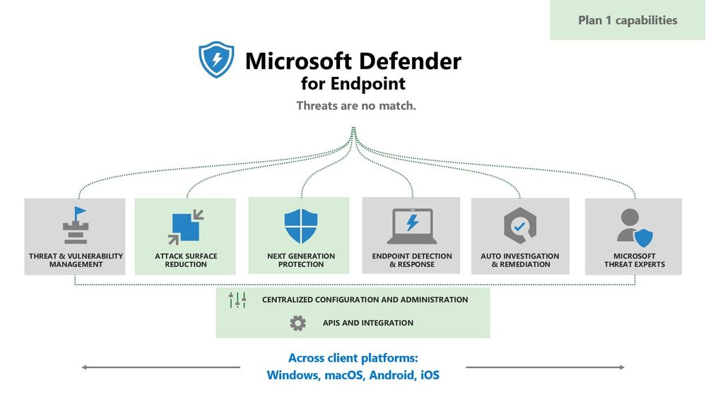
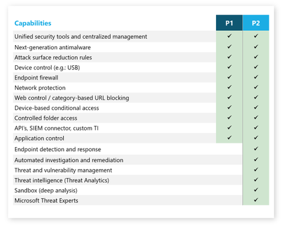

Finalmente Microsoft Defender for Endpoint sarà disponibile anche nelle licenze Microsoft 365 E3/A3! È notizia di ieri di un nuovo piano chiamato Microsoft Defender for Endpoint Plan 1″, che racchiude le seguenti funzionalità:
- Attack Surface Reduction
- Next Generation Protection

Queste caratteristiche rappresentano un sottoinsieme della soluzione completa, che d’ora in poi si chiamerà “Plan 2” e continuerà ad essere inclusa e disponibile nelle licenze E5.

Il nuovo Plan 1 invece sarà disponibile come segue:
- Nelle licenze Microsoft 365 E3/A3 e ogni utente potrà usufruire di MDE Plan 1 fino ad un massimo di 5 dispositivi (verrà attivato automaticamente per - chi ha già un piano esistente di questo tipo)
- Come pacchetto standalone secondo le stesse modalità di utilizzo illustrate al punto precedente.

Ovviamente la soluzione sarà disponibile per *Windows*, [**macOS**](/installare-microsoft-defender-for-endpoint-su-macos-via-microsoft-endpoint-manager-intune/), [**iOS**](/microsoft-defender-for-endpoint-ios-general-availability/), **Android**, **Linux**, coprendo tutte le tipologie di dispositivi esistenti.

**Perché è un’ottima notizia?** Perché, finalmente, viene reso disponibile un meccanismo di protezione dei dispositivi al di fuori delle licenze E5 e, quindi, le soluzioni E3 diventano più complete!

Per approfondimenti e dettagli leggi il blog post dell’annuncio:

➡️ [Introducing Microsoft Defender for Endpoint Plan 1 – Microsoft Tech Community](https://techcommunity.microsoft.com/t5/microsoft-defender-for-endpoint/introducing-microsoft-defender-for-endpoint-plan-1/ba-p/2636641)

Nelle immagini, uno schema di quali sono le funzionalità incluse in Plan 1 e delle differenze rispetto a Plan 2.

Che ne pensi? Parliamone insieme nei commenti, ti aspetto!

Il tuo IT Specialist, Riccardo