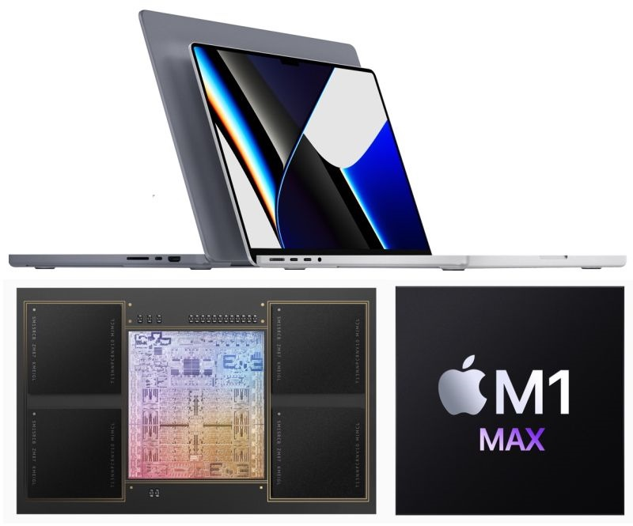

Con un giorno di ritardo, ho visto con calma: se fossi nei panni di Intel, non starei proprio sereno sereno. M1 Pro e Max sembrano davvero pazzeschi, ci vorrà tempo alla concorrenza per colmare questo gap, Apple si è creata un vantaggio competitivo non da poco.

Due in particolare i punti su cui (secondo me) hanno fatto centro con l’accoppiata CPU / MacBook Pro:

1. **Prezzo**: sono pur sempre prezzi “premium”, ok, ma rispetto alle prestazioni che offrono (impensabili da immaginare su un portatile di questo tipo) e considerando il tipo di pubblico a cui sono rivolti i MacBook Pro, sono decisamente abbordabili.

2. **Sono davvero "Pro"**: con queste prestazioni, questa autonomia, questo fattore di forma portatile, con i software nativi M1 e con quelli via Rosetta2 che girano quasi come su Intel (se non meglio in alcuni casi), chi crea contenuti (grafica, video, musica, ecc) non potrà che tornare a scegliere Mac. In parole povere, il Mac torna ad essere veramente “different” e focalizzato.

Dal 2016 al 2020 i MacBook Pro non sono stati per niente centrati rispetto ai professionisti a cui, storicamente, Apple si è sempre rivolta.
Ora, invece, sì (finalmente, aggiungerei). Tanta roba, brava Apple!

Che ne dite? Parliamone insieme sui miei profili social!

Buonanotte!

Il tuo IT Specialist, Riccardo