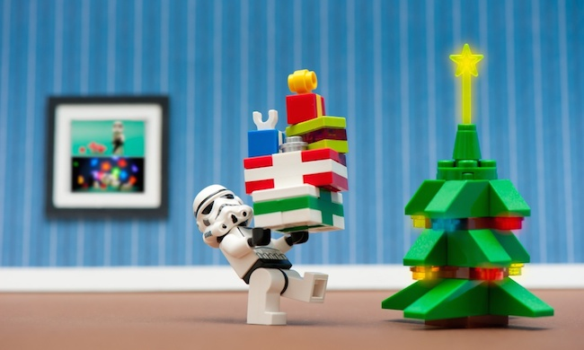

Se mi volto indietro, non so perché, gli ultimi due anni mi vengono in mente come un blocco unico, come se lo scorso anno e lo scorso Natale fossero in qualche modo un passato sfocato, come se una parte di questo tempo fosse sospesa, dispersa. Due anni sicuramente complessi, non c’è che dire.

Poi, però, mi ricordo di tutto quello che ho fatto in questo lasso di tempo: le soddisfazioni, come sono cresciuto, quello che ho imparato, i momenti stressanti e conflittuali, le decisioni importanti e l’importanza di scegliere quello che ti fa stare bene anche se è difficile farlo e ti fa uscire dalla zona di comfort.

Quindi, più che i soliti auguri di “Buone Feste”, quest’anno ti auguro di scegliere quello che ti diverte e ti fa stare bene, qualunque cosa sia, e di avere la forza di farlo.

Auguri!

Il tuo IT Specialist, Riccardo